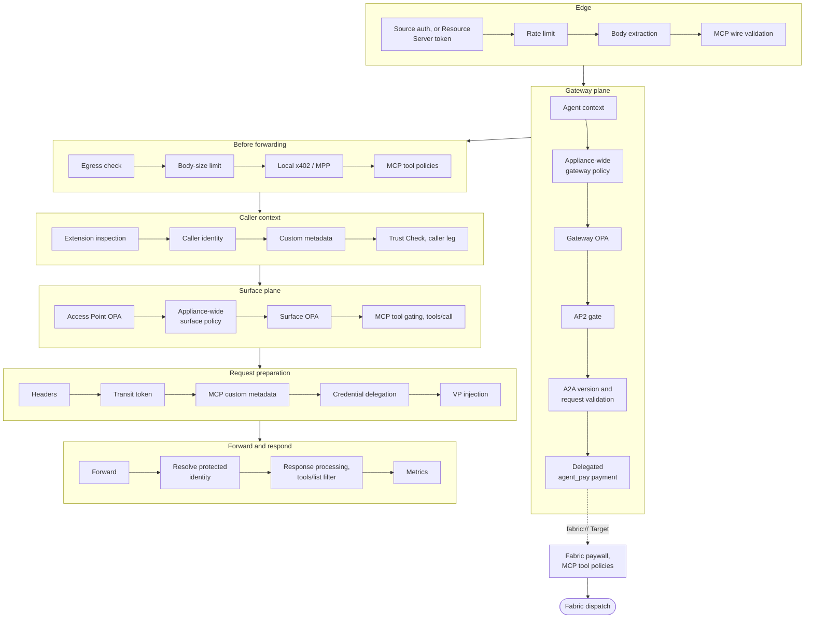
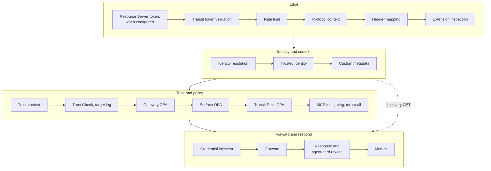
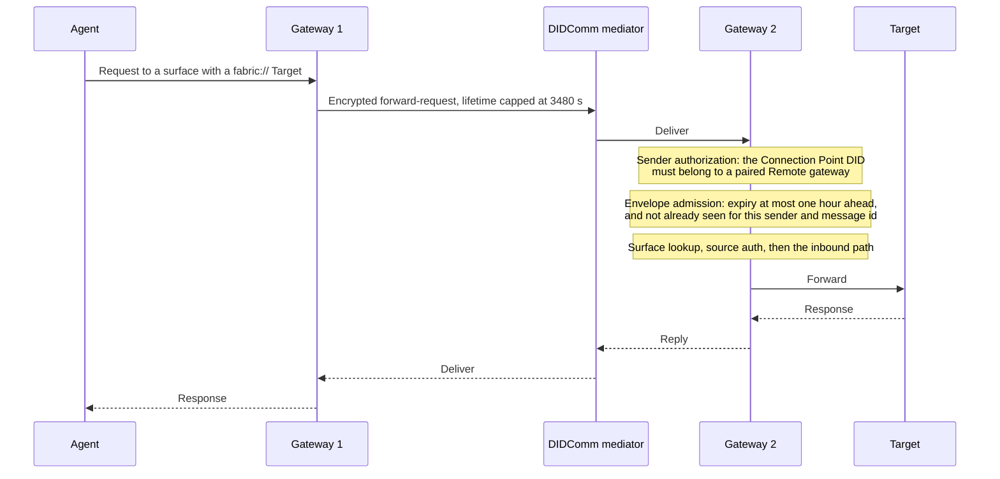
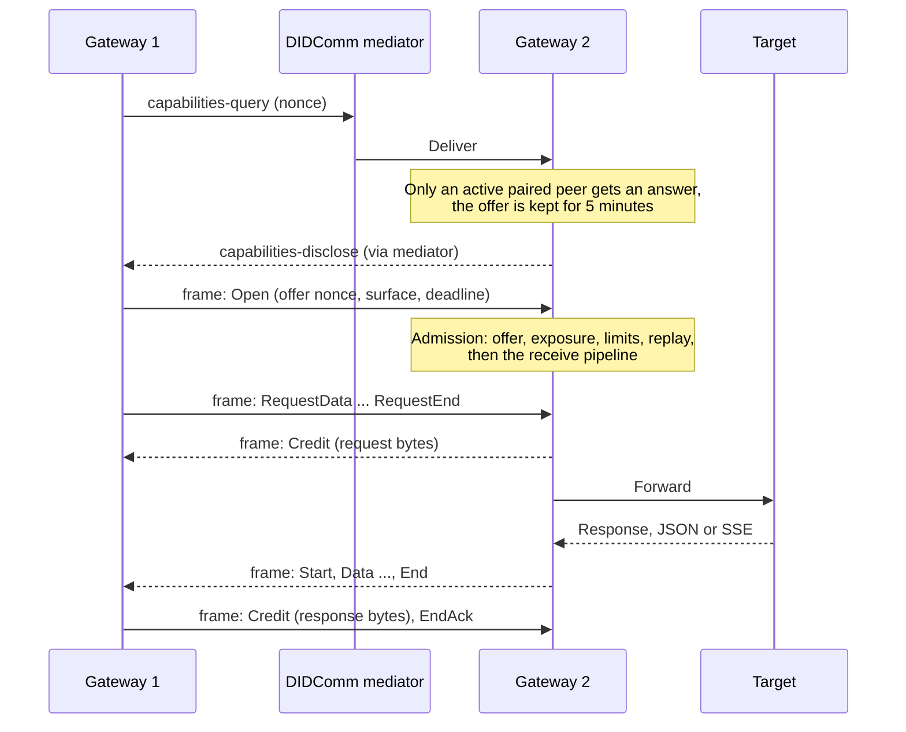

# Architecture

How Agent Gateway is put together, and where in `src/` each part lives.

This page is for contributors changing the code. For what the product does and how to
operate it, use the hosted [architecture concepts](https://docs.affinidi.com/products/affinidi-trust-fabric/agent-gateway/concepts/architecture/).
For the meaning of a term, use [`CONTEXT.md`](CONTEXT.md). For the rules a change must
follow, use [`AGENTS.md`](AGENTS.md) and [`CONTRIBUTING.md`](CONTRIBUTING.md).

## System shape

Agent Gateway is one Rust binary, `agent-gateway`, built from [`src/`](src/). It has no
database and no sidecar. A React dashboard is served from the same process, built from
[`www/default/`](www/default/).

The process runs two planes.

| Plane | What it serves | Where it binds |
| --- | --- | --- |
| Management plane | REST API and the dashboard. Configuration, secrets, policies, connections, observability. | The bootstrap TLS port, under `/api/v1/…` |
| Data plane | Agent traffic. One or more Agent Surfaces, each with an inbound Access Point and optional outbound Transit Points. | Listeners declared in `gateway.json` |

The customer-facing documentation describes the same system in four layers. The entry,
control, and routing layers are the data plane; the operations layer is the management
plane.

An **Agent Surface** is the unit both planes are organised around. It is defined in
[`src/config/agent_surface.rs`](src/config/agent_surface.rs) and carries one Access
Point, one Target, and zero or more Transit Points. Read the surface before changing
anything in the pipeline; almost all proxy behaviour hangs off it.

## State and storage

There is no external datastore.

| Layer | Behaviour |
| --- | --- |
| Runtime | A DashMap cache is authoritative. [`src/state/`](src/state/) holds the per-surface runtime state. |
| Disk | JSON files under `_storage/`, written immediately on change. [`src/storage/`](src/storage/) holds the store traits and the filesystem implementation. |
| Reload | Surfaces are hot-reloadable. Editing `_storage/` by hand needs a restart or `POST /v1/config/reload`, unless `cache_refresh_interval_secs` is set. |

Encryption at rest is optional and lives in [`src/encryption/`](src/encryption/). See
[`docs/CONFIGURATION_RELOAD.md`](docs/CONFIGURATION_RELOAD.md) for reload mechanics and
[`docs/DESIGN_PATTERNS.md`](docs/DESIGN_PATTERNS.md) for the storage-trait and
composite-store patterns.

## Startup

[`src/main.rs`](src/main.rs) parses arguments, loads configuration, and hands over to
[`server::run_axum_proxy`](src/server/orchestrator.rs). `main.rs` initialises
encryption at rest and loads the surfaces before the handover; the orchestrator wires
the stores, listeners, and middleware.

1. Read the bootstrap TOML. `BootstrapConfig` resolves every other path relative to it.
2. Load `gateway.json` and the other files named in `[config_files]`.
3. Open the storage layer and, if enabled, the encryption layer.
4. Create the surface task manager.
5. Seed built-in surface templates from the configured templates directory.
6. Start trust registry listeners.
7. Create the connection point manager for fabric peers, and pre-warm the DID cache.
8. Build the management and dashboard routers, and hand them to the surface task manager.
9. Bind listeners and start each surface.
10. Mark the process ready, at which point `/api/v1/health` returns 200.

Connection points come up before the management router and before any surface listener,
so a fabric peer can be reachable while the dashboard is still being assembled.

`server_mode` selects `active` or `standby` at startup. Standby drops listeners and
reports 503 on health. `SIGUSR1` promotes, `SIGUSR2` steps down. See
[`src/server/mode.rs`](src/server/mode.rs).

## Inbound path

External caller → Access Point → Target. Implemented in
[`src/proxy/handler.rs`](src/proxy/handler.rs). The diagram groups the stages; the
[full order](#full-order) below lists each one.

A `fabric://` Target leaves after the delegated payment. It then runs its own paywall
(skipped when the delegated payment already decided) and, for MCP, the MCP tool policies,
before fabric dispatch. Version negotiation and request validation do not run on the
fabric legs.

Each stage is driven from `handler.rs`; the column below names the module holding the
logic.

| Stage | Owns | Lives in |
| --- | --- | --- |
| Source authentication | Establishing the caller's identity. A missing or invalid credential is passed to policy, not refused. | [`src/source_auth/`](src/source_auth/) |
| Resource Server token | Replaces source authentication on an MCP surface that sets `mcp_http.authorization`: a bearer token for this resource and its scopes is required, and a missing, invalid or insufficient one is refused at once with a `WWW-Authenticate` challenge, not passed to policy | [`src/mcp/resource_server.rs`](src/mcp/resource_server.rs) |
| Rate limiting | Per-surface request limits | [`src/policies/rate_limiter.rs`](src/policies/rate_limiter.rs) |
| Body extraction | Reading the request body once | [`src/proxy/handler.rs`](src/proxy/handler.rs) |
| MCP wire validation | Rejecting malformed or non-active MCP revisions | [`src/mcp/`](src/mcp/) |
| Agent context | Trust-registry context from the original body, as `input.agent` for every policy and Trust Check template | [`src/surface_context/`](src/surface_context/) |
| Appliance-wide gateway policy | The global gateway-plane set, deny-overrides, ahead of the gateway's own policy | [`src/policies/global_policy.rs`](src/policies/global_policy.rs) |
| Gateway OPA | The appliance-level policy gate | [`src/policies/gateway_manager.rs`](src/policies/gateway_manager.rs) |
| AP2 gate | Refusing AP2 while `ap2_experimental` is off | [`src/proxy/handler.rs`](src/proxy/handler.rs), [`src/ap2/`](src/ap2/) |
| A2A version and request validation | Resolving `A2A-Version` and checking the request shape, A2A and AP2 only | [`src/a2a/version.rs`](src/a2a/version.rs), [`src/a2a/methods.rs`](src/a2a/methods.rs) |
| Delegated payment | `agent_pay` settlement through another gateway | [`src/x402/delegate.rs`](src/x402/delegate.rs) |
| Egress check | Vetting the forward target before anything is charged locally | [`src/egress.rs`](src/egress.rs) |
| Body-size limit | Refusing a body over `[a2a] max_body_size` | [`src/proxy/handler.rs`](src/proxy/handler.rs) |
| Local payment | x402 and MPP verification and paywalls | [`src/x402/`](src/x402/), [`src/mpp/`](src/mpp/) |
| MCP tool policies | Per-tool authorization, configured as `target.mcp_tool_policies` | [`src/policies/opa.rs`](src/policies/opa.rs) |
| Extension inspection | Parsing and validating declared extensions (`inspect_message_extensions`) | [`src/protocols/extensions.rs`](src/protocols/extensions.rs) |
| Caller identity | The configured caller identity (`from_mtls`, `from_api_key`, `static`, `from_jwt_claim`) and any inbound identity presentation, which Trust Check depends on | [`src/proxy/caller_identity.rs`](src/proxy/caller_identity.rs), [`src/identity/`](src/identity/) |
| Metadata injection | Operator-defined request metadata (`resolve_metadata_references`) | [`src/protocols/extensions.rs`](src/protocols/extensions.rs) |
| Trust Check, caller leg | TRQP queries feeding policy input. Never denies; OPA decides. Discovery `GET` and `HEAD` requests skip it; any other method on a discovery-like path, such as a `POST` to `{route}/agent.json`, runs it. | [`src/trust_registry_verification/`](src/trust_registry_verification/) |
| Access Point OPA | `access_point.inbound_policy`, its own deny gate, independent of the surface policy | [`src/policies/surface_manager.rs`](src/policies/surface_manager.rs) |
| Appliance-wide surface policy | The global surface-plane set, deny-overrides, ahead of the surface's own policy | [`src/policies/global_policy.rs`](src/policies/global_policy.rs) |
| Surface OPA | The per-surface policy gate | [`src/policies/surface_manager.rs`](src/policies/surface_manager.rs) |
| MCP tool gating | The allow/deny firewall over tool names | [`src/policies/mcp_tool_gating.rs`](src/policies/mcp_tool_gating.rs) |
| Headers | Trace ID, `did:webvh` identity headers, and caller-info headers | [`src/proxy/handler.rs`](src/proxy/handler.rs) |
| Transit token | The token a managed agent echoes back on its Transit Point calls | [`src/proxy/transit_token.rs`](src/proxy/transit_token.rs) |
| Credential delegation | Injecting delegated OAuth tokens, or signalling consent | [`src/proxy/credential_delegation.rs`](src/proxy/credential_delegation.rs) |
| VP injection | The deferred identity presentation added to the upstream request | [`src/identity/`](src/identity/) |
| Forward | Vetting the target and sending the request | [`src/egress.rs`](src/egress.rs) |
| Upstream response bounds | Buffering the upstream response within `[a2a] max_body_size`, the target's `networking.timeout.idle_secs` and its request timeout; `502` over the size, `504` on a stall. An MCP event-stream passthrough is not buffered. | [`src/proxy/upstream_body.rs`](src/proxy/upstream_body.rs) |
| Protected identity resolution | Deriving the managed agent's DID from its response | [`src/proxy/backend_identity.rs`](src/proxy/backend_identity.rs) |
| Response processing | Rewrites, tool-list filtering, agent cards | [`src/proxy/response_policy.rs`](src/proxy/response_policy.rs) |
| Metrics | Recording the outcome | [`src/metrics/`](src/metrics/) |

## Outbound path

Managed agent → Transit Point listener → external service. Implemented in
[`src/proxy/outbound_handler.rs`](src/proxy/outbound_handler.rs).

Public discovery GETs, such as an agent card, skip the trust and policy group. The outbound
path does not evaluate the appliance-wide policies.

## Full order

Inbound:

source auth (or, on an MCP surface with `mcp_http.authorization`, the Resource Server
token, which refuses rather than passing to policy) → rate limit → body extraction → MCP
wire validation and context → agent
context → appliance-wide gateway policy → gateway OPA → AP2 gate → A2A version negotiation
and request validation (A2A and AP2, not `fabric://`) → delegated `agent_pay` payment (a
`fabric://` Target leaves here: its own paywall, MCP tool policies for MCP, then fabric
dispatch) → forward-target egress check → body-size limit → local x402/MPP → MCP tool
policies → extension inspection → caller identity → custom metadata → Trust Check (caller
leg) → Access Point OPA → appliance-wide surface policy → surface OPA → MCP tool gating
(`tools/call`) → identity and caller-info headers → transit token generation → MCP custom
metadata → credential delegation and consent → deferred VP injection → forward → resolve
protected identity → response processing, including the `tools/list` filter → metrics.

Outbound:

Resource Server token (on a Transit Point with `mcp_http.authorization`) → transit
token validation → rate limit → protocol context → Transit Point header mapping
(A2A and AP2) → outbound extension inspection (A2A) → identity resolution → trusted
identity → custom metadata → trust context → Trust Check (target leg) → gateway OPA →
surface OPA → Transit Point OPA → MCP tool gating (`tools/call`) → credential injection →
forward → response and agent-card rewrite → metrics. The stages from trust context to MCP
tool gating are skipped for public discovery GETs.

This page is the authority on pipeline ordering. When it disagrees with a summary
elsewhere, the source is the arbiter and this page is corrected.

## Fabric path

A `fabric://{gateway_id}/{surface_id}` Target routes to a surface on another gateway
over DIDComm rather than HTTP.

This is the buffered forward: one `forward-request` and one `forward-response`, used for
legacy MCP, A2A and HTTP. Modern (`2026-07-28`) MCP crosses Fabric as a
framed stream instead, so responses and subscriptions can stream:

Every frame is its own encrypted DIDComm message through the mediator; the diagram
draws frames directly between the gateways for brevity. The negotiated capabilities are
cached per peer for 5 minutes, so later streams skip the query. Each
direction has its own byte credit, and a refused Open is answered with an `Error` frame
saying why rather than left to time out: a stale offer makes the sender negotiate again,
and an older peer whose surface does not admit modern MCP reaches the caller as `-32022`,
as from a legacy-only endpoint.

| Direction | Entry point |
| --- | --- |
| Send | [`src/proxy/fabric_forward.rs`](src/proxy/fabric_forward.rs) |
| Receive | [`src/gateways/connection_points/message_processor.rs`](src/gateways/connection_points/message_processor.rs) |
| Framed streams | [`src/proxy/fabric_stream/`](src/proxy/fabric_stream/) |

On receive, sender authorization and envelope admission, meaning expiry and replay
checks, run **before** surface lookup and source auth. Each gateway keeps its own trust
boundary: an identity presentation is attributed to the caller only when its issuer is
one of that connection's issuers.

See [`docs/FABRIC.md`](docs/FABRIC.md) for the attestation format, the connection-issuer
set, the receive-path attribution rule, and envelope replay protection.

## Invariants

Breaking one of these is a correctness bug, not a style question.

| Invariant | Consequence if broken |
| --- | --- |
| Gateway OPA runs before surface OPA, and a gateway deny is final. | A surface could override an appliance-wide decision. |
| Both policy planes fail closed. A missing, broken, or wrong-package policy denies. | A malformed policy would silently allow traffic. |
| The wrong OPA package denies. Gateway policy is `gateway.policy`, surface policy is `surface.policy`. | Policy that looks loaded would never be consulted. |
| DNS is resolved once per forward, and the request is pinned to that address with redirects disabled. | A host could rebind to an internal or metadata address between vetting and connect. |
| DashMap is authoritative at runtime; disk is written immediately. | Reads and writes would disagree after a reload. |
| Identity attribution fails closed. A presentation that does not verify never becomes the caller identity. | An unverified DID would reach policy as if it were proven. |
| The Agent Surface is the only routing unit. | Routing behaviour would drift away from what an operator configured. |

## Module map

Every top-level entry in [`src/`](src/), what it owns, and where to read about it. Where
no document exists, the Document column says **Source only** and names the file to start
from.

### Request handling

| Module | Owns | Document |
| --- | --- | --- |
| [`proxy/`](src/proxy/) | Both pipelines, surface manager, listener lifecycle, response policy, bounded upstream response reads | [Inbound path](#inbound-path), [Outbound path](#outbound-path) |
| [`server/`](src/server/) | Startup orchestration, TLS, WebSocket, active/standby mode | [`CONFIGURATION_RELOAD.md`](docs/CONFIGURATION_RELOAD.md) |
| [`state/`](src/state/) | Per-surface runtime state shared across handlers | [`DESIGN_PATTERNS.md`](docs/DESIGN_PATTERNS.md) |
| [`protocols/`](src/protocols/) | Protocol-agnostic extension inspection, metadata injection, and header rules shared by A2A, MCP, and others | [`PROTOCOLS.md`](docs/PROTOCOLS.md) |
| [`surface_context/`](src/surface_context/) | The types that become OPA policy input | [`POLICY.md`](docs/POLICY.md) |
| [`egress.rs`](src/egress.rs) | The DNS-pinning SSRF guard used by every outbound sink except DID resolution, which relies on the resolver's host policy | [`POLICY.md`](docs/POLICY.md), [DID resolution host policy](docs/POLICY.md#did-resolution-host-policy) |
| [`http_client.rs`](src/http_client.rs) | Shared reqwest client defaults | Source only: [`src/http_client.rs`](src/http_client.rs) |
| [`url_validation.rs`](src/url_validation.rs) | SSRF checks on operator-supplied URLs | [`POLICY.md`](docs/POLICY.md) |

### Protocols

| Module | Owns | Document |
| --- | --- | --- |
| [`a2a/`](src/a2a/) | A2A-specific schema, auth, errors, agent-card URL rewriting | [`PROTOCOLS.md`](docs/PROTOCOLS.md) |
| [`a2a_proxies/`](src/a2a_proxies/) | Exposing a non-A2A agent as an A2A endpoint | [`PROTOCOLS.md`](docs/PROTOCOLS.md) |
| [`mcp/`](src/mcp/) | MCP wire handling, metadata, transports | [`MCP_TOOL_GATING.md`](docs/MCP_TOOL_GATING.md), [`PROTOCOLS.md`](docs/PROTOCOLS.md) |
| [`mcp_proxies/`](src/mcp_proxies/) | Exposing REST APIs as MCP tool servers | [`PROTOCOLS.md`](docs/PROTOCOLS.md) |
| [`ap2/`](src/ap2/) | AP2, experimental and disabled by default | [`PROTOCOLS.md`](docs/PROTOCOLS.md) |
| [`comm/`](src/comm/) | DIDComm message construction and handling | [`FABRIC.md`](docs/FABRIC.md) |
| [`messages/`](src/messages/) | Stored DIDComm message records | [`FABRIC.md`](docs/FABRIC.md) |

### Identity and trust

| Module | Owns | Document |
| --- | --- | --- |
| [`identity/`](src/identity/) | Agent DIDs, `did:webvh` logs, credential issuance, VP verification, display names (including dashboard-only managed-agent Agent Card names) | [`SOURCE_AUTH.md`](docs/SOURCE_AUTH.md#managed-identity), [`POLICY.md`](docs/POLICY.md) |
| [`source_auth/`](src/source_auth/) | JWT bearer, API key, DID Auth, mTLS on the inbound edge | [`SOURCE_AUTH.md`](docs/SOURCE_AUTH.md) |
| [`didauth/`](src/didauth/) | The DID Auth challenge and JWS ceremony | [`SOURCE_AUTH.md`](docs/SOURCE_AUTH.md#did-auth) |
| [`jwt_bearer/`](src/jwt_bearer/) | JWT verification strategies and JWKS fetching | [`SOURCE_AUTH.md`](docs/SOURCE_AUTH.md) |
| [`api_keys/`](src/api_keys/) | Data-plane API keys | [`SOURCE_AUTH.md`](docs/SOURCE_AUTH.md) |
| [`certificates/`](src/certificates/) | TLS and mTLS certificate records | [`SOURCE_AUTH.md`](docs/SOURCE_AUTH.md#mtls) |
| [`vault_identity/`](src/vault_identity/) | Identity material for API keys and certificates | Source only: [`src/vault_identity/mod.rs`](src/vault_identity/mod.rs) |
| [`issuers/`](src/issuers/) | Issuer records with generated `did:web` / `did:webvh` DIDs | Source only: [`src/issuers/mod.rs`](src/issuers/mod.rs) |
| [`authorities/`](src/authorities/) | Local record of external authority DIDs used as trust anchors | Source only: [`src/authorities/mod.rs`](src/authorities/mod.rs) |
| [`trust_registries/`](src/trust_registries/) | Trust registry connection records, display-name reference fields | [`POLICY.md`](docs/POLICY.md#trust-check) for Trust Check. Records: [`src/trust_registries/mod.rs`](src/trust_registries/mod.rs) |
| [`trust_registry_verification/`](src/trust_registry_verification/) | TRQP queries, Trust Check, the Trust Recorder | [`POLICY.md`](docs/POLICY.md) |
| [`sts/`](src/sts/) | RFC 8693 token exchange, and ID-JAG issuance and redemption | [`STS.md`](docs/STS.md) |

### Policy

| Module | Owns | Document |
| --- | --- | --- |
| [`policies/`](src/policies/) | Regorus OPA evaluation, both planes, tool gating, rate limits, circuit breaker | [`POLICY.md`](docs/POLICY.md), [`MCP_TOOL_GATING.md`](docs/MCP_TOOL_GATING.md) |

### Payments

| Module | Owns | Document |
| --- | --- | --- |
| [`x402/`](src/x402/) | x402 settlement, facilitator calls, transaction records | [`PROTOCOLS.md`](docs/PROTOCOLS.md) |
| [`mpp/`](src/mpp/) | Machine Payments Protocol | [`PROTOCOLS.md`](docs/PROTOCOLS.md) |
| [`payment_credentials.rs`](src/payment_credentials.rs) | Dispute-evidence credentials | Source only: [`src/payment_credentials.rs`](src/payment_credentials.rs) |

### Federation

| Module | Owns | Document |
| --- | --- | --- |
| [`gateways/`](src/gateways/) | Remote gateway records, pairing, connection points, issuer attestation, envelope replay | [`FABRIC.md`](docs/FABRIC.md) |
| [`mediators/`](src/mediators/) | DIDComm mediator connections | [`FABRIC.md`](docs/FABRIC.md) |

### Management plane

| Module | Owns | Document |
| --- | --- | --- |
| [`auth/`](src/auth/), [`auth_manager/`](src/auth_manager/) | Dashboard login: passkey and SAML, sessions, and `fabric` CLI browser login (in-memory single-use codes, so one gateway instance) | [`CONFIGURATION_REFERENCE.md`](docs/CONFIGURATION_REFERENCE.md#samljson), [`ACCESS_TOKENS.md`](docs/ACCESS_TOKENS.md#cli-browser-login), [`TERMS_AND_CONSENT.md`](docs/TERMS_AND_CONSENT.md#gating-the-session) |
| [`rbac/`](src/rbac/) | Management API role enforcement | [`RBAC.md`](docs/RBAC.md) |
| [`access_tokens/`](src/access_tokens/) | Management PATs, delegation, resource patterns | [`ACCESS_TOKENS.md`](docs/ACCESS_TOKENS.md) |
| [`tenancy/`](src/tenancy/) | Tenant context and record ownership | [`ACCESS_TOKENS.md`](docs/ACCESS_TOKENS.md) |
| [`surfaces/`](src/surfaces/) | Agent Surface CRUD | Source only: [`src/surfaces/mod.rs`](src/surfaces/mod.rs) |
| [`surface_templates/`](src/surface_templates/) | Built-in and user surface templates | [`templates README`](config/examples/agent_surface_templates/README.md) |
| [`agents_api/`](src/agents_api/) | Agent self-registration: `/agents-api/v1/onboard` mints a DID from identity fields, with `sign-jwt` and `verify-jwt` | Source only: [`src/agents_api/handlers/onboard.rs`](src/agents_api/handlers/onboard.rs). The onboarding capture endpoint is in `identity/`; see [`AGENT_ONBOARDING_CAPTURE.md`](docs/AGENT_ONBOARDING_CAPTURE.md). |
| [`terms/`](src/terms/) | Terms versions, acceptance records, consent gating | [`TERMS_AND_CONSENT.md`](docs/TERMS_AND_CONSENT.md) |
| [`credential_providers/`](src/credential_providers/) | OAuth credential provider records | [`CREDENTIAL_DELEGATION.md`](docs/CREDENTIAL_DELEGATION.md) |
| [`delegation_vault/`](src/delegation_vault/) | Per-caller OAuth tokens, the consent flow, and the audit log. Tokens are encrypted only when encryption at rest is enabled. | [`CREDENTIAL_DELEGATION.md`](docs/CREDENTIAL_DELEGATION.md) |
| [`integrations/`](src/integrations/) | Webhooks, notifications, and outbound integrations | [`INTEGRATIONS.md`](docs/INTEGRATIONS.md) |
| [`secrets/`](src/secrets/) | Secret records and the loader schemes | [`CONFIGURATION_REFERENCE.md`](docs/CONFIGURATION_REFERENCE.md#secret-references) |

### Platform

| Module | Owns | Document |
| --- | --- | --- |
| [`config/`](src/config/) | Bootstrap parsing, `AgentSurface`, variants, limits, loaders | [`CONFIGURATION_RELOAD.md`](docs/CONFIGURATION_RELOAD.md) |
| [`storage/`](src/storage/) | Store traits, filesystem JSON, config cache, DID artifacts | [`DESIGN_PATTERNS.md`](docs/DESIGN_PATTERNS.md) |
| [`encryption/`](src/encryption/) | Encryption at rest and key sources | [`CONFIGURATION_REFERENCE.md`](docs/CONFIGURATION_REFERENCE.md#configtoml) |
| [`backup_restore/`](src/backup_restore/) | `.agbak` backup and restore | [`DEVELOPMENT.md`](docs/development/DEVELOPMENT.md) |
| [`export/`](src/export/) | Redacted `.atgx` storage export | [`DEVELOPMENT.md`](docs/development/DEVELOPMENT.md) |
| [`observability/`](src/observability/) | Tracing, policy audit events, dashboard event stream, identity view and caller names | [`OBSERVABILITY.md`](docs/OBSERVABILITY.md) |
| [`metrics/`](src/metrics/) | Metric collection, retention, aggregation | [`OBSERVABILITY.md`](docs/OBSERVABILITY.md) |
| [`component_tests/`](src/component_tests/) | Cross-module tests that need no Docker | [`CONTRIBUTING.md`](CONTRIBUTING.md) |

## Where to look

| Question | Start here |
| --- | --- |
| How does a request get routed? | [`src/config/agent_surface.rs`](src/config/agent_surface.rs), then [`src/proxy/handler.rs`](src/proxy/handler.rs) |
| Why was my request denied? | [`src/policies/`](src/policies/) and [`docs/POLICY.md`](docs/POLICY.md) |
| What does a policy see in `input`? | [`src/surface_context/`](src/surface_context/) |
| How is a surface reloaded? | [`src/proxy/surface_manager.rs`](src/proxy/surface_manager.rs) and [`docs/CONFIGURATION_RELOAD.md`](docs/CONFIGURATION_RELOAD.md) |
| Where is a record persisted? | [`src/storage/filesystem.rs`](src/storage/filesystem.rs) and `[storage_paths]` in the bootstrap TOML |
| How does the dashboard talk to the backend? | The management routes in [`src/identity/router.rs`](src/identity/router.rs), mounted by [`src/server/orchestrator.rs`](src/server/orchestrator.rs) |
| How does a call reach another gateway? | [`src/proxy/fabric_forward.rs`](src/proxy/fabric_forward.rs) and [`docs/FABRIC.md`](docs/FABRIC.md) |
| What starts at boot, and in what order? | [`src/server/orchestrator.rs`](src/server/orchestrator.rs) |

## Related

- [`docs/README.md`](docs/README.md): index of the implementation references.
- [`CONTEXT.md`](CONTEXT.md): the project glossary.
