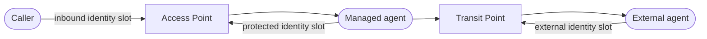

# Agent Gateway

The Agent Gateway is an intercepting proxy for AI agents. It handles inbound and outbound traffic on their behalf, and applies identity, policy, trust, and payment controls around that traffic. Also referred to as the **Affinidi Agent Gateway** (**AG**).

This document is the project glossary — the ubiquitous language, not a spec. Keep it durable and implementation-agnostic. Prefer stable domain terms over file paths, code identifiers, enum spellings, or wire-format details.

## Management tenancy

| Term | Meaning |
| --- | --- |
| **Management PAT** (_personal access token_) | A long-lived bearer credential bound to a dashboard user and used by automation on the management API. Its effective authority is the intersection of the user's RBAC role and optional PAT scopes. Distinct from a data-plane API key. |
| **Tenant** | An operator-selected management ownership namespace. Tenant selection constrains which configuration records a PAT may manage; it does not create a separate runtime or data plane. |
| **Global resource** | A management record with no tenant owner. It remains available appliance-wide and may be referenced by a tenant-owned resource. A tenant PAT cannot update or delete a global policy definition. |
| **Tenant-owned resource** | A management record assigned to one tenant. It may reference resources owned by that tenant or global resources. |
| **Canonical resource target** | The request-time identity used to match a tenant PAT's resource pattern without changing a resource's persisted UUID: tenant, resource kind, and resource ID. |

## Routing model

| Term                          | Meaning                                                                                                                                                                                                                                                                                                                                      |
| ----------------------------- | -------------------------------------------------------------------------------------------------------------------------------------------------------------------------------------------------------------------------------------------------------------------------------------------------------------------------------------------- |
| **Agent Surface** (_surface_) | The configuration and runtime unit for one managed agent: one Access Point, one Target, and zero or more Transit Points. It defines how the agent is reached, where requests go, and what identity and policy apply. _Avoid: channel, route, mapping._ |
| **Surface Variant**           | A named variation on a base surface, selected by a route-level alias, without creating a separate surface record. _Avoid: virtual channel, environment, clone, duplicate surface._                                                                                                                                                           |
| **Access Point** (_AP_)       | The inbound face of a surface: the route and protocol on which callers reach the managed agent. Owns caller authentication and inbound rate limiting. _Avoid: ingress, entry point, listener, frontend._                                                                                                                                     |
| **Target**                    | The managed-agent side of a surface. Inbound traffic arriving at the Access Point is forwarded to the Target. Owns the endpoint, service credentials, request/response policy, payment policy, and protocol-specific hooks. Exactly one per surface. _Avoid: upstream, backend, origin, destination._                                        |
| **Transit Point** (_TP_)      | An agent-initiated outbound route attached to a surface, with its own target endpoint, protocol, credentials, policy, and optional payment settings. A surface has zero or more. Several may share one listener. _Avoid: outbound channel, egress, downstream, destination._ |
| **Listener**                  | A configured network endpoint used by Access Points or Transit Points. One Listener may serve many of them. _Avoid: port, socket, server, bind, access point._                                                                                                                                                                               |
| **Inbound**                   | External caller → Access Point → Target.                                                                                                                                                                                                                                                                                                     |
| **Outbound**                  | Managed agent → Transit Point listener → Transit Point target endpoint.                                                                                                                                                                                                                                                                      |

Use **Target** only for the managed-agent component of a surface. A Transit Point also has a destination endpoint, but that is not the surface Target.

## Protocols and endpoints

| Term                                    | Meaning                                                                                                                                                                                                                                               |
| --------------------------------------- | ----------------------------------------------------------------------------------------------------------------------------------------------------------------------------------------------------------------------------------------------------- |
| **Surface protocol** (_agent protocol_) | The protocol spoken at both the Access Point and the Target. The gateway does not translate protocols on the inbound path; both sides use the same one.                                                                                               |
| **Transit protocol**                    | The protocol spoken at one Transit Point. It may differ from the surface protocol.                                                                                                                                                                    |
| **A2A**                                 | Agent-to-Agent protocol for direct agent traffic.                                                                                                                                                                                                     |
| **AP2**                                 | Agent Payments Protocol, an A2A-family protocol with payment-oriented credential exchange.                                                                                                                                                            |
| **A2A version**                         | The A2A protocol revision a request speaks, negotiated from the `A2A-Version` header (absent or empty means `0.3`). Each A2A surface accepts `0.3`, `1.0` or both (both by default; `1.0` only for an A2A proxy); the gateway never translates between them. |
| **Method era**                          | Which A2A revision a JSON-RPC method name belongs to: `0.3` slash-form (`message/send`) or `1.0` PascalCase (`SendMessage`). Both eras are accepted whatever version is negotiated.                                                                   |
| **A2A surface settings**                | An A2A Access Point's `access_point.a2a`: the accepted A2A versions (default `0.3` and `1.0`) and the validation level, `off`, `envelope` (the JSON-RPC envelope, the default) or `full` (envelope and A2A request shape). Fixed to `1.0` with `envelope` when the Target is an A2A proxy. |
| **MCP**                                 | Model Context Protocol. Canonical metadata is carried in `params._meta` for requests and notifications and `result._meta` for successful responses. A surface may also emit the legacy top-level `_meta` compatibility envelope, which remains the default output shape. |
| **MCP server**                          | A protocol endpoint that serves MCP tools, resources, or prompts. In a surface, an MCP server can be the managed agent reached at the Target.                                                                                                         |
| **MCP revision**                        | The MCP protocol version a request speaks. `2024-11-05` is the legacy revision, with sessions established by `initialize`; `2026-07-28` is the modern revision, stateless and carrying its version in every request. |
| **Legacy SSE**                          | The deprecated MCP HTTP+SSE transport of the legacy revision: the client opens an event stream, then posts each request to the session URL it announces. Distinct from a modern request-scoped SSE response. |
| **MRTR**                                | The modern revision's multi-round-trip request pattern: the gateway answers a request with an input request (such as consent through URL elicitation), and the client retries the original request once it is satisfied. |
| **DIDComm**                             | DIDComm messaging protocol. Also used as the transport substrate for fabric routing.                                                                                                                                                                  |
| **HTTP endpoint**                       | An external HTTP target reached over the network.                                                                                                                                                                                                     |
| **Fabric endpoint**                     | A Gateway-to-Gateway target resolved through another gateway in the same fabric.                                                                                                                                                                      |
| **MCP proxy endpoint**                  | A target routed through a configured MCP proxy service.                                                                                                                                                                                               |
| **A2A proxy endpoint**                  | A target routed through a configured A2A proxy that exposes a non-A2A managed agent as an A2A endpoint. _Avoid: A2A ingress proxy._                                                                                                                   |
| **Non-A2A managed agent**               | A managed agent that does not speak A2A natively and sits behind an A2A proxy endpoint, which adapts A2A requests to and from its own transport. _Avoid: HTTP agent, backend bot, worker._ |
| **Header Metadata Mapping**             | A configured normalization rule that copies selected HTTP headers received at an Access Point or Transit Point boundary into protocol-native metadata before gateway identity, policy, trust, and forwarding controls evaluate the request. _Avoid: Copilot header mapping._ |
| **Metadata Injection**                  | A configured transformation that adds operator-defined metadata to a request or response as it passes through a surface. _Avoid: header mapping, extraction._ |
| **Metadata Extraction**                 | A configured transformation that reads metadata-like evidence from request transport headers and represents it as protocol-native metadata for later gateway controls. Header Metadata Mapping is the current extraction mechanism. _Avoid: injection._ |
| **Fabric**                              | The set of DIDComm-based appliances that participate through Connection Points. A fabric may include Agent Gateways, Trust Registries, and future appliance types. _Avoid: mesh, federation, cluster._                                                |
| **Connection Point**                    | A DIDComm endpoint another appliance uses to establish and use a connection with this appliance, typically from an out-of-band DIDComm invitation. Distinct from an Access Point, which is the inbound endpoint callers use to reach a managed agent. |
| **G2G**                                 | A Gateway-to-Gateway call routed through the fabric.                                                                                                                                                                                                  |
| **Fabric route**                        | A `fabric://{gateway_id}/{surface_id}` Target endpoint. The DIDComm request field `channel_id` is the legacy wire name for the destination surface identifier.                                                                                        |
| **Envelope replay protection**          | The receiving gateway's rule that a fabric envelope carries a bounded expiry and is processed at most once per sender and message id. See [`docs/FABRIC.md`](docs/FABRIC.md#fabric-receive-pipeline). _Avoid: nonce check, dedup._ |

## Identity

The gateway distinguishes several independent identity concerns. Do not collapse them.

The three identity slots sit at different points on a surface:

| Term                                      | Meaning                                                                                                                                                                                                                                                             |
| ----------------------------------------- | ------------------------------------------------------------------------------------------------------------------------------------------------------------------------------------------------------------------------------------------------------------------- |
| **Source authentication** (_source auth_) | Verification that the inbound caller is who they claim to be. Configured per Access Point. _Avoid: caller auth, client auth except when explicitly talking about TLS client auth._                                                                                  |
| **Authenticated identity**                | The runtime result of source auth for one inbound request: the authenticated principal plus auth-specific metadata.                                                                                                                                                 |
| **Target authentication** (_target auth_) | Credentials the gateway injects on requests forwarded to the Target. Configured per surface; the outbound counterpart to source authentication. _Avoid: outbound auth._                                                                               |
| **Credential extraction**                 | The configured place source auth looks for a presented credential.                                                                                                                                                                                                  |
| **Identity resolution**                   | A rule for deriving the caller's agent DID from an authenticated inbound request. _Avoid: caller DID resolution, DID extraction._                                                                                                                                   |
| **Identity slot**                         | A named DID-extraction position on a surface: inbound, protected, or external. Distinct from source auth and from identity injection.                                                                                                                               |
| **Issuer attestation**                    | A signed statement binding a gateway's gateway DID to the Connection Point DID it sends fabric envelopes from. The verified result is that Remote gateway's *established issuer DID*. See [`docs/FABRIC.md`](docs/FABRIC.md#peer-issuer-dids). |
| **Trusted issuer DID**                    | An issuer DID an operator adds to one Remote gateway connection so presentations issued by it are attributed when they arrive over that connection. Connection-scoped; never a surface or appliance setting. _Avoid: trusted binding issuer, issuer allowlist._ |
| **Inbound identity slot**                 | Caller → Access Point identity slot. Error label: `inbound_identity`.                                                                                                                                                                                               |
| **Protected identity slot**               | Managed agent → Access Point identity slot. Error label: `protected_identity`.                                                                                                                                                                                       |
| **Outbound managed-agent identity**       | The managed agent's DID as resolved from a managed-agent-initiated Transit Point request. Use when the managed agent can present identity material only on calls to a Transit Point, not on Access Point responses. _Avoid: Transit Point identity._                  |
| **External identity slot**                | External agent → Transit Point identity slot. Error label: `external_identity`.                                                                                                                                                                                      |
| **Raw identity payload**                  | Uncredentialed identity JSON supplied in protocol metadata before it is represented as credentialed identity proof.                                                                                                                                                 |
| **Managed identity**                      | A rule that derives the managed agent's DID from a payload or a bound credential. Set at surface level, optionally overridden per Transit Point. It names the agent but does not prove it. _Avoid: agent identity, gateway identity._ |
| **Display name**                          | An unverified, human-readable label for a DID: a managed agent's surface name (the dashboard may show its target Agent Card `name` instead, marked unverified; that name is never signed or published), or a caller's Agent Card `name`. Never proves identity. _Avoid: agent name, friendly name._ |
| **Agent name**                            | A `host/@local` handle bound to a DID through `alsoKnownAs` and verified in both directions by the DID resolver. Shown as verified. |
| **Credential principal**                  | The name of the certificate or secret backing a managed identity. Shown in the dashboard only; never published. |
| **Identity origin**                       | Whether an identity record is the `managed` agent of a surface or an `external_caller`. Stamped when the gateway issues the DID, from the identity slot the DID came from. |
| **Caller identity verification**          | How the caller's agent DID was established for one request, exposed to policy alongside the DID itself. The four outcomes are listed in [`docs/POLICY.md`](docs/POLICY.md#caller-identity-verification-in-policy-input). |
| **Agent DID**                             | The decentralised identifier representing an agent in gateway identity flows. Depending on the slot, it may refer to the caller, the managed agent, or an external agent.                                                                                           |
| **Identity injection**                    | Rules governing whether forwarded calls carry proof of the resolved agent DID. _Avoid: VP injection in casual use, identity propagation, identity forwarding._                                                                                                      |
| **Verifiable Presentation** (_VP_)        | A signed credential bundle the gateway attaches when identity injection is enabled, proving the agent DID being forwarded. On receipt it counts only if it verifies against the rules in [`docs/FABRIC.md`](docs/FABRIC.md#peer-issuer-dids).                                                                                                  |
| **Trust registry verification**           | A trust-context lookup and recognition check that enriches policy input or validates a fetched target agent card.                                                                                                                                                   |
| **Trust registry injection**              | Rules that attach trust-registry metadata to supported requests or responses.                                                                                                                                                                                       |

## Terms and consent

| Term                        | Meaning                                                                                                                                                    |
| --------------------------- | ---------------------------------------------------------------------------------------------------------------------------------------------------------- |
| **Terms version**           | An immutable release of either Affinidi Terms or Customer Terms, including its externally hosted content, that a human user may be required to accept.    |
| **Terms version ID**        | The opaque, immutable identity used for acceptance and stale-version checks. Distinct from the operator-facing Terms version label.                       |
| **Terms version label**     | Human-readable version metadata shown to operators and users; it does not establish version identity.                                                     |
| **Customer Terms draft**    | The single mutable candidate Customer Terms version. It has no effect until published.                                                                    |
| **Current Terms version**   | The published version of one Terms document used to evaluate new acceptance requirements. A document has at most one current version.                     |
| **Affinidi Terms metadata** | The current global Affinidi Terms version, title, document URL, and re-consent setting published by Affinidi Well.                                         |
| **Affinidi Terms provider** | The appliance module that retrieves, validates, caches, and exposes current Affinidi Terms metadata.                                                       |
| **Last-known-good metadata** | The latest valid Affinidi Terms metadata persisted locally and used without expiry when Affinidi Well cannot be refreshed.                                |
| **Acceptance Record**       | Immutable evidence that one human user accepted one exact Terms version at a server-recorded time. _Avoid: consent registry, accepted-terms user field._   |
| **Consent-pending session** | An authenticated human-user session whose product access remains restricted until all applicable Terms versions have been accepted.                       |
| **Re-consent**              | Explicit acceptance of a replacement Terms version by a human user who previously accepted an older version of the same Terms type.                       |

## Policy

Gateway OPA runs before surface-level or transit-level OPA, and a gateway deny is final.

| Term                                     | Meaning                                                                                                                                      |
| ---------------------------------------- | -------------------------------------------------------------------------------------------------------------------------------------------- |
| **OPA**                                  | The embedded Rego policy engine used by the gateway.                                                                                         |
| **Gateway-level policy** (_gateway OPA_) | OPA policy attached to a Gateway record and evaluated as the gateway-level gate.                                                             |
| **Surface-level policy** (_surface OPA_) | OPA policy attached to a surface or transit flow and evaluated after gateway OPA. _Avoid: channel OPA, channel policy._                      |
| **Policy reference**                     | A pointer from a gateway or surface field to a stored OPA policy definition.                                                                 |
| **Policy definition**                    | Stored Rego source plus metadata that can be reused by many surfaces or gateways.                                                            |
| **MCP tool policy**                      | A tool-oriented OPA policy entry on an MCP Target. It names a tool and points to a stored policy definition. Distinct from MCP tool gating. _Avoid: MCP RBAC._ |
| **MCP tool gating**                      | An ordered allow/deny firewall over MCP tool names, optionally activated by surface-policy conditions. It controls both tool discovery and invocation. Distinct from an MCP tool policy. |
| **Trust Check**                          | The per-leg TRQP verification stage that fans out one or more `TrustCheckElement` queries in parallel and surfaces results at `input.trust_check_results.{caller,target}` for downstream OPA. The stage never denies — OPA decides. |
| **Trust Check element**                  | One configured TRQP probe: `{ id, name?, trust_registry_id, query_type, query, timeout_secs? }`. Field rules are in [`docs/POLICY.md`](docs/POLICY.md#trust-check). |
| **Trust Check list**                     | The vector of Trust Check elements configured on one leg: `AccessPoint.trust_check_list` for the caller, `Target.trust_check_list` for the target. Capped at 10 per leg. |
| **VP Audit Log** (_governance audit_)    | The appliance-wide, append-only record of the decisions that governed proxied traffic: policy decisions, trust checks, identity VP injections, credential delegation and payment events, each attested by the request's signed VP. Administrator-only evidence. _Avoid: application log._ |
| **Governance Audit integration**         | An appliance-wide integration in the `audit` category. It receives every record the VP Audit Log writes, as it is written, and shares the log's administrator-only access. |

## Payment and outbound mechanics

| Term                   | Meaning                                                                                                                                                                                                                                                                         |
| ---------------------- | ------------------------------------------------------------------------------------------------------------------------------------------------------------------------------------------------------------------------------------------------------------------------------- |
| **x402**               | An HTTP 402 payments protocol for blockchain-settled access.                                                                                                                                                                                                                    |
| **MPP**                | Machine Payments Protocol, an HTTP payment-authentication scheme using challenge and authorization headers.                                                                                                                                                                     |
| **Payment policy**     | Per-Target configuration declaring how a caller pays before the Target is reached. Transit Points also model payment policy.                                                                                                                                                    |
| **Facilitator**        | The component that verifies and settles an x402 payment.                                                                                                                                                                                                                        |
| **Settlement**         | The step that finalises a verified x402 payment or records it for deferred completion.                                                                                                                                                                                          |
| **Auto-pay**           | Automatic fulfilment of a payment challenge from a target endpoint up to a configured cap.                                                                                                                                                                                   |
| **Transit token mode** | How caller context is carried across transit calls.                                                                                                                                                                                                                             |
| **Transit token**      | A short-lived token the gateway injects on inbound traffic and the managed agent echoes when calling a Transit Point. It carries caller context, the originating surface, and the permitted Transit Points. |

## Storage and lifecycle

| Term                    | Meaning                                                                                                                 |
| ----------------------- | ----------------------------------------------------------------------------------------------------------------------- |
| **Gateway instance**    | A running Agent Gateway process or deployment. Distinct from a stored Gateway record. _Avoid: server, daemon, service._ |
| **Storage backend**     | The persistence boundary for one entity kind.                                                                           |
| **Cached storage**      | A storage wrapper that combines persisted state with an in-memory authoritative layer.                                  |
| **Uncached storage**    | A storage wrapper that reads and writes through every call.                                                             |
| **Encryption at rest**  | Optional mode where persisted entities are encrypted before disk write and decrypted on read.                           |
| **Hot reload**          | The ability to pick up supported config changes without restarting the gateway.                                         |
| **Startup-only config** | Configuration consulted only at process boot; changing it requires restart rather than reload.                          |

## Entities and actors

| Term               | Meaning                                                                                                                                                               |
| ------------------ | --------------------------------------------------------------------------------------------------------------------------------------------------------------------- |
| **Gateway record** | A stored record describing one gateway: its DID, type, status, exposure mode and exposed surfaces, and gateway-level OPA policy. The persisted `exposed_channels` field is a legacy code/wire name for exposed surfaces. Distinct from a Gateway instance. |
| **Self gateway**   | The Gateway record representing the local Gateway instance.                                                                                                           |
| **Remote gateway** | A Gateway record representing a peer Gateway instance in the fabric.                                                                                                  |
| **Issuer**         | The ownership unit for surfaces. Carries a DID and DID document.                                                                                                      |
| **Mediator**       | A stored record describing a DIDComm mediator.                                                                                                                        |
| **Certificate**    | A stored TLS certificate typed by purpose, such as server leaf, client leaf, or CA. It may also carry tags or a pre-bound identity DID.                               |
| **API key**        | A credential used for source auth or managed identity.                                                                                                                |
| **Deployment operator** | The party that controls deployment-time appliance configuration. In an Affinidi-managed deployment this is Affinidi; in a self-hosted deployment it is the deployer. |
| **Appliance administrator** | A human user authorized to configure the appliance through its dashboard or Admin API, including management of Customer Terms. Distinct from the Deployment operator. |
| **Caller**         | The external party making an inbound request to an Access Point. _Avoid: client, requester._                                                                          |
| **Managed agent**  | The agent the gateway proxies for, reached at the Target endpoint. There is exactly one managed agent per surface. _Avoid: upstream agent, backend, origin agent._    |
| **Mock agent**     | A test-only stand-in for a managed agent or external service.                                                                                                          |
| **Admin API**      | The HTTP control-plane surface used by the operator and dashboard to manage stored entities. Distinct from proxy request handling.                                    |

## Legacy and temporary terms

| Term                         | Status and guidance                                                                                    |
| ---------------------------- | ------------------------------------------------------------------------------------------------------ |
| **Channel / ChannelMapping** | Legacy term for what is now an Agent Surface. Prefer **surface** in new docs, code, and Gherkin. Existing identifiers such as `channel_id`, `channel_name`, `channel_did`, `ChannelExpired`, and `/delete-temp-channel/` are legacy code, telemetry, API, or wire names when quoted exactly. |
| **Department**               | Legacy term for what is now an **Issuer**. On-disk config and DIDs already minted with `:departments:` remain valid; the legacy `/v1/departments*` HTTP endpoints issue a **308 Permanent Redirect** to their `/v1/issuers*` equivalents (clients must follow redirects). |
