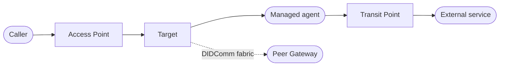

# Affinidi Trust Fabric - Agent Gateway

_The control layer for agentic AI._

[](LICENSE) [](Cargo.toml) [](https://docs.affinidi.com/products/affinidi-trust-fabric/agent-gateway/) [](https://github.com/affinidi-ai/agent-gateway/issues)

Agent Gateway is an intercepting proxy for AI agents. It sits between callers and the
agents it manages, and applies identity verification, policy evaluation, trust-registry
lookups, and payment controls to traffic in both directions.

It is protocol-aware rather than a generic network proxy: it speaks A2A, MCP, and
DIDComm natively, so it can read and act on agent traffic instead of just forwarding it.

Agent Gateway is part of the Affinidi Trust Fabric, alongside Agent Stream, which governs
the calls agents make to model providers.

> [!IMPORTANT]
> **Project status:** Agent Gateway is under active development. Interfaces and stored
> configuration may change between minor releases. Evaluate its security, privacy,
> availability, and regulatory properties before production use.

## Why use it

- **No changes to your agent code.** Point the caller at the gateway's URL instead of the
  destination. Controls that answer the caller, such as a payment challenge or a consent
  prompt, need the caller to handle that response.
- **One place to enforce access.** Identity, policy, and rate limits live in the gateway
  rather than being rebuilt in every agent and every backend.
- **Agent identity that survives a trust boundary.** Agents get verifiable decentralised
  identifiers, so a partner organisation can check who is calling and what vouches for
  them.
- **Credentials stay out of agents.** The gateway can inject API keys and tokens on the
  way out, so an agent does not need to hold the credential for the service it calls.
- **Visibility into what agents actually did.** Every request produces metrics and logs,
  and traces when OpenTelemetry is configured. A policy denial is logged with its reason
  and the policy version that made it.
- **Evidence for an auditor.** When enabled, an audit log records policy decisions, trust
  checks, and delegated credential use, each policy decision tied to the exact policy
  version that made it. On Transit Point calls, policy decisions also travel inside a
  presentation signed by the gateway.
- **Payment controls for metered services.** x402 and MPP settlement, so an agent can pay
  for what it calls under limits you set.

[`docs/CAPABILITIES.md`](docs/CAPABILITIES.md) describes every capability in detail.

## How it works

Say agent A calls MCP server B. Without the gateway, A needs its own network path to B,
which for a SaaS product or a public MCP server means direct internet access, and A holds
whatever credential B requires.

With the gateway, A calls a listener on the gateway instead, and the gateway forwards to
B. A only needs to reach the gateway. With nothing else configured, the gateway forwards
the traffic, which now passes through a point you control. Neither
A nor B needs a code change.


From there you add controls without touching either side: inject the credential for B,
require a policy to pass, check a trust registry, rate limit, or record the exchange.

Two gateways can also be connected, so a call can cross an organisational boundary and
the agent's identity still means something on the other side. That path runs over DIDComm
v2.1 through a mediator.


## Moving parts



An **Agent Surface** is the configuration and runtime unit for one managed agent. Its
**Access Point** receives inbound traffic, its **Target** identifies the managed agent's
endpoint, and optional **Transit Points** control the traffic that agent initiates. A
`fabric://` Target routes to another gateway, with each gateway keeping its own trust
boundary.

## What it looks like

Everything is configured and watched from a web dashboard served by the gateway itself.


Each surface is built on a canvas by dragging in elements such as caller context,
identity, policy, and credential delegation. The same surface can be edited as JSON, and we plan to
provide a CLI and SDK for automating it.


## Quickstart

### Deploy an appliance

Follow the hosted [Agent Gateway Quickstart](https://docs.affinidi.com/products/affinidi-trust-fabric/agent-gateway/get-started/)
to deploy an appliance, create your first surface, add access controls, and monitor
traffic.

### Build from source

The primary local path uses macOS with Homebrew. Install Git, Rust `1.95.0` or newer,
Node.js with npm, and a WebAuthn-capable browser and authenticator, then run:

```bash
git clone https://github.com/affinidi-ai/agent-gateway.git
cd agent-gateway
make install-deps
make run-debug
```

Complete passkey registration in the browser window opened by the run script. It uses the
WebAuthn origin generated in `envs/local/config/gateway.json`. Then check the local HTTPS
backend:

```bash
curl -k https://localhost:8443/api/v1/health
curl -k https://localhost:8443/api/v1/alive
```

[`docs/development/GETTING_STARTED.md`](docs/development/GETTING_STARTED.md) covers the
full source-build path, including Linux setup, expected responses, reset, and
troubleshooting.

## What is in this repository

One Rust binary, `agent-gateway`, built from [`src/`](src/), plus a React dashboard served
from the same process and built from [`www/default/`](www/default/). About 270,000 lines
of Rust across 54 top-level modules. No database and no sidecar: state lives in an in-memory cache
backed by JSON files on disk.

[`ARCHITECTURE.md`](ARCHITECTURE.md) maps the system to the source tree.

## Documentation

Everything needed to understand and build this repository is in it. The hosted
documentation adds procedures for deploying and operating an appliance. Where the two
differ, repository documentation describes this source revision exactly.

| Goal | Documentation |
| --- | --- |
| Learn what Agent Gateway can do | [`docs/CAPABILITIES.md`](docs/CAPABILITIES.md) |
| Understand how the system works and where the code is | [`ARCHITECTURE.md`](ARCHITECTURE.md) |
| Build and run this source locally | [`docs/development/GETTING_STARTED.md`](docs/development/GETTING_STARTED.md) |
| Develop, debug, and test | [`docs/development/DEVELOPMENT.md`](docs/development/DEVELOPMENT.md) |
| Configure an appliance | [`docs/CONFIGURATION_REFERENCE.md`](docs/CONFIGURATION_REFERENCE.md) |
| Inspect revision-specific internals | [`docs/README.md`](docs/README.md) |
| Contribute a change | [`CONTRIBUTING.md`](CONTRIBUTING.md) |
| Deploy and operate a hosted appliance | [Hosted product documentation](https://docs.affinidi.com/products/affinidi-trust-fabric/agent-gateway/) |

## Protocol status

| Protocol | Status in this source revision |
| --- | --- |
| A2A `1.0` | Active |
| A2A `0.3` | Accepted while `a2a_legacy_compatibility` is on, the default |
| MCP `2024-11-05` | Active |
| MCP `2026-07-28` | Active on every MCP endpoint |
| DIDComm v2.1 | Available for Fabric transport |
| TRQP | Available for Trust Check |
| x402 and MPP | Available when configured |
| AP2 | Experimental and disabled by default |

Use the hosted [protocol documentation](https://docs.affinidi.com/products/affinidi-trust-fabric/agent-gateway/concepts/protocols/)
for integration guidance. [`docs/PROTOCOLS.md`](docs/PROTOCOLS.md) records the exact
limitations and compatibility behaviour of this source revision.

## Built on open standards

Agent Gateway uses open standards so that identity and trust work across organisational
and cloud boundaries, not only inside one deployment.

| Area | Standards |
| --- | --- |
| Agent protocols | A2A, MCP, AP2, x402 |
| Identity | W3C Decentralised Identifiers, with `did:webvh`, `did:web`, `did:peer`, and `did:key` |
| Credentials | W3C Verifiable Credentials and Verifiable Presentations |
| Messaging | DIDComm v2.1, including Out Of Band invitations |
| Trust registries | Trust Registry Query Protocol v2, with an open-source registry in [`affinidi-trust-registry-rs`](https://github.com/affinidi/affinidi-trust-registry-rs) |
| Delegation | OAuth 2.0 three-legged flows, RFC 8693 token exchange |

The Affinidi technology stack adheres to open standards from the W3C, the Decentralized
Identity Foundation, the Linux Foundation, and the EU Digital Identity (EUDI) programme.
Affinidi has also donated open-source implementations to some of these bodies, among
them [`didwebvh-rs`](https://github.com/decentralized-identity/didwebvh-rs), the did:webvh
library Agent Gateway itself uses, now hosted by the Decentralized Identity Foundation.

## Contributing and support

Contributions are welcome. Read [`CONTRIBUTING.md`](CONTRIBUTING.md) for the
discuss-first workflow, required checks, tests, and changelog fragments. Participation is
governed by the [Code of Conduct](CONTRIBUTING.md#code-of-conduct).

For usage questions, use the [Affinidi support form](https://share.hsforms.com/1i-4HKZRXSsmENzXtPdIG4g8oa2v).
For reproducible technical problems or feature requests, search or open a
[GitHub issue](https://github.com/affinidi-ai/agent-gateway/issues).

To report a security vulnerability, follow the private disclosure process in
[`SECURITY.md`](SECURITY.md).

## License

Licensed under the Apache License 2.0. See [`LICENSE`](LICENSE).
