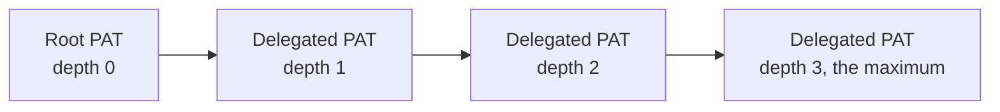

# Management Access Tokens and Tenant Ownership

Revision-specific internals of management personal access tokens (PATs) and
tenant ownership of management records. This documents the behavior of the
checked-out source. See
[`RBAC.md`](RBAC.md) for management RBAC enforcement and the permissions
response contract.

## Token contract

`src/access_tokens/` implements management PATs using a canonical
management-token contract: `agpat_` plus 32 random base64url bytes, `agat_`
record IDs, SHA-256 hash-only persistence, O(1) active-hash lookup, optional
immutable expiry, 60-second `last_used_at` write coalescing, immutable
user/expiry, and idempotent DELETE revocation. Per-token mutation locks serialize
update/revoke/usage writes so a stale usage write cannot undo revocation; revoked
hashes are removed from the authentication index. Create accepts only exact
RFC 3339 `expires_at`, bounded to the future and at most 3650 days; omission means
never, and the removed `expires_in_days` field is rejected so affected clients
must calculate an exact timestamp and reissue their tokens.

## Resource patterns and required headers

`required_headers` and `resource_pattern` retain the shared wire fields, but
Agent Gateway constrains their values: blank means appliance-wide; every nonblank
pattern must be `TENANT:${one-header}:<bounded-resource-selector>`, where every
selector alternative starts with a canonical resource kind. Static patterns,
repeated/multiple placeholders, bare `.*`, tenant-wide catch-alls, and unknown
resource kinds are rejected. The holder chooses the validated header value on
each request, so Agent Gateway requires an exact-literal header pattern for
single-tenant tokens: a broad/multi-valued selector is rejected at issue time and
fails closed with `403` at auth time unless the deployment configures
`tenancy.trusted_tenant_header` (header name + an explicit
`edge_strips_client_values` assertion) for a proxy that authenticates the caller
and overwrites/strips the header before it reaches the gateway. UUID-backed
resources are matched as `TENANT:<tenant>:<resource-kind>:<resource-id>`.

Header validation patterns are fully anchored and must match the entire sample
value (`\d` matches one digit; use `\d{4}` for four).

## PAT-to-PAT delegation

PAT-to-PAT delegation carries additive `parent_token_id` / `delegation_depth`
lineage, is capped at three hops, and is serialized under a store-wide delegation
lock. Authentication walks the bounded lineage and fails closed on an inactive,
missing, cyclic, scope-inconsistent, or depth-inconsistent ancestor; revocation
cascades to every transitive descendant under the same lock, so child creation
cannot race an ancestor revoke. A PAT carrying a resource pattern or required
headers cannot create or edit PATs; only appliance-wide/coarse feature-scoped
PATs can delegate non-empty feature-scope subsets. PAT-authenticated
list/get/update/revoke operations are confined to the caller token and its
descendants, while interactive administrators retain appliance-wide token
administration. Records predating lineage remain backward-compatible roots.

Revoking any token revokes everything to its right. Authenticating a token walks back to
the root and fails if any ancestor is inactive, missing, or inconsistent.

## Tenant ownership

Tenant-owned top-level management records carry an optional `tenant_id`. Its absence
means appliance-global, for backward compatibility.

A tenant PAT sees same-tenant records plus global ones. Dashboard sessions remain
appliance-wide.

### What a tenant PAT may do with global records

| Record kind | Read and reference | Create, update, delete |
| --- | --- | --- |
| Policy definitions, Agent Surfaces, MCP Proxies, A2A Proxies | Yes | No, including surface `PATCH` and variant writes |
| `/v1/policy-assignments` | Yes | No |
| API keys of a global Agent Surface | List and read | No, `403` on create, revoke, rotate, and delete |
| Appliance-wide Gateway records (peer gateways) | Yes | No, `403` on update, exposure, policy, delete, issuer, `POST /v1/gateways/{id}/approve` and `PUT /v1/gateways/{id}/integrations` |

Peers that arrive through the inbound Fabric handshake are always appliance-wide, so a tenant
PAT cannot approve, rename or reconfigure them. Approving one needs an appliance-wide
credential, because an active appliance-wide peer reaches every tenant's Fabric surfaces.

A tenant-owned Gateway record is limited the other way: its peer reaches only its own tenant's
Agent Surfaces and appliance-wide ones over Fabric, whatever its exposure list says. See
[`FABRIC.md`](FABRIC.md#fabric-receive-pipeline).

### Ownership of child records

API keys and Connection Points take their ownership from their Agent Surface or Gateway
parent, and every child ID is checked against the PAT pattern independently.

MCP Proxy creation accepts an optional caller-chosen `id`, so a PAT's resource pattern can
confine it to a prefix such as `mcp-proxies:boris-.*`. The value is 1 to 128 letters,
digits, `-`, or `_`, starting with a letter or digit; a UUID is assigned when it is
absent. An `id` that already exists is refused with `409` rather than replacing the
record.

### Orphaned API keys

When an Agent Surface is deleted without its API-key records, parent ownership can no
longer be established.

| Caller | Access to the orphaned keys |
| --- | --- |
| Unrestricted session | List and delete, for cleanup |
| Appliance-wide PAT with neither a resource pattern nor required-header gates | List and delete, for cleanup |
| Tenant-, resource-, or header-gated PAT | None. It can neither see nor mutate them. |

Get, revoke, and rotate stay parent-gated for every caller. A permanent deletion is
attributed to the authenticated actor and records whether it was orphan cleanup.

### References between records

- A tenant-owned resource may reference same-tenant or global dependencies.
- A global resource may reference only global dependencies.
- A referenced resource must also match the PAT pattern before the write is persisted.

### What tenancy does not partition

Runtime stores, listeners, policy compilation, hot reload, and the data-plane protocols
are unpartitioned. Tenancy constrains management records, not the running data plane.

Every PAT-accessible management route is feature-gated, so the bound user's role and the
PAT's feature scopes both apply. A scoped PAT may create or update tokens only with a
non-empty subset of its own scopes.

Resource-scoped PAT routing is fail-closed for unknown nested tenant-resource
paths: only an audited allowlist of handler-enforced actions may proceed. Mediator
trust-ping, Issuer Trust Registry retry, and Trust Registry record-list/reconnect
enforce owning-record tenancy plus canonical scope; Trust Registry
list/get/action routes also carry explicit feature guards. Tenant-ownership
impact reads filter the root and every graph edge by tenant/scope, and
resource-scoped PATs cannot reassign ownership. Surface reference validation
includes both Trust Check legs and every Trust Recorder entry. MCP tool discovery
requires MCP Proxy edit plus Secret view authority, validates raw endpoints with
`validate_resolved_url`, dials through a per-request Strict-pinned,
redirect-disabled client (`egress::pinned_strict_client`), independently
authorizes stored Proxy and Secret references, and requires resource-scoped PATs
to discover through a stored MCP Proxy rather than a caller-supplied endpoint.

Ownership changes are administrator-only: `GET
/v1/tenant-ownership/{kind}/{id}/impact` reports incoming/outgoing references and
`PUT /v1/tenant-ownership/{kind}/{id}` changes `tenant_id`, returning `409` if any
reference would become incompatible. The self Gateway and built-in Surface
Templates are immovable; child API keys and Connection Points move with their
parent.

## Dashboard

Management tokens are managed from the **Access Tokens** tab of the Secrets page in
[`www/default`](../www/default/), gated on the `access_tokens.*` permissions in
[`RBAC.md`](RBAC.md).

The tab's behaviour is specified in
[`www/default/AGENTS.md`](../www/default/AGENTS.md#access-tokens-page), which is the
owning document: routes and layout, the scope pills, list-row behaviour, the expiry
control, saving and the one-time secret, and the advanced resource-scoping editor and its
tester.

Two points from that specification matter to the token contract itself rather than to the
interface:

- A created secret is shown once. The dashboard clears it on route exit or unmount, which
  is why there is no endpoint to retrieve it again.
- The resource-pattern editor enforces the same canonical grammar described under
  [Resource patterns and required headers](#resource-patterns-and-required-headers). A
  pattern the editor refuses is one the API would also refuse.

### CLI browser login

The `fabric` CLI does not use a management token. It signs in through the dashboard:
`/api/auth/cli/authorize` sends the browser through the normal passkey or SAML sign-in to a
consent page, `/api/auth/cli/consent` issues a single-use code once the signed-in, approved
user allows it, and the CLI redeems that code with its PKCE verifier at
`/api/auth/cli/exchange`. What the CLI receives is the browser's own dashboard session. It
carries the user's full role and cannot be revoked on its own, and signing out on either side
ends both: the browser signing out, or the CLI calling `/api/auth/logout`. Pending codes live
in memory for two minutes, so CLI login works with one gateway instance. With more than one
replica, an exchange that reaches a different instance than the consent gets `invalid_grant`;
session stickiness does not help, because the exchange request carries no browser cookie.
Limits and the full flow are in [`CAPABILITIES.md`](CAPABILITIES.md#managing-the-gateway).

The `fabric` CLI lives in its own repository, so this is the contract it must follow:

| Step | Request | Response |
| --- | --- | --- |
| Authorize (browser opened by the CLI) | `GET /api/auth/cli/authorize?port=&state=&challenge=`. `port` is 1024 to 65535, `state` is 1 to 256 bytes and returned unchanged, `challenge` is the 43 character base64url S256 hash of the verifier. Only S256 is supported, so there is no method parameter, and the names are not OAuth's `code_challenge`. | A redirect to sign-in, then to the consent page. |
| Callback (browser to the CLI) | `GET http://127.0.0.1:<port>/callback?code=&state=` after Allow, with a 36 character `code`. `GET http://127.0.0.1:<port>/callback?error=access_denied&error_description=&state=` after Cancel or for an account that is not approved. | Whatever page the CLI serves. |
| Exchange (CLI) | `POST /api/auth/cli/exchange` with `Content-Type: application/json` and `{"code", "verifier"}`, the verifier being 43 to 128 RFC 7636 characters. | `200` `{"session_token"}`, with no expiry field. On failure `{"error", "error_description"}`: `invalid_request` (`400`, or `415` for a body that is not JSON), `invalid_grant` (`400`), or `too_many_requests` (`429` with `Retry-After`). Every answer carries `Cache-Control: no-store`. |
