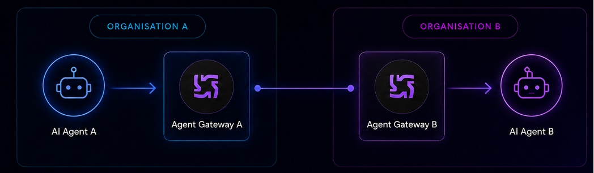
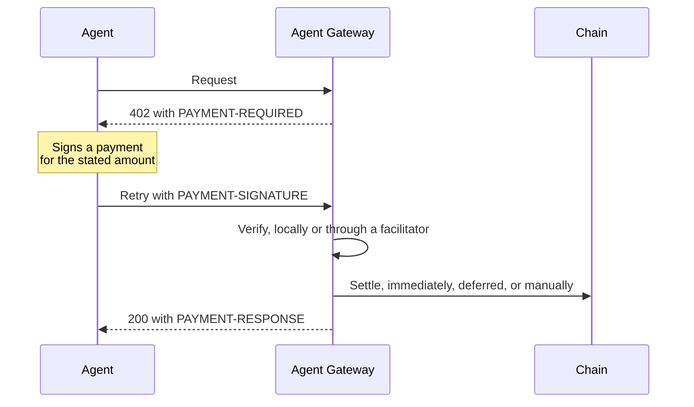
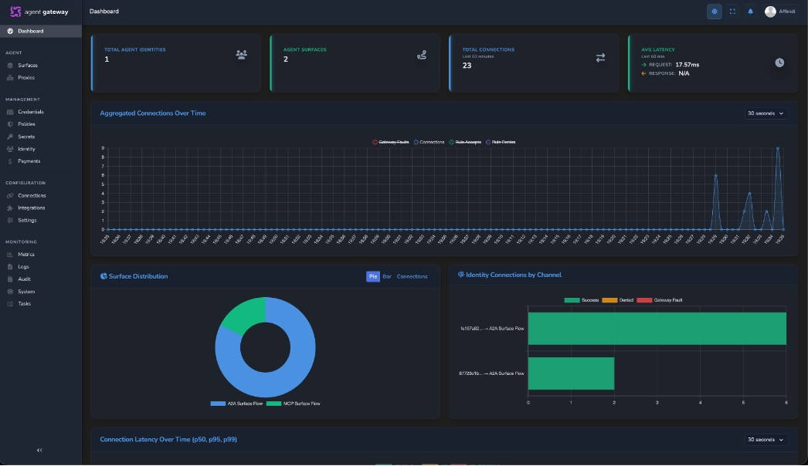
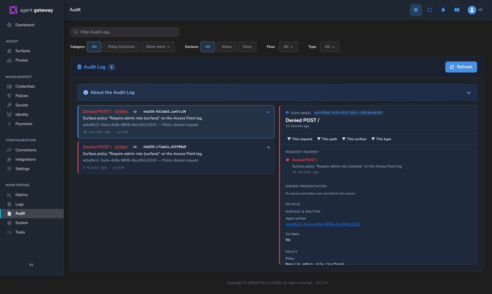

# Capabilities

What Agent Gateway can do, described from the point of view of someone deciding whether
it fits their problem.

This page is here so you can understand the product without leaving the repository. The
hosted [documentation](https://docs.affinidi.com/products/affinidi-trust-fabric/agent-gateway/)
covers the same capabilities as procedures for a deployed appliance. For how each one is
built, see [`ARCHITECTURE.md`](../ARCHITECTURE.md).

## What it solves

Agents are moving from isolated experiments to systems that retrieve data, execute
workflows, coordinate with other agents, and make decisions on behalf of people. A pilot
that was easy to run becomes hard to govern once it touches production systems: access to
those systems is unmanaged, what the agents do is hard to see, each team rebuilds its own
controls, and compliance risk grows.

Ordinary infrastructure was built for people and services, not for autonomous agents
acting across many systems, and leaves these questions open:

- How does an agent reach an internal or external service without holding the
  credential for it, or having its own route to the internet?
- How do you know which agent made a call, and on whose behalf?
- How do you apply the same access rules whichever protocol or provider an agent uses?
- How does an agent's identity keep its meaning when a call crosses into another
  organisation?

Agent Gateway answers them in one place, in front of the agents, without changing the
agents themselves.

## Protocol awareness

The gateway understands the protocols agents speak, so it enforces identity, policy, and
payment rules at the protocol level rather than as a generic HTTP proxy.

| Protocol | Role |
| --- | --- |
| A2A | Agent-to-agent calls, including agent cards and extensions |
| MCP | Agent-to-tool calls, including tool discovery and invocation |
| AP2 | Agent payments over A2A. Experimental and off by default. |
| DIDComm v2.1 | Encrypted transport between gateways |
| x402, MPP | Payment settlement for metered services |

It can also expose a non-A2A agent, such as a Microsoft Copilot Studio agent reached over
Direct Line, as an A2A endpoint, and expose a REST API as a set of MCP tools.

Exact supported revisions and their limits are in [`PROTOCOLS.md`](PROTOCOLS.md).

## Agent identity

Identity systems built for people are usually tied to one organisation's directory, so
an identity stops meaning anything once a call leaves that organisation. A decentralised
identifier can be resolved and checked by anyone, without a shared directory and without
a connection to the system that issued it, so an agent's identity can be verified on the
far side of an organisational boundary.

Every agent passing through the gateway can be given a W3C Decentralised Identifier. The
gateway resolves it, verifies it, and forwards proof of it to backend services, without
any change to the agent's code.

### Identity from what the agent already sends

With payload extraction, the gateway reads an identity descriptor the agent already
carries, derives a stable identifier from it, and issues or reuses a DID for that exact
agent configuration. The same agent gets the same identity every time, with no manual
enrolment.

| Protocol | Where the descriptor travels |
| --- | --- |
| A2A | As a protocol extension. The agent names `https://fabric.affinidi.io/extensions/agent-identity/v1` in its extensions array and puts the descriptor under that key in `metadata`. |
| MCP | In the JSON-RPC `_meta` field, under `_meta.agentIdentity`, keeping identity separate from tool parameters. |

The descriptor holds whatever fields you choose, such as the model, provisioning, or
application. You pick which fields are significant, for example the model provider and
model. The gateway hashes those, looks up or mints a `did:webvh` identity with its own key
pair, and attaches a signed identity credential to the response, replacing the raw
descriptor with a verifiable one.

Other binding methods need no special payload at all: the identity can come from an mTLS
client certificate, an API key, or a claim on a validated JWT. See
[`SOURCE_AUTH.md`](SOURCE_AUTH.md#managed-identity) for all five modes and how each is
treated by policy.

### Managed or owned

You choose how much of the identity the gateway manages, from fully managed to fully owned.

| Model | Who holds the key | How it works |
| --- | --- | --- |
| Fully managed | The gateway | The gateway stores the agent's private key with its identity record, signs on its behalf, and issues verifiable credentials attesting facts about the agent. |
| Owned by the developer | The agent | Affinidi's Trust Developer Kit, a developer SDK, lets the developer take full ownership of DID and key generation and management if they choose. The gateway can then be configured to send the DID and any attestations signed by the agent code itself, and not manage the identity. |

### Resolvable identities

The gateway hosts the `did:webvh` logs for the identities it manages, so they resolve with
standard DID tooling such as the Universal Resolver. Its own DID is served at
`/.well-known/did.jsonl`, each managed agent's under `/dids/{path}/did.jsonl`, and surfaces,
issuers, trust registries, and Connection Points each at their own path. Each document
carries the verification methods and service endpoints another system needs to check a
signature.

## Federation across organisations

Two or more gateways can be connected, so a call crosses an organisational or network
boundary and the calling agent's identity still means something on the other side.
Deployments range from a single gateway, with every agent inside one trust boundary, to
chains of gateways across several organisations.

1. An agent calls Gateway 1 over A2A or MCP.
2. Gateway 1's surface has a `fabric://` Target naming a surface on Gateway 2. Instead of
   forwarding over HTTP, it wraps the request in an encrypted DIDComm v2.1 message.
3. Gateway 2 unwraps it, verifies the sender, and forwards the original request to the
   real destination: another agent, a proxy, or a REST API.

The identity of the calling agent travels with the request, so Gateway 2 can confirm who
is asking and why. Neither agent needs to know any of this is happening.

Each gateway on the path applies its own policy and records its own telemetry, so every
hop is governed and observable by the organisation that runs it.

| Use case | What it enables |
| --- | --- |
| Cross-organisation calls | Company A's agents call Company B's services through linked gateways, and each side keeps full control of its own policies and observability. |
| Network boundaries | An agent on an internal network reaches an external service through a gateway in the DMZ, which forwards to a gateway in a public cloud, with the traffic between the gateways encrypted and the calling agent's identity verified on arrival. |

Gateways link through **Connection Points**, each a persistent, DID-authenticated,
bidirectional link to another gateway through a DIDComm mediator. See
[`FABRIC.md`](FABRIC.md).

## Carrying caller context across calls

When a managed agent calls out through a Transit Point, the gateway can attach a signed
**workload binding**: a verifiable presentation that travels with the call and records
who the agent is acting for and what was allowed on the way.

| It carries | Detail |
| --- | --- |
| The agent's identity | The managed agent's DID |
| Caller context | Only the claim names an operator allowlists, copied verbatim from the transit token or the bearer JWT on the call |
| Policy decisions | The allow and deny outcomes reached for this request |
| Trace, intent, target | So the receiving side can tie the call back to its origin |

Because the presentation ties the person the agent acts for to the agent's own identity
and to the decisions made, both the human and the agent are accountable for the call.

The allowlist is the disclosure boundary: a claim that is not listed never leaves the
gateway, and a listed claim that is missing is omitted rather than sent empty. The
receiving gateway verifies the presentation and exposes it to its own policy as
`input.identity_binding`, so a partner can decide based on who the agent is acting for.
See [`FABRIC.md`](FABRIC.md#peer-issuer-dids).

## Traffic management

Traffic controls, configured per surface and applied without a restart. Each applies to
both A2A and MCP surfaces and can be enabled on its own.

| Control | Behaviour |
| --- | --- |
| Timeouts | Three levels: overall request, connect (DNS and TCP handshake), and idle (the gap between data frames). A slow or unresponsive backend cannot hang a request indefinitely. |
| Retries | Exponential backoff with configurable attempts, initial delay, maximum delay, and multiplier. You choose which status codes are retriable, typically 502, 503, and 504. |
| Circuit breaker | Starts closed. After a configured run of consecutive failures it opens, and requests fail immediately without reaching the backend. After a timeout it goes half-open and lets a few test requests through; success closes it, failure reopens it. |
| Traffic mirroring | Sends a percentage of production traffic to a shadow endpoint, fire-and-forget or waiting for the reply, with its own timeout. Mirrored requests carry an `X-Mirrored-Request` header. |
| Variants | A named alternate configuration of a surface, reachable at its own route alias, so a change can run beside the live version without a separate surface record. Variants are selected by alias, not by traffic share. |

The circuit breaker wraps the retry logic, which protects both the gateway and a failing
backend from being flooded during an outage.

## Access control

Several independent layers, evaluated before a request is forwarded.

| Layer | What it controls |
| --- | --- |
| Source authentication | Who the caller is: JWT bearer, API key, API key provider, DID Auth, or mTLS. |
| Rate limiting | A token bucket per surface, with a rate and a burst size. An empty bucket answers 429 with a `Retry-After` header. |
| Policy | Rego policies, evaluated by an embedded engine, over the request method, path, headers, body, and agent identity. |
| MCP tool policies | An OPA policy attached to an individual MCP tool. |
| MCP tool gating | An ordered allow/deny firewall over MCP tool names, matched by pattern and optionally activated by a policy condition. It hides tools from discovery and blocks their invocation. |

A missing or invalid caller credential does not by itself refuse the request. The request
continues with no caller identity and the failure is passed to policy, so a surface that
must reject unauthenticated callers needs a policy that denies them. See
[`POLICY.md`](POLICY.md#failed-caller-authentication).

A policy can express rules such as "only agents using a particular model may call these
tools", "these endpoints are reachable only by agents from one cloud provider", or "every
call must carry a user context from a given Microsoft Entra ID tenant, and that user must
be in a specific group".

There are two policy planes: an appliance-wide gateway plane evaluated first, whose deny
is final, and a per-surface plane. See [`POLICY.md`](POLICY.md) and
[`MCP_TOOL_GATING.md`](MCP_TOOL_GATING.md).

### Management access

The management API and dashboard have their own role-based access control, with three
roles.

| Role | Can |
| --- | --- |
| Administrator | Everything, including surfaces, gateways, trust registries, users, secrets, API keys, access tokens, policies, and system settings. |
| Power user | Manage mediators, MCP and A2A proxies, issuers, and notifications; capture a surface's traffic; view and retry payments. |
| User | Read most resources. |

These are the built-in defaults. The mapping from permission to role is configurable in
`rbac.json`. The dashboard hides
controls a user's role does not allow, and the backend checks the permission on every
protected route. See [`RBAC.md`](RBAC.md), and [`ACCESS_TOKENS.md`](ACCESS_TOKENS.md) for scoped
tokens that narrow a role further.

## Token exchange

The gateway includes an OAuth token service, so an agent can trade a proof of identity for
a short-lived token scoped to one audience.

| Endpoint | Purpose |
| --- | --- |
| `POST /oauth2/token` | RFC 8693 token exchange, which can also issue an ID-JAG, and RFC 7523 ID-JAG redemption |
| `GET /oauth2/jwks.json` | Public keys for verifying issued tokens |
| `GET /.well-known/oauth-authorization-server` | RFC 8414 metadata |

An issued token carries an RFC 8693 `act` chain recording who acted for whom. Every mint is
authorised by a gateway policy, and each connection can run Trust Check queries first. See
[`STS.md`](STS.md).

## Credential delegation

A managed agent can call a third-party API such as Google or GitHub with **the user's own
credentials**, obtained with that user's consent, without ever holding them.

- Operators define credential providers: three-legged OAuth, client credentials, or a
  static API key.
- A surface binds a provider, chooses the scopes, and decides how the token is injected.
- When a token is missing, the gateway asks for consent in one of three ways: a
  `consent_required` response, a refusal at session start until every token exists, or an
  MCP elicitation prompt.
- Tokens are kept per agent, user, and provider, and refreshed when they expire.

See [`CREDENTIAL_DELEGATION.md`](CREDENTIAL_DELEGATION.md).

## Trust registries

The gateway connects to trust registries over DIDComm and asks them, using the Trust
Registry Query Protocol, whether an agent is recognised or authorised. Any registry that
answers TRQP over DIDComm works. Affinidi Radix is one, built on the open-source
[`affinidi-trust-registry-rs`](https://github.com/affinidi/affinidi-trust-registry-rs), a Rust trust registry that answers TRQP v2.0
queries over HTTPS and DIDComm.

| Capability | What it does |
| --- | --- |
| Trust Check | Runs registry queries for the caller or the target on each request and hands the results to policy. It never denies on its own; the policy decides. |
| Trust Recorder | Writes an agent's record into a registry when it is seen, so recognition builds up without manual enrolment |

See [`POLICY.md`](POLICY.md#trust-check) and
[`SOURCE_AUTH.md`](SOURCE_AUTH.md#trust-recorder).

## Rewriting traffic in flight

The gateway can validate what arrives and add to what leaves, so it works as middleware
between agents.

**Extension validation** checks that an incoming A2A message declares the extension URIs a
surface requires, and that their metadata holds every mandatory field with the expected
type. A failure returns a JSON-RPC error naming exactly which fields are missing or
malformed.

**Metadata injection** merges operator-defined data into every outgoing request without
the sending agent knowing. Typical uses:

- Tenant IDs for multi-tenant backends.
- API keys, shared secrets, or tokens drawn from the secrets store.
- Version numbers or feature flags for A/B testing.
- Routing hints for downstream services.

**Identity credential injection** adds the agent's DID and a verifiable presentation to
outgoing messages, so a downstream service can verify the agent cryptographically.

**Secret resolution** replaces placeholders in a surface's configuration with values from
a secrets store, such as AWS Secrets Manager, at request time. Secrets never have to be
written into the surface itself.

## Payments

| Protocol | Behaviour |
| --- | --- |
| x402 | Blockchain-settled payment for HTTP requests. The gateway can also act as an x402 facilitator, over HTTP at `/api/x402/verify`, `/api/x402/settle`, and `/api/x402/supported`, and over the fabric for other gateways. |
| MPP | Machine Payments Protocol authentication. |

A surface can require payment before a request reaches its target, and an agent can pay an
upstream service automatically under limits you set.

## Observability

| Capability | Behaviour |
| --- | --- |
| Metrics to several backends | Local JSON files feed the dashboard, while Prometheus, AWS CloudWatch, and OpenTelemetry collectors receive the same metrics for long-term analysis. All can be active at once. |
| Connection tracking | Every request is recorded with its timestamp, surface, source, destination, status, latency, trace ID, direction, and the agent's identity hash, and kept for the metrics retention window, six hours by default. For lasting evidence, use the audit log. |
| Request correlation | Every request gets a trace ID, carried as an `X-Gateway-Trace-Id` header and attached to the request's log entries. |
| Policy decision audit | Every policy evaluation records which policy version decided and why. |
| Live dashboard | A WebSocket stream updates the dashboard as traffic flows. |
| Payload capture | Start a capture session on a surface to see four stages side by side: the request as the client sent it, as the gateway forwarded it, the response as the target returned it, and as the gateway returned it. |
| Task monitoring | Active connections, totals, and error counts per surface, connection point, and proxy. |
| System performance | The underlying host's resource use alongside the gateway's own. |

The in-appliance view is for a point-in-time picture of the system. The external backends
are for retention and analysis. See [`OBSERVABILITY.md`](OBSERVABILITY.md).

## Audit log

Logs are for diagnosing an incident. The **audit log** is for showing an auditor what
the gateway authorised, for whom, and under which policy.

| Records | When |
| --- | --- |
| Policy decisions | A gateway, surface, MCP tool, or response policy allows or denies a request |
| Trust checks | A trust registry query returns a result to policy |
| Trace terminated | A surface starts a fresh trace at an organisational boundary; the entry links the two trace IDs |
| VP injected | The managed agent's identity presentation is attached to a request or response |
| Token injected | A delegated credential is used on a user's behalf |
| Consent granted | A user completes consent and a token is stored |
| Payments | An x402 or MPP payment is challenged, verified, or settled, locally or through another gateway |

Entries are written as JSON Lines to a file that rotates daily. Each policy decision
records the exact policy version and content hash that decided. On calls through a Transit
Point, policy decisions are also carried inside the signed workload-binding presentation,
so the receiving side can check them against the gateway's own key. Auditing is off until
enabled in the dashboard, where you choose to record policy decisions, trust checks, and
identity events.

Each record can also be forwarded as it is written to a Kafka, Kinesis, Pulsar, or Redis
stream, or a webhook, so a copy is kept outside the appliance. Forwarding is best-effort. See
[`OBSERVABILITY.md`](OBSERVABILITY.md#governance-audit-forwarding).

## Onboarding an agent

When you do not yet know exactly what an agent sends, a temporary Access Point with an
automatic expiry lets you sample its traffic. The gateway derives schema metadata from the
payloads it sees, which you then use to configure validation and identity extraction.

- A `GET` returns the agent card of a temporary onboarding agent, which requires the
  agent identity extension.
- A `POST` accepts an A2A or MCP message and answers it locally. Nothing is forwarded, and
  authentication, policy, and payment checks do not run, so the endpoint is for observing
  traffic only.

After onboarding, payload capture lets you watch the traffic at every stage. See
[`AGENT_ONBOARDING_CAPTURE.md`](AGENT_ONBOARDING_CAPTURE.md).

## Managing the gateway

Everything is managed from a web dashboard, signed into with a passkey or, for enterprise
deployments, SAML single sign-on. A SAML sign-in must return from the identity provider within
five minutes and is accepted once. `/api/saml/login` allows 20 sign-ins per source address per
minute by default (`login_throttle` in `saml.json`) and answers 429 with `Retry-After` past
that. The source address is read from `X-Forwarded-For` or `Forwarded`, which a caller can set
unless a proxy overwrites it, so a request without one is not limited per address. The backstop
is a cap of 1000 unfinished SAML sign-ins for the whole gateway; past that, `/api/saml/login`
answers 503 until older ones expire.

The `fabric` CLI signs in through the browser. It opens `/api/auth/cli/authorize` with a
loopback port and a PKCE challenge. After the dashboard sign-in (passkey or SAML) the browser
shows a confirmation page that names the signed-in user and the loopback port. Only when the
user chooses Allow does the dashboard request a short-lived, single-use code and return it to
`127.0.0.1`. Cancel issues nothing. The CLI redeems the code with its PKCE verifier at
`/api/auth/cli/exchange`, so the session token never appears in a URL. The loopback port must
be 1024 or higher, the challenge is a 43 character S256 value, and the verifier is 43 to 128
characters as defined in RFC 7636. The consent page and its API must be served from the same
origin: the consent request is accepted only when `Sec-Fetch-Site` is `same-origin`, or when
`Origin` equals `Host` for clients that do not send it. The user must also be approved. After
sign-in, the browser returns only to the dashboard root or the CLI authorize path. For SAML the
gateway keeps that return target for five minutes and sends only a one-time 32 character key as
`RelayState`, within the 80 byte limit of the HTTP-Redirect binding. The assertion consumer
service uses the key once and checks the target again; an unknown, expired or reused key lands
on the dashboard root. A session holds at most three pending codes, and a new request replaces
the oldest. The authorize, consent and exchange endpoints each allow 20 requests per source
address per minute by default (`cli_login_throttle` in `gateway.json`). Past that they answer
429 with `Retry-After` before any code is issued or redeemed, and exchange answers in JSON. The
source address comes from `X-Forwarded-For` or `Forwarded`, which a caller can set unless a
proxy overwrites it, so a request without one is not limited per address. Codes stay safe
regardless, because each is random, single use, expires in two minutes and needs the PKCE
verifier.

Known limitations: the login hands the CLI the browser's own session, and the code store and the
SAML return targets are in memory, so the login works with one gateway instance.

Surfaces are built on a canvas by dragging in elements. Adding a caller context element
extracts the JWT claims a user presents to their agent from an identity provider such as
Microsoft Entra ID or Okta. Adding a policy element then enforces a rule over those claims
at runtime. The same surfaces can be written as JSON.

We plan to provide a CLI and SDK for automated configuration of Agent Gateway, for
scalable, reproducible, and automatable deployments.

The gateway integrates with the rest of an enterprise estate: OpenTelemetry for metrics,
logs, and traces; email and Slack for operator notifications; and webhooks for system
integration. See [`INTEGRATIONS.md`](INTEGRATIONS.md) for the events and publishers.

### Surface templates

New surfaces start from templates: complete starters for A2A and MCP, and partial
templates that add one capability, such as caller context, tool gating, credential
delegation, or an x402 payment wall. Built-in templates ship with the gateway, and
operators can save, import, and export their own. See the
[templates README](../config/examples/agent_surface_templates/README.md).

### Multiple teams on one appliance

Management access can be divided by tenant. A tenant-scoped access token sees its own
tenant's records plus shared global ones, and cannot change the global ones. Tokens can
delegate narrower tokens, up to three levels deep, and revoking one revokes everything
below it. Tenancy divides management, not traffic: surfaces still run on one shared data
plane. See [`ACCESS_TOKENS.md`](ACCESS_TOKENS.md).

### Terms and consent

The gateway can require dashboard users to accept terms before using the product: the
Affinidi Terms, your own Customer Terms, or both. Every acceptance is kept as an immutable
record of exactly which version was accepted and when, and a new version can be marked to
require everyone to accept it again. See [`TERMS_AND_CONSENT.md`](TERMS_AND_CONSENT.md).

## Deployment

Agent Gateway ships as an appliance. It is most commonly run as a managed appliance
hosted by Affinidi, and can also be run in your own infrastructure. From this repository
it builds and runs locally as a single binary; see
[`development/GETTING_STARTED.md`](development/GETTING_STARTED.md).

### Secrets and encryption at rest

Secrets live in the gateway's secrets store, on disk or in AWS, and configuration refers
to them rather than containing them: by environment variable, file, AWS Secrets Manager, or
AWS Systems Manager Parameter Store. Stored records can be encrypted at rest with a master
key from the environment, a file, or AWS KMS. Encryption at rest is off by default; enable
it on any appliance that holds real credentials. See
[`CONFIGURATION_REFERENCE.md`](CONFIGURATION_REFERENCE.md#secret-references).

### Backup and export

| Archive | Contains |
| --- | --- |
| `.agbak` | A full backup of the appliance's storage, encrypted with AES-256-GCM using the configured backup key |
| `.atgx` | A redacted export with personal data removed, encrypted to a recipient's public key, for sharing a configuration safely |

See [`DEVELOPMENT.md`](development/DEVELOPMENT.md#storage-export-and-backup).

### High availability

A gateway starts in **active** or **standby** mode. A standby instance holds no
listeners and reports itself unready, so a load balancer sends it no traffic. `SIGUSR1`
promotes it and `SIGUSR2` steps it down. Two instances sharing storage can keep their
caches in step with a periodic refresh. See
[`CONFIGURATION_RELOAD.md`](CONFIGURATION_RELOAD.md#server-mode).

## Related

- [`../README.md`](../README.md): the short introduction.
- [`../ARCHITECTURE.md`](../ARCHITECTURE.md): how each capability is built, and where.
- [`README.md`](README.md): every document in this repository.
