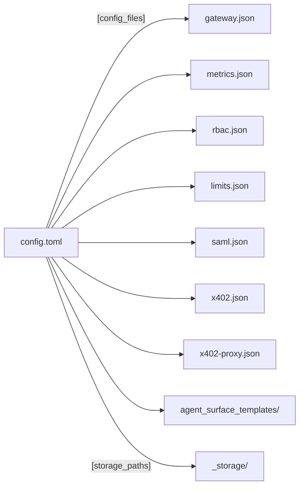

# Configuration Files

What each configuration file controls, when the gateway reads it, and what changes when
you set a field.

Use the hosted [Agent Gateway reference](https://docs.affinidi.com/products/affinidi-trust-fabric/agent-gateway/reference/)
for the supported operator-facing fields of the deployed product. This page describes
the files as the checked-out source reads them, including fields that exist in the
source but are not part of the product surface.

For the reload machinery, see [`CONFIGURATION_RELOAD.md`](CONFIGURATION_RELOAD.md). For
worked examples of every file, see [`config/examples/`](../config/examples/).

## Configuration files

The bootstrap TOML is the entry point. Everything else is named from it.

| File | Controls | Read |
| --- | --- | --- |
| `config.toml` | Bootstrap: storage paths, TLS, encryption, protocol defaults, server mode | Startup only |
| `gateway.json` | Listeners, routes, WebAuthn, DID domain, STS runtime | Startup only |
| `metrics.json` | OpenTelemetry, CloudWatch, and metrics export | Startup |
| `rbac.json` | Which management role each permission requires | Startup |
| `limits.json` | Resource count ceilings per record kind | Startup |
| `saml.json` | SAML identity provider, when `auth_mode = "saml"` | Startup |
| `x402.json` | x402 payment networks, assets, and facilitator settings | Startup |
| `x402-proxy.json` | Networks and wallets for the x402 proxy | Startup |
| `test-endpoints.json` | Payment requirements for the x402 test endpoints, when `facilitator_mode.enable_test_endpoints` is on | Startup |
| `agent_surface_templates/` | Surface templates seeded into the template store | Startup |

**No configuration file is re-read after startup.** `POST /v1/config/reload` rebuilds the
running surface set from `_storage/agent_surfaces/` and reuses the bootstrap and gateway
configuration already in memory
([`load_base_gateway_config`](../src/identity/handlers/config.rs)). Editing any file in
this table takes effect only on restart. See
[`CONFIGURATION_RELOAD.md`](CONFIGURATION_RELOAD.md).

`mpp.example.json` is not in this list. It is an example of the `mpp_policy` block that
belongs inside a surface record, not a file the gateway loads. See
[`config/examples/README.md`](../config/examples/README.md).

## Locating the files

`config.toml` names the others in its `[config_files]` table. A relative path resolves
against the directory holding `config.toml`, not the working directory. An absolute path
is used as given.

```toml
[config_files]
gateway = "../gateway.json"
metrics = "metrics.json"
rbac = "rbac.json"
limits = "limits.json"
saml = "saml.json"
x402 = "x402.json"
x402_proxy = "x402-proxy.json"
agent_surface_templates_dir = "agent_surface_templates"
```



Path resolution is in
[`BootstrapConfig::from_file`](../src/config/bootstrap.rs). `[storage_paths]` resolves
the same way.

## Settings with non-obvious effects

Each of these behaves differently from the obvious reading of the field.
`config.example.toml` also notes each one in a comment.

| Field | Behaviour |
| --- | --- |
| `server_mode` | Must be a top-level key, before any `[table]` header. Placed after one, TOML nests it under that table and the setting is silently ignored. |
| `a2a.message_expires_seconds` | Should be strictly greater than `a2a.fabric_gateway_timeout_ms / 1000`. Nothing validates this. When it is not, a fabric message expires at the mediator while the sending gateway is still waiting, and the failure looks like a timeout with no cause. |
| `backup_encryption_key` | Required. The service does not start without a resolvable value. |
| Unknown top-level keys | Ignored, not rejected. A misspelled key takes no effect and produces no error. |
| `encryption.key_source = "local"` | Does not encrypt. It writes plaintext `ENC[0::…]` envelopes and is for development only. |
| `encryption.field_encryption_enabled` | Reserved and not wired to any field. Leave it false. |

## Secret references

Any field documented as accepting a loader reference resolves through
[`src/config/loaders/`](../src/config/loaders/).

| Scheme | Resolves to |
| --- | --- |
| `env://NAME` | The value of environment variable `NAME` |
| `file://PATH` | The contents of `PATH` |
| `aws_secrets://NAME` | An AWS Secrets Manager secret |
| `aws_parameter_store://NAME` | An AWS Systems Manager parameter |
| `string://VALUE` | The literal value |
| anything else | Treated as a literal value |

A bare literal is accepted so that a value without a scheme still works. Prefer an
explicit scheme, because a literal key in a shared repository is a leaked key.

## Environment variables

| Variable | Used for | Required |
| --- | --- | --- |
| `AG_BACKUP_ENCRYPTION_KEY` | Encrypts the whole `.agbak` archive, AES-256-GCM. Referenced from `backup_encryption_key`. | Yes, unless that field resolves another way |
| `AG_MASTER_KEY` | Master key for encryption at rest when `encryption.key_source = "environment"`. Named by `encryption.key_env_var`. | When encryption at rest is enabled |
| `AG_IDENTITY_HASH_PEPPER` | HMAC pepper for agent DIDs derived from a credential: the `from_mtls`, `from_api_key`, and `from_jwt_claim` managed identity modes, and A2A proxy identities other than Entra agents. Payload extraction does not use it. When encryption at rest is off, it also keys the seal on the OAuth delegation `state`. Hex, or a loader reference, decoding to at least 32 bytes. | No. Without it, or with a value that is too short or cannot be resolved, an ephemeral pepper is used: those DIDs change on every restart, and with encryption at rest off, an OAuth consent started before a restart or on another replica fails at the callback. |
| `AG_LEGACY_BACKUP_KEYS` | Up to four comma-separated previous backup keys, tried after the current one. Only read when `legacy_backup_encryption_keys` names it. | No, migration only |
| `AFFINIDI_TERMS_REFRESH_INTERVAL_SECONDS` | How often the Affinidi Terms metadata is refreshed. Clamped to 60 to 3600 seconds in release builds. See [`TERMS_AND_CONSENT.md`](TERMS_AND_CONSENT.md#refresh-and-outage-behaviour). | No. Defaults to a random point between 55 and 60 minutes. |
| `AG_ALLOW_LOCAL_OOB` | Permits out-of-band invitations pointing at local addresses. Development only; must not be set in production. | No |
| `AG_ALLOW_LOCAL_A2A_PROXY` | Permits an A2A proxy to reach a local or private `base_url`. Development only; must not be set in production. | No |

Variables prefixed `AG_TEST_` and `AG_BDD_` exist for the test suites and have no role in
a deployment.

## `config.toml`

The bootstrap file. Startup only; changes need a restart.

| Section | Controls |
| --- | --- |
| top level | `channel_config_source`, AWS region and profile, `secrets_backend`, `backup_encryption_key`, `auth_mode`, session timeout, WebSocket auth and buffer, metrics retention and cache, `server_mode` |
| `[tenancy.trusted_tenant_header]` | Declares that an authenticated edge writes the tenant header. Enables broad header-derived PAT selectors. |
| `[encryption]` | Encryption at rest: on or off, key source, KMS settings |
| `[config_files]` | Where the other configuration files are |
| `[storage_paths]` | Where each record kind is persisted under `_storage/` |
| `[did_cache]` | DID document cache TTL, size, staleness, and path; whether DID resolution may contact private hosts |
| `[tls]` | Certificate and key paths, upstream verification |
| `[mcp]` | Default MCP revision, validation, timeouts, SSE and stdio transports. Gateway-originated `2026-07-28` consent needs `[mcp.continuations]`; see [`MCP_METADATA.md`](MCP_METADATA.md#protected-continuations). |
| `[reconnect_policy]` | Backoff for DIDComm connection points |
| `[oob_connection]` | How long an out-of-band pairing invitation stays pending |
| `[a2a]` | Default A2A revision, body size, timeouts, fabric timeouts and envelope lifetime, inbound cache sizing |
| `[logging]` | Level, JSON output, log directory |
| `[extension_inspection]` | Whether to parse A2A extensions, and which URIs to watch |

Fields and defaults are defined in [`src/config/bootstrap.rs`](../src/config/bootstrap.rs).
`config.example.toml` documents each field inline and is the most complete field-level
description that exists today.

### Fields worth understanding before a deployment

| Field | Effect |
| --- | --- |
| `server_mode` | `active` serves traffic. `standby` drops listeners and returns 503 on `/api/v1/health` while `/api/v1/alive` stays 200. `SIGUSR1` promotes, `SIGUSR2` steps down. |
| `cache_refresh_interval_secs` | Above 0, DashMap-backed stores reconcile with disk on that interval, so manual `_storage/` edits are picked up without a reload. Policy definitions and global policies do not participate. |
| `auth_mode` | `passkey` uses WebAuthn. `saml` requires `saml.json` and a configured identity provider. |
| `secrets_backend` | `filesystem` keeps secrets under `_storage/`. `aws` uses AWS. |
| `encryption.enabled` | Writes whole storage files as `.json.enc`. Losing the master key loses the data. |
| `metrics_retention_minutes` | Parsed but not used. Retention is the value in `_storage/settings/settings.json`, set from the dashboard, which defaults to 360 minutes whatever this field says. |
| `websocket_require_auth` | Off means an unauthenticated client can open the dashboard event stream. |
| `did_cache.allow_private_hosts` | Off (the default) refuses `did:web` and `did:webvh` on loopback, private-network and link-local hosts. On is needed for a local stack whose mediator lives on `localhost`, and reopens SSRF through attacker-supplied DIDs, cloud metadata included, so keep it off wherever an instance metadata service is reachable. See [`POLICY.md`](POLICY.md#did-resolution-host-policy). |

## `gateway.json`

Network topology and the surfaces served. The largest configuration file; the example is
1,137 lines.

| Key | Controls |
| --- | --- |
| `listeners` | Named bind addresses and ports. Access Points and Transit Points reference these. |
| `channels` | Route prefixes. The legacy wire name for surface routes. |
| `routes` | Route categories and their types, prefixes, and fallbacks |
| `mcp_proxies` | Route prefixes for MCP proxy endpoints |
| `did` | The domain used when generating `did:web` and `did:webvh` identifiers |
| `webauthn` | Relying-party ID and external origin for passkey registration |
| `integration` | Notification and webhook integration settings |
| `sts` | Security Token Service runtime settings. See [`STS.md`](STS.md). |
| `cli_login_throttle` | Optional per-client-IP limit on each `fabric` CLI login endpoint: `enabled` (default `false`) and `per_ip` `{requests, window_secs}` (default 20 per 60 seconds). Behind a load balancer, set `client_ip.trusted_proxies` first. |
| `client_ip` | `trusted_proxies`: proxy CIDRs whose `X-Forwarded-For` gives the client IP for the SAML and CLI login limits (default empty, so the TCP peer is the client). Each listed proxy must append the address it saw to `X-Forwarded-For` or overwrite it; `Forwarded` is read only when `X-Forwarded-For` is absent. Separate from `tls.client_auth.trusted_proxies`. |
| `facilitator_mode` | x402 facilitator behaviour |
| `cors` | Permitted dashboard origins |
| `terms`, `affinidi_terms_url` | Whether Terms acceptance is enforced, and where metadata is fetched |
| `logging` | Log redaction rules. Only `redaction` is read here; level, JSON output, and directory come from `config.toml`. |
| `oauth_callback_route` | Where OAuth redirects land |

The example file also carries `oob_connection` and `secrets` blocks, which `NetworkConfig`
does not read. Out-of-band invitation expiry is set by `[oob_connection]` in `config.toml`.
`NetworkConfig` also parses an `encryption` block but never uses it: encryption at rest is
set only by `[encryption]` in `config.toml`, so an `encryption` block in `gateway.json` leaves
storage unencrypted.

One listener can serve several Access Points, and one transit listener several Transit
Points. A request is matched to its surface by route.


The type is [`NetworkConfig`](../src/config/network.rs). Surfaces themselves are stored
records rather than file content; see [`src/config/agent_surface.rs`](../src/config/agent_surface.rs).

`webauthn.external_origin` is the value a browser must be visiting for passkey
registration to succeed. A mismatch is the most common local-setup failure, and
[`development/GETTING_STARTED.md`](development/GETTING_STARTED.md) treats the generated
value as the source of truth.

## `rbac.json`

Maps each management permission to the minimum role that holds it. Roles are
`administrator`, `poweruser`, and `user`.

```json
{
  "permissions": {
    "gateways.view": "user",
    "gateways.edit": "poweruser",
    "secrets.view": "administrator"
  }
}
```

The file is merged over the built-in defaults in `RbacConfig::default()`, so it only needs
the permissions you change; the example above lowers `gateways.edit`, which defaults to
`administrator`. A role value other than the three names denies the permission to every
role, `administrator` included. The file is read at startup, so a change needs a restart.

A missing or unparseable file does not stop startup: the gateway logs a warning and runs
with the built-in defaults. A misspelled permission key is accepted without an error and
matches nothing, so the permission it meant to change keeps its default. Check the startup
log before relying on tightened permissions.

Lowering a permission to a weaker role grants it to everyone at that role and above,
appliance-wide. Enforcement and the permissions response contract are in
[`RBAC.md`](RBAC.md). Management tokens narrow this further; see
[`ACCESS_TOKENS.md`](ACCESS_TOKENS.md).

## `limits.json`

Ceilings on how many records of each kind may exist. Each entry carries an operator-facing
`name` and `description` alongside the `limit`.

```json
{
  "limits": {
    "secrets": { "name": "Secrets (total)", "description": "…", "limit": 20 },
    "secrets.apikeys": { "name": "API Keys", "description": "…", "limit": 5 },
    "surfaces": { "name": "Surfaces (total)", "description": "…", "limit": 10 }
  }
}
```

Keys are hierarchical, and the two levels constrain different counts rather than the
same one. Adding a record checks the leaf dimension against its own count, and then, when
the key is dotted, checks the umbrella parent against the rollup total. With
`secrets.apikeys` at 5 and `secrets` at 20, you may hold 5 API keys and still add secrets
and certificates until the three together reach 20.

The umbrella total is a directly registered counter when one exists, otherwise the sum of
every registered `parent.*` child
([`enforce_add`](../src/config/limits_config.rs)).

| Situation | Result |
| --- | --- |
| Dimension listed in the file | Its `limit` applies |
| Dimension not listed | `DEFAULT_LIMIT` of 1,000,000 applies, which is effectively unconstrained |
| Dimension with no registered counter | Skipped, and the check passes |
| Limit reached | Creation fails. Existing records are unaffected. |

Counters are registered at startup in
[`src/server/orchestrator.rs`](../src/server/orchestrator.rs).

## `saml.json`

Read when `auth_mode = "saml"`. Ignored otherwise.

| Group | Fields |
| --- | --- |
| Identity provider | `idp_entity_id`, `idp_sso_url`, `idp_slo_url`, `idp_cert_path` |
| Service provider | `sp_entity_id`, `sp_acs_url`, `sp_key_path`, `sp_cert_path` |
| Security | `sign_requests`, `require_encrypted_assertions` |
| Sign-in throttle | `login_throttle`: `enabled` (default `false`) and `per_ip` `{requests, window_secs}` (default 20 per 60 seconds) per client IP for `/saml/login`. Behind a load balancer, set `client_ip.trusted_proxies` in `gateway.json` first. |
| Claims | `attribute_mapping` from SAML claim URI to user field |
| Roles | `role_mapping` from identity-provider role to gateway role |
| Directory | `graph_api` for Microsoft Entra ID group and profile lookup |

`role_mapping` decides what an authenticated user may do. A mapping that sends an
unexpected identity-provider role to `administrator` grants full management access, so
treat it as a security-relevant setting rather than a convenience.

## `x402.json` and `x402-proxy.json`

`x402.json` configures payment networks, assets, and facilitator behaviour for the x402
protocol. `x402-proxy.json` configures the `networks` and `wallets` the x402 proxy uses,
each network carrying a CAIP-2 `id`, `chain_type`, and `rpc_endpoint`.

Two `x402.json` sections control x402 storage. If `x402.json` fails to parse, the gateway
logs a warning and starts neither.

| Section | Effect |
| --- | --- |
| `settlement_storage` | Its presence starts the settlement worker, using `batch_size` (default 100), `settlement_interval_seconds` (default 60), and `max_retries` (default 3) |
| `transaction_storage` | When present, transaction records are stored at `filesystem_path` (default `_storage/x402-transactions`) instead of `[storage_paths].x402_transactions`; `retention_days` (default 7) sets how long the daily cleanup keeps them |

Transaction records are always kept on the filesystem; other keys in these sections are
ignored.

`test-endpoints.json` (`[config_files].test_endpoints`) feeds the unauthenticated x402 test
endpoints, which are mounted only when `facilitator_mode.enable_test_endpoints` is on. Its `evm`,
`solana_devnet`, and `solana_mainnet` entries each give a `network`, `rpc_endpoint`,
`token_address`, `recipient`, and `amount`; each endpoint issues and verifies against one `exact`
requirement built from them. The `evm` entry also takes `payment_method`, and optional `token_name`
and `token_version`, issued as the EIP-712 `extra.name` and `extra.version` that `/protected`
(EIP-3009) needs.

Both reach live payment infrastructure. A network entry pointing at mainnet moves real
value. The demo scripts and a worked walkthrough are in
[`scripts/x402/README.md`](../scripts/x402/README.md); protocol behaviour is in
[`PROTOCOLS.md`](PROTOCOLS.md).

## `metrics.json`

Telemetry export. Three independent sinks, each with its own `enabled` flag.

| Sink | Controls |
| --- | --- |
| `opentelemetry` | Endpoint, service name, environment, and separate `traces`, `metrics`, and `logs` blocks |
| `cloudwatch` | Region, namespace, and dimensions |
| Remaining keys | Local metric collection and retention |

`opentelemetry.traces.sample_rate` is a fraction, so `0.1` records one span in ten.
`opentelemetry.traces.record_caller_identity` adds `caller.auth_method`,
`caller.principal`, and `caller.did` to the root HTTP span. It is off by default because
those values identify the caller; turning it on puts caller identity into your tracing
backend. See [`OBSERVABILITY.md`](OBSERVABILITY.md).

## `agent_surface_templates/`

Every `*.json` file in the directory is seeded into the template store at boot and marked
`builtin: true`, which stops the API deleting or overwriting it. Files with any other
extension are ignored. The storage filename comes from the template's `id` field, not
from the source filename, so two files sharing an `id` collide and only the last one
seeded survives.

Full loading rules are in
[`config/examples/agent_surface_templates/README.md`](../config/examples/agent_surface_templates/README.md).

## Remote gateway records

Gateway records live in `_storage/gateways/`, not in a configuration file, and are managed
through `/v1/gateways`. Two fields of a Remote record decide which local surfaces that peer
reaches over Fabric:

| Field | Values | Behaviour |
| --- | --- | --- |
| `exposure_mode` | `all`, `none`, `list` | `none` for every newly paired peer. A record without the field is migrated on boot: an empty list becomes `all`, a non-empty list `list`. |
| `exposed_channels` | Surface ids | Used only in `list` mode. An empty list in `list` mode reaches nothing. |

A manual edit is picked up as described in
[`CONFIGURATION_RELOAD.md`](CONFIGURATION_RELOAD.md). See
[`FABRIC.md`](FABRIC.md#peer-exposure).


- [`CONFIGURATION_RELOAD.md`](CONFIGURATION_RELOAD.md): what a reload does and does not re-read.
- [`config/examples/README.md`](../config/examples/README.md): the example files and their roles.
- [`../ARCHITECTURE.md`](../ARCHITECTURE.md): where configuration is parsed and applied.
