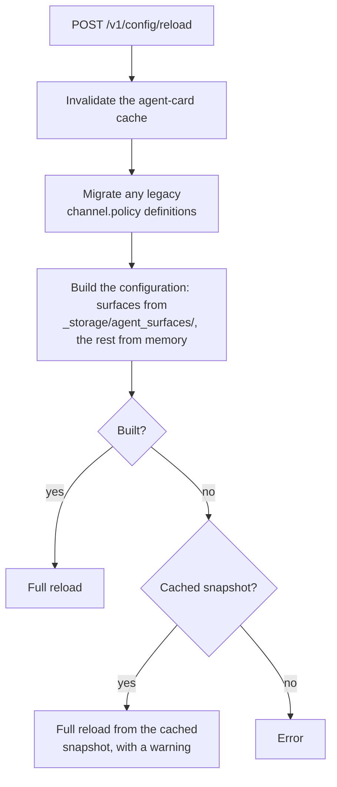

# Configuration Reload

This page documents implementation behavior for the checked-out source revision. Use the hosted
[Agent Gateway reference](https://docs.affinidi.com/products/affinidi-trust-fabric/agent-gateway/reference/)
for supported configuration fields and operator guidance.

## Scope

This page describes runtime configuration reload behavior: what a reload re-reads, what it does
not, and how listener state is rebound. It also documents the `[a2a]` bootstrap table (see
[A2A settings](#a2a-settings)). For what each configuration file controls and the effect of
its fields, see [`CONFIGURATION_REFERENCE.md`](CONFIGURATION_REFERENCE.md). The source of truth for
accepted fields and defaults is the configuration types under [`src/config/`](../src/config/).

## Bootstrap parsing

`BootstrapConfig::from_file` reads the bootstrap TOML at process startup and resolves relative
configuration, storage, and TLS paths against the bootstrap file's directory. Unknown top-level
keys are ignored, which lets a newer configuration remain readable by an older binary. Operators
should still validate changes carefully because a misspelled key will not take effect. Nested
configuration types define their own parsing rules, so this page is not a complete field schema.

`server_mode` selects the `active` or `standby` mode (see [Server mode](#server-mode)). In a
shared-storage deployment, `cache_refresh_interval_secs` controls periodic reconciliation for
DashMap-backed filesystem caches; `0` disables that refresh. Policy-definition and global-policy
stores are not part of the periodic cache-refresh loop and reconcile from disk at startup. An
explicit configuration reload uses their current in-memory state rather than refreshing those two
stores from disk.

## A2A settings

The bootstrap `[a2a]` table maps to `A2aConfig` in [`src/config/types.rs`](../src/config/types.rs).
`A2aConfig::validate` runs at startup, and an invalid value fails startup with
`Invalid [a2a] config: …` (or `Invalid [a2a] config in <path>: …`) naming the field. An absent table or field takes the default below.

| Field | Default | Behavior |
| --- | --- | --- |
| `default_version` | `"1.0"` | The `protocolVersion` of the agent cards the Gateway generates. Must resolve on `Major.Minor` to `0.3` or `1.0` (`1.0.1` resolves to `1.0`). It is installed once at startup and held in a `OnceLock`, so a configuration reload does not change it; changing it needs a restart. It does not change which versions are accepted (each A2A surface sets that), and a Managed Agent's own card keeps its own version. A generated card never names a version its endpoint refuses: the A2A proxy card names `1.0` whatever this setting says. |
| `validate_messages` | — | Deprecated. Validation is set per A2A surface (`access_point.a2a.validation`; see [A2A surface settings](PROTOCOLS.md#a2a-surface-settings)). It is only applied to A2A surfaces loaded without their own settings, which are then written with `validation = "off"` when it is `false` and `"envelope"` otherwise. A startup warning names it; remove it once every surface has its own settings. |
| `max_body_size` | `10485760` (10 MiB) | On the direct inbound path, request bodies larger than this are refused with HTTP `413`. The check runs after `fabric://` dispatch, so it does not apply to fabric targets. It also caps every upstream response the gateway buffers (HTTP `502` when larger), on the Access Point, Transit Point and Fabric receive paths alike, including agent-card fetches, and one incomplete event of an event stream the gateway parses. A Legacy SSE session and MCP Proxy tool discovery always use the default (10 MiB), whatever is configured. It is read once at startup, and a reload keeps that value, so changing it needs a restart on every path. |
| `timeout_seconds` | `30` | Request timeout in seconds. |
| `fabric_gateway_timeout_ms` | `60000` | How long the sending gateway waits for a response over the fabric when the surface sets no request timeout. |
| `message_expires_seconds` | `90` | DIDComm message lifetime; must be strictly greater than `fabric_gateway_timeout_ms`, or the mediator could drop a response the sender is still waiting for. See [Fabric envelope lifetime](#fabric-envelope-lifetime). |
| `max_inflight_dispatches` | `256` | Fabric requests one Connection Point listener dispatches concurrently; must be greater than `0`. When every slot is busy, a forward request the listener would admit is answered at once with HTTP `503` and `retry-after: 1`, which the sending gateway returns to its caller; the sender does not retry it. A redelivered or replayed forward request is dropped without a reply, and an expired or unauthorized one gets its usual `504` or `403`. Other messages wait for a slot. |
| `sdk_inbound_cache_count` | `1024` | Unprocessed DIDComm messages the SDK inbound cache holds before it stops draining the websocket; must be greater than `0`. |
| `sdk_inbound_cache_bytes` | `104857600` (100 MiB) | Bytes the SDK inbound cache holds before applying back-pressure; must be greater than `0`. |

Which A2A versions a surface accepts, and whether it validates messages, are not TOML fields. They
are the surface's `access_point.a2a` settings, saved with the surface and applied without a restart.
See [A2A surface settings](PROTOCOLS.md#a2a-surface-settings).

## Reload entry points

The runtime implementation is in
[`src/proxy/surface_manager.rs`](../src/proxy/surface_manager.rs). Some method names retain
`channel` as a legacy code term; their managed object is an Agent Surface.

| Method | Typical caller | Behavior |
| --- | --- | --- |
| `reload_channels` | Full-reload implementation | Replaces the complete runtime surface set and rebinds listeners. |
| `reload_channels_with_fallback` | `POST /v1/config/reload` | Loads the requested configuration and uses the cached snapshot only when loading the requested source fails. |
| `reload_single_channel` | `reload_single_channel_with_fallback` | Rebuilds one surface and swaps it into the current inbound listener state. |
| `reload_single_channel_with_fallback` | `POST /v1/config/reload/{config_id}` and surface mutation paths | Serializes and applies the single-surface update; a source-load error is returned rather than silently substituting another surface. |

Full and single-surface reloads share a reload lock so they cannot concurrently mutate listener
state or rebind the same port.

## Full reload

A full reload is disruptive to the listener tasks, even though it does not restart the Agent
Gateway process:

1. Load the configured source and inject active Agent Surface records.
2. Abort existing inbound and outbound port-listener tasks and clear their stored runtime states.
3. Clear stale task-monitor entries and wait briefly for listening sockets to be released.
4. Replace the shared `GatewayConfig` and save the successful snapshot to the configuration cache.
5. Reload network configuration, group active surfaces by listener, and rebuild derived surface
   state.
6. Bind new inbound listeners and outbound listeners that have active outbound surfaces, retaining
   each inbound listener's `MultiSurfaceProxyState` for later single-surface updates. An outbound
   port with no active outbound surfaces receives a placeholder task during reload and is not bound;
   this differs from startup, which binds empty outbound ports so their liveness route remains
   available.

Requests using a listener while it is stopped and rebound can be interrupted. Process-wide services
that are not owned by those listener tasks continue running, but their routers are attached to the
new listeners when those listeners are created.

If the requested configuration source cannot be loaded,
`reload_channels_with_fallback` attempts to load the cached `GatewayConfig`. If neither source is
available, reload returns an error. A failure after listener teardown is not converted into the old
live listener set.

## Single-surface reload

A single-surface reload keeps the existing inbound listener bound:

1. Replace or add the surface in the shared `GatewayConfig` and save the updated cache snapshot.
2. Resolve the surface's Access Point listener from its `listen_address`.
3. Rebuild its `SurfaceInfo`, including identity selectors and variant engines.
4. Replace the matching entry in `MultiSurfaceProxyState.channels` under its write lock.
5. Refresh task-monitor entries and any existing outbound surface state.

Concurrent inbound requests retain the listener and observe either the previous or replacement
surface state around the brief write-lock acquisition. The operation does not promise that every
outbound listener remains bound: if Transit Point routes were added, removed, renamed, or moved,
the affected outbound listener is restarted because its Axum routes are static.

Single-surface reload assumes the Access Point still maps to a running inbound listener. Changes
that require a different listener topology belong to a full reload.

## Dashboard events

Neither full nor single-surface reload broadcasts `WsUpdate::RefreshDashboard`. Dashboard state
converges through its periodic `DashboardDelta` stream or an explicit refetch. The actual
`RefreshDashboard` producers are documented in [Observability Internals](OBSERVABILITY.md).

## Server mode

A node runs in one of two modes, set by `server_mode` in the bootstrap config (default `active`):

- **Active** serves traffic and runs the fabric and trust listeners.
- **Standby** keeps the fabric and trust listeners inactive and reports not ready.

The default API mount exposes `GET /api/v1/health` (200 when Active and ready, 503 when Standby)
and `GET /api/v1/alive` (always 200); the router-relative paths are `/v1/health` and `/v1/alive`.

### Cache refresh

Set `cache_refresh_interval_secs` in the bootstrap config (default `0` = disabled) so every
**DashMap-backed** cached filesystem store periodically reconciles its cache with disk and picks up
changes written by another node sharing the storage. Only DashMap-backed stores refresh on this
interval; the RwLock-backed policy-definition and global-policy stores are **not** on the periodic
loop and reconcile with disk only at startup; an explicit reload uses their in-memory state. Each
store's periodic scans are serialized by a shared per-store lock, so two overlapping refreshes can
never apply out of order and revert a record to an older on-disk snapshot.

Nodes sharing storage must run the same version. A newer node can write a field an older one
rejects; the older node's refresh then drops that record from its cache while it is still serving.
Per-surface A2A settings are such a field: a newer node writes `access_point.a2a` into stored A2A
surfaces on its first start. Upgrade nodes that share storage together, or set
`cache_refresh_interval_secs` to `0` on the older node until it is upgraded (see
[A2A surface settings](PROTOCOLS.md#a2a-surface-settings)).

## Fabric envelope lifetime

A `forward-request` sent over the fabric carries a DIDComm `expires_time`. The sending gateway
derives it from the request timeout — `target.networking.timeout.request_secs`, or on an Access
Point request to a `fabric://` Target `a2a.message_expires_seconds` when the surface sets no
timeout; a Transit Point uses its own `networking.timeout`, then the surface timeout, then 30 s —
and caps it at 3480 s
([`sent_envelope_lifetime_secs`](../src/gateways/connection_points/envelope_replay.rs)). The
receiving gateway refuses an envelope whose `expires_time` lies more than 3600 s ahead of its own
clock, and the 120 s between the two caps absorbs clock skew. A request timeout above the cap still
works: the caller deadline (`deadline_ms`) keeps the full timeout, only the envelope has to be
delivered within 58 minutes of being sent. Neither `TimeoutConfig` nor `A2aConfig::validate` rejects
larger values; every send, the payment retry included, clamps them.
