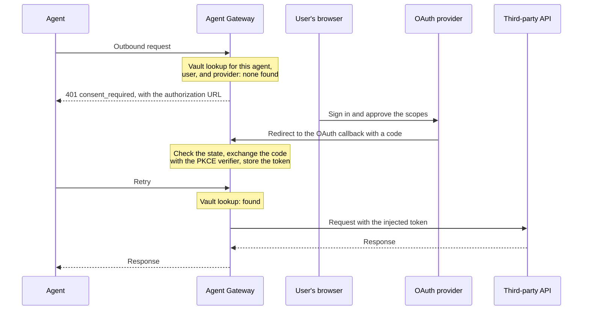

# Credential Delegation

How the gateway lets a managed agent call a third-party API with credentials the agent
never holds. For a user-facing flow, the credentials belong to the human the agent acts
for, and are obtained with that person's consent.

Use the hosted [per-caller credential delegation guide](https://docs.affinidi.com/products/affinidi-trust-fabric/agent-gateway/how-to-guides/setup/configure-per-caller-credential-delegation/)
for the operator procedure. This page documents the implementation in
[`src/credential_providers/`](../src/credential_providers/),
[`src/delegation_vault/`](../src/delegation_vault/), and
[`src/proxy/credential_delegation.rs`](../src/proxy/credential_delegation.rs).

## Moving parts

| Part | What it is |
| --- | --- |
| Credential provider | A configured OAuth 2.0 or API-key provider, such as Google or GitHub. Defined once and referenced by any number of surfaces. |
| Outbound credential binding | An entry in a surface's `outbound_credentials` naming a provider, the scopes, when it applies, and how the token is injected. |
| Delegation vault | Where obtained tokens are kept, one per agent, user, and provider. |
| Delegation audit log | A record of every lookup, consent prompt, refresh, and injection. |

## Credential providers

`CredentialProvider` ([`src/credential_providers/mod.rs`](../src/credential_providers/mod.rs))
has three types, set by `provider_type`.

| Type | Flow | Consent |
| --- | --- | --- |
| `oauth2_authorization_code` | Three-legged OAuth. The user signs in to the provider and approves the scopes. | Required, per user |
| `oauth2_client_credentials` | Two-legged, machine to machine. The gateway authenticates as the client. | None |
| `api_key` | A static key resolved from the secrets store. No OAuth. | None |

A provider carries its authorization and token endpoints and its default scopes. Its
client ID and client secret are **references** into the secrets store, such as
`GOOGLE_CLIENT_SECRET`, and are never stored in the provider record itself.

## Binding a provider to a surface

Each entry in `AgentSurface.outbound_credentials`
([`OutboundCredentialBinding`](../src/config/types.rs)) decides four things.

| Field | Options | Default |
| --- | --- | --- |
| `required_for` | `all` outbound requests, or `tools`: a list of MCP tool names | `all` |
| `consent_mode` | `on_demand`, `pre_authorize`, or `elicit` | `on_demand` |
| `inject_as` | `bearer_header`, `custom_header { name, format }`, or `meta { field }` | `bearer_header` |
| `scopes` | Scopes to request | The provider's defaults |

`custom_header` takes a format string, so a provider that expects `token {value}` rather
than `Bearer {value}` still works. `meta` writes the token into a JSON-RPC `_meta` field
instead of a header.

## When a token is missing

Delegation needs a user to key the token by, so a surface with delegation but no
authenticated source identity rejects the request with HTTP 403 `identity-required`. For an
authenticated caller, the consent mode decides what happens the first time.

| Mode | Behaviour |
| --- | --- |
| `on_demand` | The request fails with HTTP 401 and an `application/problem+json` `consent_required` body carrying the authorization URL. The caller has to interpret this payload itself; it is not the MCP elicitation mechanism. |
| `pre_authorize` | The session is refused at bind or `initialize` time until every binding's token already exists. After that, runtime traffic never sees a consent prompt. |
| `elicit` | Spec-compliant MCP elicitation. The gateway sends `elicitation/create` back over the open Streamable HTTP or SSE stream, with the authorization URL in the message, and waits up to `elicit_timeout_secs` (300 by default) for the user to finish or decline. |

`elicit` needs an MCP client that advertised the `elicitation` capability during
`initialize`. When it did not, `elicit_fallback` decides: `on_demand`, the default,
degrades to the 401 response, and `fail` fails the tool call with a JSON-RPC error.

## Across Fabric

When a surface's Target is `fabric://`, its delegated credential depends on the request's MCP
revision. A legacy request never carries it to the peer. A modern (`2026-07-28`) request
does: the sending gateway applies the credential after stripping the caller's token,
and sends the access token, never the refresh token, inside the encrypted framed stream to the
peer, which can use it until it expires. Consent, refresh and revocation stay on the sending
gateway. See [Delegated credentials over Fabric](FABRIC.md#delegated-credentials-over-fabric).

## Consent flow

For an authorization-code provider in `on_demand` mode:

The authorization URL uses PKCE with the `S256` challenge method. The `state` parameter is
an `OAuthState` carrying the agent DID, the user identity hash, the surface, the provider,
a random nonce, an expiry, and the PKCE code verifier. The callback therefore needs no
server-side session to know which request it completes.

`state` is always sealed with AES-256-GCM before it is base64url-encoded, so neither the
provider nor anyone else who sees the authorization URL can read it (the PKCE code verifier
included) or forge one naming a different agent or user. When encryption at rest is
enabled, its key seals the state; otherwise a key derived from `AG_IDENTITY_HASH_PEPPER`
does, so gateways that share the pepper can open each other's states. The callback refuses
a `state` this gateway did not seal, an expired one, and one whose nonce was already used
([`encode_oauth_state`, `decode_oauth_state`, `claim_oauth_state`](../src/delegation_vault/oauth.rs)).
Used nonces are remembered in the gateway process for 15 minutes, longer than a state
lives, so a restart or a different gateway instance does not know about them. A state is
used up only when its credential is stored, so a callback that fails before then, for
example at the token exchange, can be retried with the same state.

The callback lands on `/v1/identity/oauth/callback` unless `gateway.json` sets
`oauth_callback_route`. On success the gateway stores the
token and issues a `DelegationCredential`, a verifiable credential recording the
delegation chain, kept with the token as `delegation_vc`.

## Delegation vault

A `DelegationToken` ([`src/delegation_vault/mod.rs`](../src/delegation_vault/mod.rs)) is
keyed by three values.

| Key | Source |
| --- | --- |
| `agent_did` | The managed agent the delegation is for |
| `user_identity_hash` | A SHA-256 hash of the identity source authentication established: the JWT `sub`, the API key name, the DID, or the mTLS principal |
| `credential_provider_id` | The provider |

With API-key or mTLS source authentication, every caller presenting the same key or
certificate identity therefore shares one set of delegated tokens.

Client-credentials tokens have no user, so they are cached under the fixed user hash
`__client_credentials__`.

A lookup has four outcomes.

| Result | What the gateway does |
| --- | --- |
| Found and valid | Injects the token |
| Expired, with a refresh token | Refreshes it through the provider's token endpoint |
| Expired, no refresh token | Treats it as missing and applies the consent mode |
| Not found | Applies the consent mode |

For client-credentials providers an expired token is deleted and a fresh one fetched,
since no user is involved.

### Storage

The vault uses **uncached** storage: tokens are read from disk on each lookup and are not
held in the in-memory cache, so they do not linger in process memory.

The vault is encrypted at rest **only when at-rest encryption is enabled** in the
bootstrap configuration (`[encryption] enabled = true`), because it uses the global
storage configuration like every other store. The default is off. With the default,
access and refresh tokens are written to `_storage/` as plaintext JSON. Enable encryption
at rest on any appliance that holds real user tokens. See
[`CONFIGURATION_REFERENCE.md`](CONFIGURATION_REFERENCE.md#configtoml).

## Management API

| Route | Purpose |
| --- | --- |
| `GET /api/v1/delegation-vault` | List vault entries, as metadata only, without tokens |
| `GET`, `DELETE /api/v1/delegation-vault/{id}` | Read or revoke one entry |
| `DELETE /api/v1/delegation-vault/by-user/{user_hash}` | Revoke every delegation one user has granted |
| `GET /api/v1/delegation-audit` | The delegation audit log |

Credential providers have their own management routes in
[`src/credential_providers/router.rs`](../src/credential_providers/router.rs), gated on
the `credential_providers.*` permissions.

In the dashboard these live on the Credentials page, under the **Credential Providers**,
**Credential Tokens**, and **Credential Delegation Audit** tabs.

## Related

- [`SOURCE_AUTH.md`](SOURCE_AUTH.md): the source authentication that supplies the user identity.
- [`STS.md`](STS.md): token exchange, a different way of acting on a caller's behalf.
- [`../ARCHITECTURE.md`](../ARCHITECTURE.md): where outbound credentials sit in the request path.
