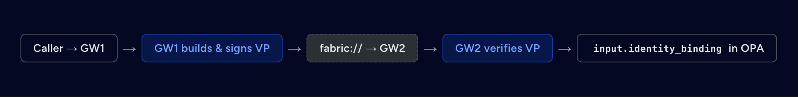

# Fabric and Gateway-to-Gateway Internals

Use the hosted [architecture](https://docs.affinidi.com/products/affinidi-trust-fabric/agent-gateway/concepts/architecture/)
and [federated connectivity guides](https://docs.affinidi.com/products/affinidi-trust-fabric/agent-gateway/how-to-guides/connections/)
for product concepts and connection procedures. This page records implementation details and
security invariants of the checked-out source revision.

## Fabric model

The Fabric is the set of DIDComm-based appliances connected through Connection Points. A
Gateway-to-Gateway (G2G) call targets an Agent Surface on a remote Agent Gateway while preserving
the authenticated sending gateway identity for policy evaluation.

An Agent Surface targets a remote surface with:

```text
fabric://{gateway_id}/{surface_id}
```

The DIDComm forward-request body still calls the second value `channel_id`. That identifier is a
legacy wire name; it carries the destination surface's `config_id`. Source methods and telemetry
fields that use `channel_id`, `channel_name`, or `channel_did` are likewise legacy code or wire
names, not current product terminology.

## Connection-point manager

[`ConnectionPointListenerManager`](../src/gateways/connection_points/ws_listener.rs) owns the
Connection Point listener lifecycle. Its runtime state includes:

- running listener information keyed by Connection Point ID;
- a gateway-to-Connection-Point index used by `fabric://` forwarding;
- stores for Connection Points, gateways, pending connections, mediators, notifications, and
  messages;
- a persistent, TTL-based [`DIDCache`](../src/gateways/did_cache.rs);
- a listener-start command channel for requests originating inside message handlers; and
- a `Weak<Self>` back-reference used by spawned tasks.

The manager is constructed with `Arc::new_cyclic`. A listener upgrades the weak reference only for
the duration of a callback, avoiding a manager-to-listener-to-manager strong-reference cycle.

## DIDComm listener

Each Connection Point maintains a persistent DIDComm connection through its mediator. The listener
authenticates, registers the receive ACL, receives encrypted envelopes, decrypts them, and dispatches
them by DIDComm message type. Applicable messages are persisted and connection metrics are updated.
A forwarded G2G request also emits a dashboard `PayloadCaptured` event through the payload-capture
helper.

Forward responses are correlated to pending requests by message ID. Resolving the pending
`oneshot` completes the HTTP request that initiated the G2G call.

The listener deletes a message from the mediator only after processing it, so every in-flight
fabric request stays queued at the mediator until it is answered. A mediator from v0.27 caps the
messages one sender may have queued for one recipient at `[limits] queued_send_messages_per_peer`
(default `50`, and not settable by environment variable in v0.33.1). A forward over the cap is
refused with `e.p.limits.queue.peer`, and the caller sees a fabric timeout (`504`). Size the cap
for the concurrent requests expected between two gateways, below the recipient's
`queued_receive_messages_soft` (default `200`). The E2E mediators (`scripts/g2g-mediator.sh`) and
the local mediator (`make mediator-up`) run with `150`. `scripts/mediator/user-data-v2.sh` sets the
cap from its optional thirteenth argument, and without it leaves the mediator default.

Framed stream messages (`forward-stream/1.0` frames and capability queries) also arrive through the
listener. It answers a capability query only from a registered, active peer gateway, and answers an
Open it refuses with an `Error` frame to that peer saying why: `stale_offer` (the sender negotiates
again), `legacy_only` (sent only by an older peer whose surface does not admit modern MCP; the
sender's caller gets `-32022`, as from a legacy-only endpoint) or `unavailable`, which it also sends
when a framed-stream cap or the Open replay table is full. A sender treats a `capacity_reached` it
receives as a full cap and answers its caller `429` with `Retry-After`, and treats any code it does
not recognise as `unavailable`. An Open's
envelope must carry a valid `expires_time`, as a `forward-request`'s must. See the Framed Fabric Transport section of
[`MCP_METADATA.md`](MCP_METADATA.md#framed-fabric-transport).

The Agent Gateway exposes DID documents at `/.well-known/did.json` for `did:web` and
`/.well-known/did.jsonl` for `did:webvh`. Resolution checks the JSON Lines form first and then the
JSON document. DIDComm envelopes are accepted through the configured `/didcomm` HTTP or WebSocket
surface.

## Connection establishment invariants

Invitation fetching is SSRF-protected. A gateway invitation reaches a local address only through
the test-mode egress allow-list (`AG_BDD_EGRESS_ALLOWLIST`, honoured only when `AG_TEST_MODE=true`);
the development override `AG_ALLOW_LOCAL_OOB=1`, which must not be set in production, applies
only to the trust-registry OOB and `did:web` fetches in `src/trust_registries/communication.rs`.
Pairing also resolves the inviter's and the mediator's DIDs, so a peer or mediator whose
`did:web` / `did:webvh` lives on a local or private host needs `[did_cache] allow_private_hosts`;
see [DID resolution host policy](POLICY.md#did-resolution-host-policy).

The wire payloads use `channel_did` for the persistent peer DID. This is an exact legacy wire field
name. A connection-accepted message must be authcrypt; accepting anoncrypt here would let an
unauthenticated sender complete the handshake.

`connection-setup` and `connection-accepted` must also carry a valid issuer attestation, or the
handshake is rejected. Pairing therefore fails closed against a peer built before attestations
existed, until that peer is upgraded. Both messages are also refused, failing the handshake with no
reply, when their DIDComm `expires_time` has passed or their `(sender DID, message id)` pair was
already processed: `connection-setup` after it proves control of its `channel_did` on a live
invitation, `connection-accepted` once its sender and `channel_did` are present; both verify their
issuer attestation afterwards. A pairing message without `expires_time` is remembered for one hour.

## Peer issuer DIDs

A gateway sends fabric envelopes from a per-pairing Connection Point DID but signs the identity
credentials it issues with its gateway DID. An issuer attestation
([`issuer_attestation.rs`](../src/gateways/issuer_attestation.rs)) is a typed JWT
(`gateway-issuer-attestation+jwt`) binding those two DIDs together: `sub` is the sender's Connection
Point DID, `aud` the receiver's temporary DID, and `nonce` the handshake thread id.

Each Remote gateway record therefore carries a set of **connection issuers**
([`gateways::types::PeerIssuers`](../src/gateways/types.rs)):

- `issuer_did` — established by the gateway itself, either from the attestation in the pairing
  handshake or from the `gateway-issuer-request` exchange
  ([`issuer_exchange.rs`](../src/gateways/issuer_exchange.rs), run on demand and at listener start).
  `issuer_did_source` records which. It cannot be set through the API.
- `trusted_issuer_dids` — issuer DIDs an operator adds to this one connection.

Trust is connection-scoped, never per surface or appliance-wide, so a peer cannot replay a
presentation another gateway issued. A sender with neither an established nor a trusted issuer is
rejected with 403; a sender with trusted issuers but a failed attestation exchange is admitted for
those issuers only.

Earlier builds had a per-surface allowlist, `AgentSurface.trusted_binding_issuers`, which accepted
a presentation from any peer that forwarded it. The field no longer exists. A stored surface that
still carries it has the field removed at load, with a WARN naming the surface
(`AgentSurface::migrate_raw_json`), and a write that includes it is rejected as an unknown field.
Add those issuer DIDs to the Remote gateway connection's `trusted_issuer_dids` instead.

The issuer string is trustworthy because [`LocalVerifier::verify_vp`](../src/identity/ssi/verifier.rs)
verifies every embedded VC's Data Integrity proof and requires the proof key's DID to equal the VC
`issuer` (and the VP proof key's DID to equal `holder`). ssi alone verifies only the outer VP proof
and never binds a proof key to the document it signs.


On the fabric path the credential's issuer must also be one of the connection's issuers,
which the diagram above does not show.



Attribution fails closed. A presentation that does not verify, or whose issuer is not one
of the connection's issuers, never falls back to the `did` claim beside it. The request
continues with no caller identity, only the audit record for the unverified DID is
written, and no weaker identity source is consulted for that request, neither the identity
binding VP nor a raw identity extension.

The `did` field is never a source of identity. A credential extension carrying only a
`did` claim yields nothing, and a `did` field in the raw `agent-identity/v1` extension is
ignored. The identity is instead computed from:

1. The extension's `x-identity` fields.
2. Failing that, when the surface has no identity schema or the gateway has no VC issuer,
   a hash of its `agentIdentity`, `agentId`, `id`, or `agent_id` value.
3. Failing that, a hash of the whole extension with its `did` removed.

A gateway with no VC issuer configured cannot verify presentations at all. It skips them
rather than rejecting them, so a raw identity extension beside one still yields a
payload-derived identity.

The direct A2A path applies the same no-fallback rule to payload identities: once a
presented VP is rejected, a raw `agent-identity/v1` extension beside it yields no identity
either. On that path no audit record is written, and a presentation it cannot verify
because no verifier is configured counts as rejected. A surface-configured
`inbound_identity`, meaning `static`, `from_mtls`, `from_api_key`, or `from_jwt_claim`,
still applies, except on public discovery paths where none is resolved.

Policies read how the caller DID was established from
`input.extension_identity.verification` and `input.agent.did_verification`.

| Value | Meaning |
| --- | --- |
| `vp` | Verified presentation from a connection issuer. Fabric path only. |
| `vp_unanchored` | Verified presentation on the direct A2A path, where no authenticated sender vouches for the issuer. |
| `source_auth` | DID bound to this request's authenticated source credential, meaning `from_jwt_claim`. |
| `unverified` | Payload-derived pseudonyms, and surface-configured identities such as `static`, `from_mtls`, and `from_api_key`. |

`input.extension_identity.verified` and `input.agent.did_verified` are the boolean
projections: everything but `unverified` is verified.

On the direct HTTP path there is no authenticated sender, so no issuer anchor exists; the verified
issuer is exposed to OPA as `input.identity_binding.issuer_gateway` for a binding presentation and
as `input.agent.identity_issuer_did` for an identity presentation, for policy to decide.

Management API: `GET /v1/gateways/{id}` (`gateways.view`) exposes `issuer_did`,
`issuer_did_source`, and `trusted_issuer_dids`. The rest are `gateways.edit`:
`POST /v1/gateways/{id}/issuer` runs the exchange; `DELETE /v1/gateways/{id}/issuer` forgets the
attested issuer; `POST /v1/gateways/{id}/trusted-issuers` and
`DELETE /v1/gateways/{id}/trusted-issuers/{issuer_did}` manage operator trust.

## Runtime health behavior

After a Gateway Ping timeout, the Gateway checks its mediator account. It reauthenticates and
reregisters if the account has disappeared, or restores the receive list when the account remains
but its ACL has been reset.

When the appliance is Standby, fabric and trust listeners are inactive and the node reports not
ready. Periodic cache refresh keeps supported cached stores current on a Standby node.

## Peer exposure

Each Remote gateway record carries an exposure mode that decides which local surfaces that peer
reaches over Fabric ([`Gateway::exposes_surface`](../src/gateways/types.rs)):

| `exposure_mode` | The peer reaches |
| --- | --- |
| `none` | No surface. Every newly paired peer starts here, on every pairing path, including the inbound handshake. |
| `list` | Only the surface ids in `exposed_channels`. An empty list reaches nothing. |
| `all` | Every active surface. |

The same check applies to buffered `forward-request` traffic, framed-stream Opens, and the
`get-channels` capability query, which lists only the surfaces the sender may reach. The tenant rule
applies on top of every mode.

Records written before the mode existed have no `exposure_mode`. On boot,
[`migrate_exposure_modes`](../src/gateways/filesystem.rs) persists `all` for a record with an empty
list (its earlier meaning) and `list` for a record with a non-empty one, so existing peers keep their
access. Until a record is migrated, it is read with that same earlier meaning, never with more access.

Set the mode with `PUT /v1/gateways/{id}/exposed-surfaces` (`gateways.edit`), body
`{"exposure_mode": "list", "exposed_channels": ["surface-id"]}`. The list is stored only in `list`
mode. A body without `exposure_mode` selects `list` for a non-empty list and `none` for an empty
one, so an empty list never means every surface. The dashboard sets it on the **Publishing** tab of
a remote gateway.

## Fabric receive pipeline

[`process_forward_request`](../src/gateways/connection_points/message_processor.rs) handles a G2G
request received by the destination gateway:

1. Decrypt and authenticate the DIDComm envelope.
2. Authorize the sender and admit the envelope once. The sender's Connection Point DID must belong
   to an active paired Remote gateway record that exposes the requested surface (403 otherwise).
   See [Peer exposure](#peer-exposure). Tenancy narrows that further: an appliance-wide peer, which
   includes every peer that arrived through the inbound handshake, may reach every surface its mode
   allows, while a tenant-owned peer reaches only surfaces of its own tenant and appliance-wide
   surfaces, whatever its exposure mode says
   ([`fabric_peer_may_reach_surface`](../src/gateways/connection_points/message_processor.rs)). A
   framed stream Open checks the same peer exposure and tenant rule, and also the receiving
   Connection Point's exposure list. A refused Open is answered with the `unavailable` stream error
   code, which 1.0.0 senders can parse, so a modern MCP caller sees `502` rather than `403`. The
   envelope is then checked by
   [`envelope_replay.rs`](../src/gateways/connection_points/envelope_replay.rs): its DIDComm
   `expires_time` must be present, in the future and at most one hour ahead, its `created_time`
   (when present) at most 120 s in the future, and its `(sender DID, message id)` pair not processed
   before. An undated envelope, or one dated too far ahead, is refused with 403 and an expired one
   with 504, before surface lookup, source authentication, policy, payment or dispatch. A
   re-delivered envelope is dropped without a reply: the mediator re-delivers a message that was not
   deleted after dispatch, and a reply threaded to the original id would displace the real response
   at the sender. The seen set holds a SHA-256 digest per pair in memory until the envelope's
   `expires_time`; expired entries are swept during admission, at most once a minute. It is exported
   as the `agent_gateway_fabric_envelope_seen_entries` gauge, which counts entries not yet swept. On
   the sending side the envelope lifetime is capped at 3480 s (`sent_envelope_lifetime_secs`)
   whatever the request timeout says (see [Fabric envelope
   lifetime](CONFIGURATION_RELOAD.md#fabric-envelope-lifetime)), leaving 120 s of clock skew below the
   receiver's cap; the caller deadline (`deadline_ms`) keeps the full timeout.
3. Resolve the destination surface from the legacy wire field `channel_id`.
4. Run the destination surface's configured source authentication and MCP request-boundary
   validation. DIDComm authentication proves the sending Gateway; source authentication separately
   evaluates caller evidence presented to the destination surface. There is no A2A counterpart:
   `A2A-Version` is negotiated and A2A requests are validated on the sending gateway, not here
   (see below).
5. Build policy input containing the authenticated sending Gateway and any source-auth result. An
   identity presentation is attributed to the caller only when its issuer is one of the sending
   connection's issuers (see [Peer issuer DIDs](#peer-issuer-dids)).
6. Run Gateway policy, payment verification, caller identity extraction, MCP per-tool policy, Trust
   Check, surface policy, and MCP tool gating in that order where configured.
7. Forward to the local surface Target.
8. Apply response processing, including MCP tool-list filtering when configured, before packaging
   the DIDComm response.

The sending and receiving gateways enforce their own policies independently. For MCP surfaces, tool
gating on each side composes: a tool hidden or denied by either surface remains unavailable.

### Modern MCP activation

Modern MCP (`2026-07-28`) is active on every MCP surface and crosses Fabric only
as framed streams, which any active MCP surface on the receiving gateway serves.
Pair single-tenant or trusted deployments first, and do not pair a
multi-tenant or internet-facing gateway: some gateway-wide tables and signals
are shared across tenants and peers (appliance-wide access changes still end
every subscription, and the capability offer and Open replay tables are shared), and the limits are per caller,
per peer or per surface, never per tenant. Framed streams are capped at 8 per peer and 16 per surface,
with listens counted apart from request streams under their own caps of the same size, so a partner's
long-lived listens do not use up its request slots. One peer can therefore hold 16 inbound streams and
one surface 32; only the total of 128 counts both. Past a cap on the sending gateway the caller gets `429` with `Retry-After: 5`; past a cap
on the receiving gateway it gets `502`, because the receiver refuses with `unavailable`. The full list of limits is in
[Framed Fabric limits](MCP_METADATA.md#framed-fabric-limits). A buffered `ForwardRequest` receiver
does not recheck the caller's browser Origin against its own `mcp_http.allowed_origins`; it trusts
the paired sending gateway's check, as it trusts that peer for every other forwarded header.

### Delegated credentials over Fabric

A sending surface with `outbound_credentials` keeps its delegated tokens to itself for legacy
traffic. For a modern (`2026-07-28`) MCP request, the sending gateway applies the
caller's delegated credential after stripping the caller's own token, the same way it would for a
local Target, and sends it to the peer inside the authcrypt framed stream: the access token only,
injected as the binding's `inject_as` says (a header or a `_meta` field), never the refresh token.
The receiving gateway, and its Target, can therefore use that access token until it expires.
Any modern MCP caller on a `fabric://` route with `outbound_credentials` triggers this, with no
per-route opt-in or opt-out, so routes that predate this behaviour start sharing tokens on upgrade.
Pair only with peers you would trust with those tokens, and remove `outbound_credentials` from a
`fabric://` route whose peer must not receive them. See [Credential delegation](CREDENTIAL_DELEGATION.md#across-fabric).

A2A version negotiation, JSON-RPC and A2A request-shape validation, and the
`agent_gateway_a2a_protocol_version_total` metric run on the sending gateway, against the sending
surface's `access_point.a2a`, before a `fabric://` request is dispatched. The receive pipeline above
does not run them again, so the receiving surface's A2A settings do not apply to fabric requests;
see [Fabric coverage gap](PROTOCOLS.md#fabric-coverage-gap).
