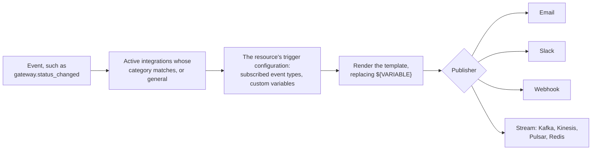

# Integrations

How the gateway tells other systems that something happened: an email when a user
registers, a Slack message when a remote gateway goes offline, an event on a Kafka topic
for every failed payment. Implemented in [`src/integrations/`](../src/integrations/),
with definitions persisted by [`src/storage/integrations.rs`](../src/storage/integrations.rs).

In-dashboard notifications, the bell in the top bar, are a separate feature and are
covered at the end.

## How an event becomes a message

Delivery runs in a spawned task, with a semaphore bounding how many run at once. It never
blocks or fails the operation that raised the event.

A transient failure (a connection error, timeout, or request error, or an HTTP 429 or 5xx
response) is retried up to five times, after 1, 2, 4, 8, and 16 seconds plus jitter
([`integration_service.rs`](../src/integrations/integration_service.rs)). Any other failure,
such as an HTTP 4xx, is logged and dropped. A retried delivery can arrive more than once, so
a receiver that is not idempotent should expect duplicates.

## Integration definitions

An `Integration` ([`src/storage/integrations.rs`](../src/storage/integrations.rs)) is one
configured destination.

| Field | Holds |
| --- | --- |
| `integration_type` | `email`, `slack`, `webhook`, or `stream` |
| `category` | Which resource's events it serves, and so which variables it can use |
| `configuration` | Connection details: SMTP settings, a webhook URL, a stream platform and topic |
| `content` | The message template, such as a subject and body, with `${VARIABLE}` placeholders |
| `status` | Only `active` integrations fire |
| `tenant_id` | Optional tenant owner. See [`ACCESS_TOKENS.md`](ACCESS_TOKENS.md#tenant-ownership). |

An integration with the category `general` serves every resource type. An integration with
the category `audit` is a Governance Audit integration: it receives every record the audit
log writes, may be of any type (Email and Slack send one message per record), cannot
belong to a tenant, and never receives resource events. See
[`OBSERVABILITY.md`](OBSERVABILITY.md#governance-audit-forwarding).

## Publishers

| Type | Sends to | Configuration |
| --- | --- | --- |
| `email` | An SMTP server | `smtp_host`, `smtp_port`, `smtp_username`, `smtp_password`, `from`, `to`, optional `cc` and `bcc`, `use_tls`, `use_starttls` |
| `slack` | A Slack incoming webhook | `webhook_url` |
| `webhook` | Any HTTPS endpoint | The URL |
| `stream` | Kafka, Amazon Kinesis, Apache Pulsar, or Redis Streams | The platform and its connection settings |

All four stream platforms are compiled into the binary; which one is used is a matter of
configuration.

## Events

Each resource type raises its own events. The event type is always
`<resource>.<action>`, such as `gateway.created`.

| Resource | Events |
| --- | --- |
| Surface | `created`, `updated`, `deleted`, `accessed`, `error` |
| Connection point | `created`, `updated`, `deleted`, `connected`, `error` |
| Gateway | `created`, `updated`, `deleted`, `status_changed`, `accessed` |
| Identity | `created`, `updated`, `deleted`, `appeared`, `accessed` |
| User | `created`, `approved`, `updated`, `deleted`, `login`, `accessed` |
| Secret | `created`, `updated`, `deleted` |
| Trust registry | `created`, `updated`, `deleted`, `status_changed` |
| MCP proxy | `created`, `updated`, `deleted`, `status_changed` |
| Mediator | `created`, `updated`, `deleted`, `status_changed` |
| x402 | transaction verification failed, settlement failed, completed; cleanup completed |
| MPP | verification failed, payment verified, challenge issued |

Surface events and the `surface` category were named `channel` in earlier builds. A stored
integration with the `channel` category, or a `gateway.json` that still uses it, is moved
to `surface` at load, and `${CHANNEL_*}` template variables become `${SURFACE_*}`.

## Attaching an integration to a resource

A definition says *where* and *what*. A **trigger configuration** says *when*, per
resource. For a gateway it is stored under `integration_triggers/gateways/<gateway_id>/`
and lists, for each attached integration:

- `event_types`: which of that resource's events it fires on.
- `variables`: custom values substituted into the template alongside the built-in ones.

So one Slack integration can be attached to three gateways, fire on `status_changed` for
two of them, and on every event for the third.

## Template variables

Every event provides four variables, plus the resource's own. `APPLIANCE_ID` is available
to every category too.

| Variable | Value |
| --- | --- |
| `APPLIANCE_ID` | The **Appliance ID** set in Settings › System Settings (`appliance_id` in `settings.json`), such as the appliance's id in Agent Watch. It never comes from event or trigger values, is never the appliance DID, and is unrelated to any Kafka topic name. While unset, `${APPLIANCE_ID}` is left unfilled. |
| `EVENT_TYPE` | For example `gateway.created` |
| `TIMESTAMP` | RFC 3339 |
| `NEW_STATE` | The resource after the change, as JSON. Empty for a delete. |
| `OLD_STATE` | The resource before the change, as JSON. Empty for a create. |

Resource variables follow a prefix, such as `GATEWAY_ID`, `GATEWAY_NAME`, `GATEWAY_DID`,
and `GATEWAY_STATUS` for a gateway. `GET /v1/integrations/runtime-variables` lists every
variable available to each category.

## Outbound requests

Webhook and Slack URLs are checked with `validate_resolved_webhook_url`
([`src/url_validation.rs`](../src/url_validation.rs)), which resolves the host and rejects
cloud metadata addresses, loopback and unspecified addresses, the RFC 1918 private ranges,
IPv4 and IPv6 link-local, IPv6 unique-local, and IPv4-mapped forms of all of these. This is
stricter than the forward legs, which allow loopback and RFC 1918 for same-host and
same-network targets. A DNS failure is an error. The request is then sent through the shared
external client ([`src/http_client.rs`](../src/http_client.rs)), which has a 30-second
timeout and redirects disabled, so a redirect cannot lead to an internal address.

These sinks do not use the pin-once primitive in [`src/egress.rs`](../src/egress.rs) that
the forward legs use. The client resolves the host again when it connects, so the checked
address and the connected address are not bound together. See
[`POLICY.md`](POLICY.md#egress-and-ssrf-controls) for the sinks that are pinned.

## Management API

| Route | Purpose |
| --- | --- |
| `GET`, `POST /v1/integrations` | List and create definitions |
| `GET`, `PUT`, `DELETE /v1/integrations/{id}` | Read, change, and remove one |
| `POST /v1/integrations/test` | Send a test message |
| `POST /v1/integrations/{id}/trigger` | Fire one integration by hand |
| `POST /v1/integrations/trigger-multiple` | Fire several |
| `GET /v1/integrations/runtime-variables` | Variables available per category |
| `GET /v1/integrations/config` | Publisher configuration |
| `/v1/gateways/{id}/integrations` | A gateway's trigger configuration |
| `/v1/users/integrations`, `/v1/identities/integrations` | User and identity trigger configuration |

Governance Audit integrations also require `audit.view`. Without it they are left out of
lists, a read returns 404, and a write or manual trigger returns 403. See
[`RBAC.md`](RBAC.md#governance-audit-integrations).

## In-dashboard notifications

Separate from integrations, the gateway keeps notifications for dashboard users, shown in
the top bar.

| Route | Purpose |
| --- | --- |
| `GET`, `POST /v1/notifications` | List and create |
| `GET`, `PUT`, `DELETE /v1/notifications/{id}` | Read, update, or delete one |
| `GET /v1/notifications/unread/count` | The badge count |
| `POST /v1/notifications/send-welcome` | Send the welcome message |
| `GET`, `PUT /v1/notifications/user-welcome-template` | Read or change the welcome template |

Welcome messages for administrators and users start from the templates
[`admin_welcome.json`](../src/integrations/admin_welcome.json) and
[`user_welcome.json`](../src/integrations/user_welcome.json).

## Related

- [`CAPABILITIES.md`](CAPABILITIES.md#managing-the-gateway): integrations from a user's point of view.
- [`POLICY.md`](POLICY.md#egress-and-ssrf-controls): how outbound requests are controlled.
- [`OBSERVABILITY.md`](OBSERVABILITY.md): metrics and traces, which are separate from integrations.
