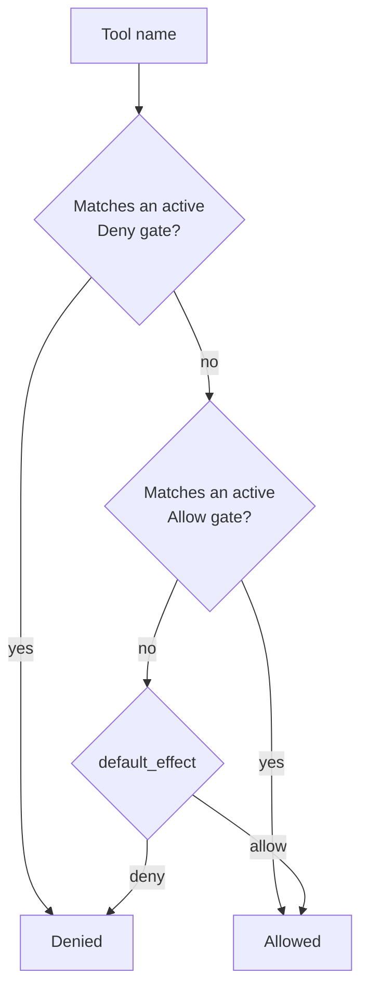
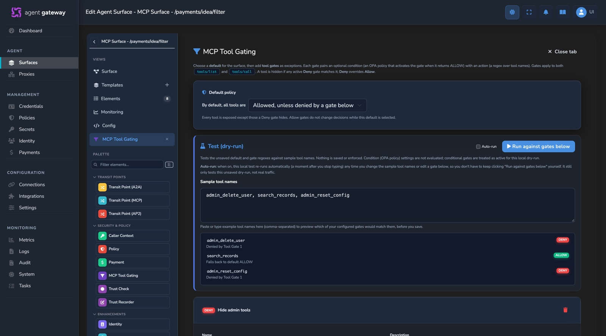

# MCP Tool Gating

Revision-specific internals of MCP metadata handling and the MCP tool-gating
firewall. This documents the behavior of the checked-out source. See [`PROTOCOLS.md`](PROTOCOLS.md) for the MCP wire
protocol and validation boundaries.

## MCP metadata

`AgentSurface.mcp_legacy_metadata_output` is optional (`compatibility` by
default, `canonical` opt-in), inherited by every variant and applied to MCP
Transit Points. Canonical request/notification metadata lives in `params._meta`,
results in `result._meta`, with `io.affinidi.fabric/*` aliases; A2A URL keys and
existing legacy writer locations remain unchanged in compatibility mode.
`src/mcp/meta.rs` owns canonical-first reads, explicit top-level compatibility,
conflict/malformed-container checks, and protected operator keys. Presented MCP
proofs are verified once at admission on direct, Transit Point, and Fabric
receive paths; on Fabric receive the issuer must be one of the sending
connection's issuers (see Peer issuer DIDs). Invalid proofs fail closed; policy
extraction alone never establishes verification. PUT omission retains the stored
preference; PATCH null removes it. No preference enables modern processing. See
[`MCP_METADATA.md`](MCP_METADATA.md) for the alias table, output/error contract,
and downgrade procedure.

## MCP request-boundary invariant

Validate every MCP POST on direct Access Point, MCP Transit Point, standalone MCP
Proxy and Fabric receive paths, including empty bodies. Wire validation runs before generic method-prefix
protocol classification, so modern `tasks/*` requests receive MCP errors instead
of being classified as A2A. The generic family guard still applies to
legacy/no-signal traffic. A single `MCP-Protocol-Version: 2024-11-05` header
alone stays legacy; modern body metadata or mirrored method/name headers still
select validation, and duplicate version headers are rejected. Decode `Mcp-Name`
only when both Base64 sentinel markers are present, using checked extraction so
overlapping markers return `HeaderMismatch` rather than panicking.

Validate every supplied `Mcp-Name` before version rejection, including methods
without a mirrored name source. Well-formed extra headers are tolerated;
malformed values return HTTP `400` / `HeaderMismatch` (`-32020`). Modern
per-request metadata declaring the legacy `2024-11-05` version returns HTTP `400`
/ `Invalid params` (`-32602`) with a mixed-era diagnostic, not an
unsupported-version response listing that same version as supported. Actual
header/body version mismatches still return `HeaderMismatch`.

## Firewall

`target.mcp_tool_gating` (MCP surfaces only, `Option<McpToolGatingConfig>` on
`Target`) is a firewall over a surface's MCP tool surface: an ordered list of
**gates**, each pairing an optional OPA **condition** with an allow/deny
**action**. The same firewall can also be scoped **per Transit Point** via
`TransitPoint.mcp_tool_gating` (`Option<McpToolGatingConfig>`, MCP transit points
only) — an independent gate over that TP's own outbound MCP tool surface, not
inherited from the surface-wide target gate.

- **Condition** — a surface policy (`condition_policy_definition_id`, `package
  surface.policy`). An `allow` result activates the gate; a deny leaves it
  inactive (its action is skipped). **No condition = always active**
  (unconditional filter). A condition that cannot be resolved/compiled/evaluated
  **fails closed toward denial** — effect-aware: a `Deny` gate stays **active**
  (keep hiding), an `Allow` gate is forced **inactive** (never grant on an
  unknowable condition), so a broken/missing condition can never silently widen
  an allow-list. Evaluated against the same `PolicyInput` the surface OPA gate and
  the tools/list filter see, so a gate that hides a tool from the list decides
  identically on a call.
- **Action** — `effect: allow | deny` plus a regex `patterns` list over tool
  names (empty/whitespace patterns ignored; RegexSet-compiled once).
- **Default** — `default_effect: allow | deny` (top-level on
  `McpToolGatingConfig`, default `allow`, omitted from JSON when `allow`) is the
  baseline for a tool matching **no active gate**. `allow` = allow-by-default
  (gates are deny carve-outs); `deny` = deny-by-default (gates are the
  allow-list). A `deny` default with **no gates** denies every tool and is **not**
  treated as empty (the stage still runs). This keeps "deny unless allowed"
  robust even when every allow gate is conditional and currently inactive (no
  active allow ⇒ fall back to `deny`), rather than relying on a `*`-allow gate
  that would leak when its condition is off.
- **Composition (firewall)** — a tool is denied if any active `Deny` gate matches
  it; else if any active `Allow` gate matches it the tool survives (active Allow
  gates union into an allow-list); else the tool falls back to `default_effect`.
  `Deny` overrides `Allow`.

## Enforcement points

Enforced on the inbound **direct-MCP** path (parity with the existing OPA
tools/list filter) on **both** the `tools/list` response (hiding tools) and
`tools/call` requests (blocking invocation), so a hidden tool is uncallable.
Gates evaluate their condition **once per request**, then apply the precompiled
regex per tool.

- **SSE / Streamable-HTTP note**: when the upstream MCP server answers
  `tools/list` with `text/event-stream` (SSE), `src/proxy/handler.rs` buffers
  that SSE response into its JSON-RPC payload (via
  `mcp::sse_transport::consume_sse_response`, gated on
  `mcp::is_tools_list_request`) so the tool filter and gating run, then re-wraps
  the filtered result as SSE for Streamable-HTTP clients — otherwise the SSE
  pass-through would bypass the response-leg filter/gating entirely (other SSE
  responses still stream through untouched). The buffered stream gets the
  upstream response bounds (`docs/PROTOCOLS.md`): `502` over
  `a2a.max_body_size`, `504` on an idle gap or past `request_secs`.
- **Fail-closed shape**: the Transit Point, `fabric://` send and Fabric receive
  gating sites build their un-inspectable `tools/list` reply with
  `crate::mcp::fail_closed_tools_list` (the direct Access Point passes an
  unparsable response through), which echoes the request id rather than
  answering `id: null` and adds `resultType` plus private cache hints when the
  request was admitted as modern. **Cache scope**: a caller-scoped gate makes
  the list authorization-dependent even when it removes nothing, so a modern
  gated result is marked privately cached on the direct, Transit Point and both
  `fabric://` legs. The direct Access Point does the same for a surface or
  variant OPA policy or a response policy (`caller_scoped_mcp_result` in
  `src/proxy/handler.rs`); without any of them, and without result enrichment,
  the upstream's `ttlMs`/`cacheScope` pass through. Gateway-level OPA alone
  leaves them unchanged, matching Transit Points.
- **Per-Transit-Point** — enforced symmetrically on the **outbound transit path**
  (`src/proxy/outbound_handler.rs`): `step_transit_mcp_tool_gating` blocks a
  `tools/call` toward the TP (→ `TransitMcpToolGated`, 403) and
  `filter_transit_mcp_tools_list` hides denied tools from the TP's `tools/list`
  response — both guarded on `virtual_channel.protocol == Mcp`, so a tool the
  managed agent can't see through a TP it also can't call. The per-TP
  `tools/list` filter handles the same SSE framing: when a TP answers
  `tools/list` as `text/event-stream`, `filter_transit_mcp_tools_list` extracts
  the last JSON-RPC frame (`mcp::sse_transport::extract_last_json_rpc_from_sse_bytes`),
  applies the gating, and re-wraps the filtered result as SSE
  (`mcp::sse_server::wrap_json_as_sse_event`).
- **G2G (`fabric://`) receive leg** — a surface reached from another gateway is
  served by the connection-point (DIDComm) pipeline, **not**
  `src/proxy/handler.rs`, so the same firewall is enforced in
  `src/gateways/connection_points/message_processor.rs::process_forward_request`:
  `evaluate_mcp_tool_gating_call_for_fabric` blocks a denied `tools/call` (after
  the surface OPA gate, JSON-RPC `-32001`) and `filter_mcp_tools_list_for_fabric`
  strips denied tools from the `tools/list` response before it is packaged into
  the `ForwardResponse` (the response is already de-SSE'd on this leg, so SSE
  targets are covered). Both build their input via the shared
  `build_fabric_gating_input` (mirrors the direct-path `PolicyInput`) and reuse
  `CompiledMcpToolGating::filter_tools_list_value`. Without this a deny-by-default
  surface would still expose and execute every tool for a cross-gateway caller.
- **G2G (`fabric://`) send leg** — a surface whose *own* target is `fabric://` is
  forwarded to the remote gateway from
  `src/proxy/handler.rs::handle_fabric_request` **before** the direct-path gate in
  `proxy_handler_with_mcp_runtime` would run, so that function enforces the sending
  surface's firewall too: a `tools/call` gate (after the fabric surface OPA gate)
  blocks a denied tool before forwarding
  (`build_tools_call_policy_denied_response`), and a `tools/list` filter on the
  fabric response (already plain JSON — the remote gateway de-SSE'd it) strips
  denied tools via `CompiledMcpToolGating::filter_tools_list_value`. Both
  gateways in a G2G chain filter independently and compose.
- **MCP proxy (`proxy://`) targets** — a surface whose target is a stored MCP
  proxy is answered by `src/proxy/handler.rs::handle_mcp_proxy_request` (the
  gateway *is* the MCP server), which returns before the direct-path gate in
  `proxy_handler_with_mcp_runtime` would run. That function therefore enforces the
  surface's firewall itself, for all three transports (plain JSON-RPC, Legacy
  SSE, Streamable HTTP): a denied `tools/call` is refused with JSON-RPC `-32001`
  before any REST call is made, and the `tools/list` result is filtered with
  `CompiledMcpToolGating::filter_tools_list_value`. The gate condition is
  evaluated against the same `PolicyInput` as the path's inbound and surface OPA
  gates (`evaluate_mcp_proxy_opa_policies`): `source_auth`, `mcp`, `payment`,
  `agent` (from the caller's `_meta` trust-registry extension) and the
  caller-leg `trust_check_results`. The managed-identity resolver does not run
  on this path, so `extension_identity` and `identity_binding` are always
  absent; a condition that reads them is undefined, which leaves a `Deny` gate
  inactive. Write such conditions so an absent field fails toward denial, or
  keep them on `http://` targets.

## Configuration, compilation, and cost

Config types and `validate()` in `src/config/agent_surface.rs`
(`McpToolGatingConfig` / `McpToolGate` / `McpToolGateAction` / `McpToolGateEffect`;
`validate()` caps gate/pattern counts and pattern length —
`MCP_TOOL_GATES_MAX` / `MCP_TOOL_GATE_PATTERNS_MAX` /
`MCP_TOOL_GATE_PATTERN_LEN_MAX` — so a surface write can't install an unbounded
regex set); variant override on `TargetOverrides`
(`src/config/agent_surface_variants.rs`). Compiled and cached in
`SurfacePolicyManager` (regex sets + condition OPA engines precompiled at
surface-load, keyed `{config_id}` / `variant:{config_id}:{alias}` for the
surface-wide gate and `transit:{config_id}:{alias}` per Transit Point; fetched
once per request as a cloned `Arc<CompiledMcpToolGating>` via
`compiled_mcp_tool_gating` / `compiled_mcp_tool_gating_for_transit`, then queried
directly — one lock per request; on hot-reload the new entries are compiled
off-lock and swapped in under a **single** write lock so a concurrent request
never sees a clear-then-repopulate gap that would fail open); engine and firewall
logic in `src/policies/mcp_tool_gating.rs` (`CompiledMcpToolGating`).

**Per-request cost is minimal**: gates that share a condition policy id share one
compiled `OpaEngine` (build-time dedup) and are evaluated once, keyed by engine
identity; the request input is serialized **once** (lazily) and reused across
engines; when no gate carries an OPA condition (`has_policy_conditions()` is
`false`) the runtime skips building/serializing the `PolicyInput` entirely and
passes `Value::Null`.

Runtime hooks in `src/proxy/handler.rs` (inbound tools/list filter + tools/call
gate, plus the `fabric://` send-leg tools/list filter + tools/call gate in
`handle_fabric_request`), `src/proxy/outbound_handler.rs` (per-TP tools/list
filter + tools/call gate), and
`src/gateways/connection_points/message_processor.rs` (G2G `fabric://`
receive-leg tools/list filter + tools/call gate); surface-API validation in
`src/identity/handlers/surfaces.rs` (regex per gate + per-TP MCP-only protocol
check).

## Dashboard

Dashboard element `mcp-tool-gating` under
`www/default/src/components/surface-builder/elements/mcp-tool-gating/` — a small
circle (like the Policy/OPA node) droppable on the **response edge from the
external target** (writes the surface-wide `target.mcp_tool_gating`, `ownedBy:
'source'`) or a **Transit Point** (writes the per-TP
`transit.points[{owner}].mcp_tool_gating`, `ownedBy: 'target'`, folded by the
Transit Point factory), with a summary sidebar and a fullscreen gate editor
(mirrors the Payment element). The fullscreen editor leads with a **"By default,
all tools are Allowed/Denied"** dropdown (writes `default_effect`) and auto-seeds
one empty gate on open so the operator has a row ready to fill.
