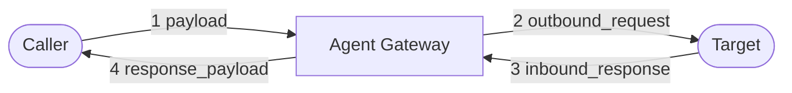

# Observability Internals

Use the hosted [observability documentation](https://docs.affinidi.com/products/affinidi-trust-fabric/agent-gateway/concepts/observability/)
and [reference](https://docs.affinidi.com/products/affinidi-trust-fabric/agent-gateway/reference/observability/)
for monitoring and operator guidance. This page documents internal event and correlation contracts
for the checked-out source revision.

## Dashboard WebSocket

[`WsState`](../src/server/websocket.rs) wraps a Tokio broadcast sender. Each connected dashboard
WebSocket subscribes independently after any configured authentication check; a slow receiver that
lags is disconnected rather than blocking producers. `websocket_broadcast_buffer` controls the
channel capacity and defaults to `500`.

`WsUpdate` currently defines these event shapes:

| Variant | Current behavior |
| --- | --- |
| `IdentityCreated` | Emitted after an identity is created. |
| `IdentityUpdated` | Emitted after persisted identity usage data changes. |
| `MetricsUpdated` | Emitted by metrics update paths. |
| `LogEntry` | Emitted by the tracing WebSocket layer for a new log event. |
| `PayloadCaptured` | Emitted by direct-path payload capture when `extension_inspection.enabled` is set, by every MCP Proxy (`proxy://`) request whether it succeeds or fails, by every forwarded fabric-received request, and by onboarding capture. |
| `ChannelExpired` | Emitted when an in-memory onboarding session expires. `channel_name` is a legacy event field. |
| `OnboardingAttempt` | Defined for wire compatibility but not emitted; onboarding uses `PayloadCaptured`. |
| `RefreshDashboard` | Requests a complete dashboard refetch after settings updates, policy-definition create/update/delete, or Trust Registry connection-state changes. |
| `DashboardDelta` | Carries a pre-serialized periodic dashboard delta in `Arc<String>`. |

Configuration reload does **not** emit `RefreshDashboard`. A dashboard observes reloaded state
through periodic `DashboardDelta` broadcasts or an explicit refetch.

## Payload capture

Normal surface capture can represent four pipeline observations in one `PayloadCaptured` event:

1. `payload`: inbound request;
2. `outbound_request`: request after gateway transformations;
3. `inbound_response`: response received from the Target; and
4. `response_payload`: response after gateway transformations.



The event also carries validation status, an optional validation error, derived schema, and an
optional surface-variant alias. Some producers do not have all four observations. Onboarding, for
example, sets both intermediate fields to `None` because it does not forward the request.

## WebSocket flow

For each dashboard connection, the handler subscribes to the broadcast channel and multiplexes
outbound updates with periodic ping frames. An incoming JSON `subscribe` command replaces the set
of dashboard sections included in subsequent `DashboardDelta` events. Any broadcast receive error,
including lag, ends the connection; socket closure does likewise.

`DashboardDelta` is already serialized before broadcast and held in `Arc<String>`, reducing clone
cost across subscribers. Other variants are serialized per connection.

## A2A protocol version metric

`agent_gateway_a2a_protocol_version_total{channel_id,negotiated_version,method_era}` is a Prometheus
counter incremented once for each A2A or AP2 request that reaches
[version negotiation](PROTOCOLS.md#version-negotiation), whether its `A2A-Version` negotiates or is
refused. A request answered before that step is not counted: for example agent-card discovery, and
refusals by source authentication, rate limiting, gateway or appliance-wide policy, or the AP2 gate.
A request later refused by delegated payment, the egress guard or the request-body size limit
(HTTP `413`) is counted. Requests to a `fabric://` target are never negotiated and never counted.

| Label | Value |
| --- | --- |
| `channel_id` | The surface **name** (a legacy label name; it is not the surface ID) |
| `negotiated_version` | `0.3` or `1.0`, as resolved from `A2A-Version` (an absent or empty header counts as `0.3`), or `rejected` when the request is refused with `-32009` |
| `method_era` | The era of the JSON-RPC method name: `0.3` (slash-form), `1.0` (PascalCase), `unknown` (not an A2A method), or `none` (no method) |

The two version labels can differ, because either method era is accepted whatever version was
negotiated; a `negotiated_version="0.3"` series shows callers that would be refused with legacy
compatibility off. After it is switched off, refused callers appear as `negotiated_version="rejected"`,
with `method_era` showing which method names they send. Requests later refused by JSON-RPC or
request-shape validation are counted under their negotiated version. `fabric://` traffic is never counted (see
[Fabric coverage gap](PROTOCOLS.md#fabric-coverage-gap)).

## Logging initialization

Logging is initialized after the encryption service so secret-backed OTLP headers can be resolved.
The tracing subscriber combines:

- the logging level from `config.logging.level`;
- a stderr formatting layer;
- an optional file layer;
- the WebSocket log layer that emits `LogEntry` events; and
- optional OpenTelemetry export according to the observability configuration.

Structured call sites attach searchable fields such as surface identifiers, request method, path,
latency, and trace context. Some older field names still contain `channel`; treat those as legacy
telemetry schema names rather than current domain terminology.

## Request correlation

HTTP tracing and policy auditing attach correlation data to request spans and structured events.
When configured, the root HTTP span can also record `caller.auth_method`, `caller.principal`, and
`caller.did`. Policy decisions are emitted through the policy-audit target with policy scope,
decision, policy identity, deny reason, surface identity, and caller context; denials are WARN and
allows are DEBUG.

The gateway propagates `X-Gateway-Trace-Id` to a Target where the request path creates that trace
identifier, allowing gateway and managed-agent logs to be correlated.

## Access token rotation events

`POST /api/v1/access-tokens/{id}/rotate` emits structured tracing events on the `audit` target.
They are log events only: they are not written to `delegation-audit.jsonl` and are not forwarded
to Governance Audit integrations, so ship the `audit` target off the appliance to keep them. See
[`ACCESS_TOKENS.md`](ACCESS_TOKENS.md#token-contract) for the rotation contract.

| Event | Level | Fields |
| --- | --- | --- |
| `access_token.rotated` | INFO, or WARN when `rotated_for_other_user` is true | `token_id`, `owner_user_id`, `caller_user_id`, `caller_auth_method`, `caller_token_id`, `rotated_for_other_user`, `rotation_generation` |
| `access_token.rotate_denied` | WARN | `token_id`, `caller_user_id`, `caller_auth_method`, `caller_token_id`, `status`, `reason` |

`caller_auth_method` is `access_token` for a PAT caller and `session` otherwise; `caller_token_id`
is the calling PAT's id and empty for a session caller. `access_token.rotate_denied` carries no
owner and covers only refusals made by the handler: `401` for a request with no authenticated
caller, `403` for a non-administrator rotating another user's token or a PAT caller outside its
lineage or using a resource-scoped PAT, `404` for an unknown token id, and `409` for a revoked,
expired, inactive-lineage or concurrently rotated token. Requests refused by the authentication
or `access_tokens.edit` route checks before the handler runs emit neither event.

## Governance audit forwarding

Every record the VP Audit Log appends to `delegation-audit.jsonl` is also handed to the
Governance Audit integrations: integrations in the `audit` category. Forwarding happens in the
audit writer after the append succeeds, so an integration receives exactly the records the log
holds, including the signed VP stamped on each record of a proxied request. A record counts as
appended once the write is flushed; a record the log could not append or flush is not
forwarded.

**Recipients.** Every integration with category `audit`, type Stream (Kafka, Kinesis, Pulsar or
Redis Streams) or Webhook, status `active` and no tenant owner. Email and Slack are refused on
create and update: every record is a delivery, more than either can carry, and the records hold
administrator-only evidence: the caller's email and name, request details and the signed VP
leave the appliance with each record, so point audit integrations only at destinations cleared
for that data. There is no per-integration event filter: each recipient gets every record, and
`EVENT_TYPE` (`audit.<category>`) lets the consumer filter. The offered event types are listed
in the category's `metadata.event_types`, one per audit record category (`audit.policy_decision`,
`audit.trust_check`, `audit.vp_injected`, `audit.payment`, …).

**Access.** The records carry administrator-only evidence (caller context and VP JWTs), so
Governance Audit integrations share the `audit.view` permission of `/v1/audit`, on top of the
`integrations.*` permission of each route:

- `GET /v1/integrations` omits them and `GET /v1/integrations/{id}` returns 404 for a caller
  without `audit.view`.
- Creating one, editing one (including moving an integration into or out of the category),
  deleting one, and triggering one through `/v1/integrations/{id}/trigger` or
  `/v1/integrations/trigger-multiple` return 403 without `audit.view`. That stops a caller who
  only has `integrations.edit` from reading or forging governance records.
- A PAT must carry the `audit.view` scope as well; a request without an authenticated caller
  or RBAC guard is refused.
- They cannot belong to a tenant. Create or update with a tenant owner, and
  `PUT /v1/tenant-ownership/integrations/{id}` with a tenant, return 400. A tenant-owned
  integration never receives records even if its category is edited on disk.
- Only the dispatcher and the two manual trigger endpoints above publish to them. A connection
  point or gateway cannot link one (400), and every event trigger (connection point, gateway,
  user, identity, surface, x402, MPP) refuses one, so values those triggers carry, some of them
  caller-supplied, never reach the audit stream.

**Delivery.** `forward` never blocks the writer. A dispatcher task keeps the recipient list,
reloaded once it is 30 seconds old (so manual `_storage/` edits are picked up) and straight
after any integration is saved or deleted through the API, and gives each recipient its own
bounded queue (1024 records) drained by its own task. A slow
or unreachable destination therefore delays only itself; records arrive at each destination in
the order the log wrote them. Each delivery re-checks that the integration is still a recipient
and uses the integration retry policy, which retries only transient failures (connect, timeout
or send errors, HTTP 429 and 5xx) and fails a 4xx at once. When a queue (or the 4096-record
intake) is full the record is skipped for that destination; when a recipient stops receiving
records, what is still queued for it is discarded. Outcomes are counted in
`agent_gateway_audit_forward_total{result="delivered"|"failed"|"dropped", integration_id}`
(`integration_id` is empty for an intake drop), and drops and delivery failures are each
logged at most every 10 seconds with the number held back. Delivery is best-effort: the VP
Audit Log remains the source of truth, and forwarding is not replayed after a restart.

**Payload.** Audit templates may use `EVENT_TYPE`, `TIMESTAMP` (the record's own timestamp),
`AUDIT_RECORD`, `AUDIT_CATEGORY`, `AUDIT_TRACE_ID`, `AUDIT_SURFACE_ID`, `AUDIT_SURFACE_NAME`,
`AUDIT_PROTOCOL`, `AUDIT_AGENT_DID`, `AUDIT_VIA_FABRIC`, `AUDIT_PRINCIPAL`,
`AUDIT_PRINCIPAL_EMAIL`, `AUDIT_PRINCIPAL_NAME`, `AUDIT_AUTH_METHOD`, `AUDIT_DECISION`,
`AUDIT_DENY_REASON`, `AUDIT_POLICY_NAME`, `AUDIT_POLICY_VERSION`, `AUDIT_POLICY_CONTENT_HASH`,
`AUDIT_VP_JWT` and `AUDIT_VP_FINGERPRINT`. `AUDIT_RECORD` is the full record in the
`/v1/audit` row shape. The principal variables come from the record's `caller` context:
`AUDIT_PRINCIPAL` is the caller's email, else display name, else authenticated subject (JWT
`sub`, API key name, DID, mTLS principal, or on a Transit Point the caller the transit token
carries), and all four are empty when the request had no caller context (no source auth, or a
Transit Point whose token carries no caller). The policy variables describe the policy that made
a `policy_decision` (`AUDIT_POLICY_NAME` falls back to the Rego package when the policy has no
stored definition) and are empty for other records; see
[`POLICY.md`](POLICY.md#versioned-policy-definitions) for which decisions carry a revision. In a JSON template (Stream, Webhook), a string value that is exactly
`${AUDIT_RECORD}` is embedded as a JSON object; inside other text it is inserted as JSON text.
Other state variables such as `OLD_STATE` keep their string form. The dashboard seeds Stream
and Webhook audit integrations with:

```json
{
  "event_type": "${EVENT_TYPE}",
  "category": "${AUDIT_CATEGORY}",
  "timestamp": "${TIMESTAMP}",
  "trace_id": "${AUDIT_TRACE_ID}",
  "surface_id": "${AUDIT_SURFACE_ID}",
  "record": "${AUDIT_RECORD}"
}
```

Kafka producers are reused per integration, rebuilt when its brokers or SASL settings change,
and dropped when the integration is saved or deleted; the Kinesis, Pulsar and Redis Streams
publishers still open a client per record.

**Configuration.** `config/examples/gateway.example.json` carries the canonical `audit`
category entry. A `gateway.json` that lacks it, such as one created before the category
existed, is given the built-in entry at load with a WARN, so an upgrade offers Governance Audit
without an edit; an operator's own `audit` entry is kept. The records forwarded are those the VP
Audit Log writes, so VP Auditing and the audit categories enabled in Settings › Security also
decide what is forwarded.
See `src/integrations/audit_integration_triggers.rs`.
