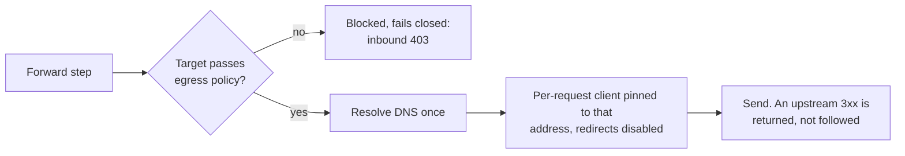

# Policy Planes, Enforcement, and Egress Controls

Revision-specific internals of the OPA policy planes, versioned policy
definitions, appliance-wide enforcement, and the egress/SSRF controls on the
forward legs. This documents the behavior of the checked-out source; for the
request-pipeline ordering see [`ARCHITECTURE.md`](../ARCHITECTURE.md#full-order).

## OPA packages

OPA is [Regorus](https://github.com/microsoft/regorus) (Rust-native Rego, no
external process). Gateway-level policy is evaluated before surface-level, and a
gateway deny is final. Using the wrong package name fails closed.

| Scope   | Package                  | Query                       |
| ------- | ------------------------ | --------------------------- |
| Gateway | `package gateway.policy` | `data.gateway.policy.allow` |
| Surface | `package surface.policy` | `data.surface.policy.allow` |

There are exactly two policy planes — **Gateway** (appliance-to-appliance) and
**Agent Surface**. Legacy `package channel.policy` is auto-migrated to
`surface.policy` at boot. Deny reason: `data.surface.policy.deny_reason` /
`data.gateway.policy.deny_reason`.

### MCP request context (`input.mcp`)

On an MCP surface, gateway and surface policies get `input.mcp` on the direct
Access Point and on Fabric receive alike. A legacy MCP request carries its
`method`, `tool_name` (for `tools/call`) and raw `params`; a modern
(`2026-07-28`) request carries its validated context, including the protocol
version and client declarations (see
[`MCP_METADATA.md`](MCP_METADATA.md#policy-context)). Fabric receive used to set
`input.mcp` only for modern requests, so a rule keyed on `input.mcp` never
matched legacy Fabric traffic; it now does, and a decision can change on upgrade.

## Versioned policy definitions

Policy definitions are immutable and versioned
([`src/policies/policy_definitions.rs`](../src/policies/policy_definitions.rs)). A
`PolicyDocument` holds an append-only list of `PolicyVersion`s, each carrying a monotonic
version, a content hash of `sha256(policy_type ∥ 0x1e ∥ rego)`, and an author. Editing the
Rego appends a version rather than replacing one. The flat `PolicyDefinition` API projects
the current version, and a policy's type is fixed after creation.

### How a gateway resolves its Rego

A gateway resolves **reference-only**, from one or more policy definitions named by
`opa_policy_config.policy_definition_id` and `policy_definition_ids`, at compile time. An
inline `policy` is a legacy fallback.

A definition set is evaluated as **deny-overrides**: every member must allow, and any deny
blocks.

### What an edit recompiles

Editing a definition recompiles live:

- Gateways whose `policy_definition_id` names it.
- Surfaces whose target, inbound, response, outbound, or Transit Point policy references
  it, including variant overrides.
- The appliance-wide set, when that references it.

It does **not** recompile a gateway that references it only through
`policy_definition_ids`, or a surface that uses it only as an MCP tool-gating condition.
The impact endpoint does not count those surfaces either.

### Audit and failure

Every OPA decision made by a stored policy definition records the definition's name and
the enforced `policy_version` and `content_hash` in the audit event, and, when the
`policies` audit category is enabled, in the JSONL `PolicyDecision` and the signed
`PolicyDecisionSummary`. That covers gateway, appliance-wide, surface, access-point
inbound, Transit Point, and response policies, and a denying MCP tool policy, on the
direct, MCP-proxy, outbound, and fabric paths.

These carry no revision: MCP tool gating, an allowed MCP tool-policy call (no single
policy decides it), and the built-in allow-all default.

The JSONL `PolicyDecision` also records the leg's caller context as `caller`: its
authenticated source identity, or on a Transit Point the caller the transit token carries
(its allowlisted `sub`, `email`, and `name` claims, else the caller DID). It is absent when
the request had neither.

Enforcement is **fail-closed** on both planes. An enabled but broken policy denies, and a
gateway set is evicted wholesale if any member fails to resolve or compile.

Change-control endpoints: `GET /v1/policy-definitions[/{id}[/versions|/impact]]`,
`POST /v1/policy-definitions/{id}/simulate` (dry-run), `GET`/`PUT
/v1/policy-assignments` (appliance-wide set).

Tenant-scoped PATs may read global (untenanted) policy definitions and reference
them from their own surfaces, but may update or delete only definitions owned by
their tenant and within their resource pattern. `PUT /v1/policy-assignments`
rejects any tenant-scoped PAT with 403. See
[`ACCESS_TOKENS.md`](ACCESS_TOKENS.md#tenant-ownership).

## Appliance-wide (global) enforcement

In `src/policies/global_policy.rs`: a policy can be assigned to a whole plane via
`PUT /v1/policy-assignments` (`policies.edit`) — enforced on **every** gateway
(`gateway.policy`) or **every** agent surface (`surface.policy`), independent of
each object's own OPA config. `GlobalPolicyManager` compiles one engine per
assignment per plane and evaluates the set **deny-overrides ahead of the
per-object policy** at the inbound PEPs (fabric gateway + fabric surface in
`message_processor`; direct-inbound gateway + surface in `proxy/handler` — the
surface global runs even when the surface's own OPA is disabled). Each
`GlobalAssignment` supports `monitor_only` (evaluated + audited with version/hash,
never blocking) for safe rollout; the set is **fail-closed** (a broken-to-compile
or missing enforced member denies that plane, monitor-only exempt) and recompiles
live when a referenced definition is edited. Deleting a definition removes it from
every plane's global assignments (`global_policies/global.json`). `GET
/v1/policy-definitions/{id}/impact` reports `globally_enforced` + `planes`.

## Trust Check

`src/trust_registry_verification/` runs TRQP queries per-leg, with results at
`input.trust_check_results.{caller|target}`. The stage never denies — OPA decides.
Discovery paths bypass the caller-leg check. See the source for error codes and
template syntax.

Each leg carries a `trust_check_list`: `AccessPoint.trust_check_list` for the caller leg
and `Target.trust_check_list` for the target leg. A list holds at most
`TRUST_CHECK_LIST_MAX` (10) elements
([`src/config/agent_surface.rs`](../src/config/agent_surface.rs)). A surface variant
override replaces the whole list verbatim, never element by element.

Element validation is in
[`src/trust_registry_verification/trust_check_element.rs`](../src/trust_registry_verification/trust_check_element.rs).

| Field | Rule |
| --- | --- |
| `id` | Required, unique within the leg, at most `TRUST_CHECK_ID_MAX_CODE_POINTS` (64) code points. Rego-addressable and audit-visible. |
| `name` | Optional display label, at most `TRUST_CHECK_NAME_MAX_CODE_POINTS` (64) code points. |
| `id` and `name` | Control, DEL, C1, and bidi-override codepoints are rejected. |

The two caps are separate constants that happen to share a value today, because `id` is
addressable from policy while `name` is only a label. Counts are code points, not bytes.

## Failed caller authentication

Source auth does not refuse a request whose credential is missing or invalid. The
request continues with no caller identity, `input.source_auth` is
`{"method": "failed", "attempted_method": ..., "reason": ...}`. On the direct inbound
path the stored target credential is not attached when forwarding. A surface that
must reject such callers needs a policy that denies
`input.source_auth.method == "failed"`. Server-side
source-auth errors (missing configuration, internal failures) still block with `500`.

## Caller identity verification in policy input

`input.extension_identity` is the caller identity the gateway resolved on the
inbound leg (`did`, `identity_hash`), and `normalize_caller_did` promotes its
`did` into `input.agent.did` when the body asserted none (unless the Trust
Check flagged an identity mismatch). Both carry how the DID was established:

| Field | Values | Meaning |
| --- | --- | --- |
| `input.extension_identity.verification`, `input.agent.did_verification` | `vp` | The caller proved control of the DID with an identity presentation that verified and whose issuer is one of the sending connection's issuers. Only the fabric receive path produces it. |
| | `vp_unanchored` | The caller proved control of the DID with an identity presentation that verified, but no trust anchor vouches for its issuer: the direct A2A path has no authenticated sender, so a self-issued credential ends here too. Trust its identity fields only after checking `input.agent.identity_issuer_did` or a Trust Check. |
| | `source_auth` | The DID is bound to the source credential this gateway authenticated on this request (`from_jwt_claim`). |
| | `unverified` | Nothing in the request proves the DID: `x-identity` payload pseudonyms and surface-configured identities (`static`, `from_mtls`, `from_api_key`). |
| `input.extension_identity.verified`, `input.agent.did_verified` | `true` / `false` | Boolean projection: everything but `unverified` is verified. |

A DID copied from the request body or an agent card into `input.agent.did` that
differs from `extension_identity.did`, or when there is none, carries
`did_verified: false` and no `did_verification`; one equal to it takes the
extension's verification. A presentation that fails verification, or a bare
`did` claim, never becomes `extension_identity`. The request carries at most a
payload-derived identity from a raw `agent-identity/v1` extension, and only when
no presentation was rejected (a bare `did` claim, or on the fabric path a
gateway with no VC issuer), or, on the direct path, a surface-configured
identity (`unverified` or `source_auth`). A rule such as
`input.extension_identity.verification == "vp"` therefore denies those requests.
The same rule denies every request on the direct A2A path, which never produces
`vp`; a rule for that path accepts `vp_unanchored` together with a check on
`input.agent.identity_issuer_did`.

## Egress and SSRF controls

### Forward-leg SSRF guard

`src/egress.rs::pinned_forward_client`: the **forward** step on the inbound
(`src/proxy/handler.rs`), outbound
(`src/proxy/outbound_handler.rs::step_forward_request_http`) and Fabric receive
(`src/gateways/connection_points/message_processor.rs::forward_client_for`)
sinks vets the target
with the DNS-aware cloud-metadata-only policy (cloud metadata blocked; loopback +
RFC 1918 allowed for localhost-sidecar/same-VPC forwards), resolves DNS **once**,
and forwards through a per-request `reqwest::Client` **pinned** to that exact
resolved address via `resolve_to_addrs` (TLS SNI preserved) with **redirects
disabled** — so a host cannot rebind to an internal/metadata IP between vetting
and connect, and an upstream 3xx is returned to the caller rather than followed.
A2A-proxy and legacy MCP `proxy://` targets are **not** DNS-resolved/pinned here
(vetted at dial time / MCP-proxy create time). A modern (`2026-07-28`) owned MCP
Proxy `tools/call` dials its REST backend through a pinned, redirect-free client
too, under the stricter save-time policy (see _Other pinned egress sinks_). A
blocked target fails closed (inbound
and Fabric receive `403` "Request blocked by egress policy"; outbound
`TargetAuthUnavailable`) with the resolved IP log-only.

### Other pinned egress sinks

The same pin-once-then-`resolve_to_addrs` primitive closes the DNS-rebinding
TOCTOU on the remaining validate-then-connect fetch sinks.

- `egress::pinned_strict_client` (Strict policy — blocks cloud metadata,
  loopback, RFC 1918, link-local and unique-local) pins the caller-supplied
  **MCP tool discovery** dial (`src/mcp_proxies/handlers.rs`, incl. the
  Legacy-SSE fallbacks — whose session POST URL is additionally
  **origin-locked** to the SSE host via
  `mcp::sse_transport::resolve_session_post_url`, so a cross-origin `endpoint`
  event can't redirect the POST to an internal address).
- `egress::pinned_configured_client` (Configured policy — blocks cloud
  metadata, loopback and unspecified addresses, allows RFC 1918) pins the
  modern owned **MCP Proxy `tools/call`** to its REST backend
  (`src/mcp_proxies/modern_rest.rs`). It applies at call time the same policy
  `validate_resolved_url` applies to `base_url` when the proxy is saved, so a
  backend host that rebinds to loopback afterwards is refused. Under
  `AG_TEST_MODE=true`, `AG_BDD_EGRESS_ALLOWLIST` can admit an exact loopback
  fixture (never cloud metadata); the MCP conformance runner uses this for its
  REST fixture.
- `egress::pinned_forward_client` (cloud-metadata-only) pins the **JWKS** fetch
  (`src/jwt_bearer/jwks.rs`, fresh client per fetch) and the **x402
  remote-facilitator** client (`src/x402/remote_facilitator.rs`, re-pinned per
  construction, resolve/pin on `spawn_blocking` off the async runtime).
- `egress::pinned_forward_client` also pins the **agent-card fetch** from an
  `http(s)` surface target whenever it carries `target.auth`
  (`src/proxy/handler.rs::fetch_agent_card_from_surface_target`), so the
  credential cannot follow a 3xx to another host. A 3xx answers `502`
  "Upstream redirected"; a blocked target answers `403` "Request blocked by
  egress policy". It shares the `pinned_target_client` helper with the
  inbound forward step. Without `target.auth` the fetch
  uses the shared proxy client, which returns a 3xx rather than following it
  but is not pinned.
- Fabric receive's **agent-card hop** to the local Target, made for the GW2
  policy context, uses the forward's `forward_client_for`
  (`egress::pinned_forward_client` for an `http(s)` Target), so it is pinned
  and does not follow redirects. A blocked target or a redirect yields no card.
- The Transit Point's **agent-card fetch** for target-leg Trust Check and
  agent context (`src/proxy/outbound_handler.rs::fetch_agent_card`) pins each
  well-known URL with `egress::pinned_forward_client`, the forward step's
  policy, and reads the card within the Transit Point's response bounds. A
  blocked URL, a redirect or an oversized card yields no card.

Both helpers share one `pin_and_build` body.

### DID resolution host policy

`did:web` and `did:webvh` resolution names its own host, so an attacker-supplied
DID is an egress target. Every resolver the gateway builds refuses non-public hosts
by default:

- the shared resolver (`src/gateways/did_cache.rs::init_shared_resolver`), which VP
  and VC verification (`src/identity/ssi/verifier.rs::CompositeResolver`) also uses
  for `did:web` and `did:webvh`;
- the per-client DIDComm resolvers (`did_cache::headless_tdk_config`), which keep
  their own caches.

The common guard is the address check: a host that is, or resolves to, a loopback,
private-network, carrier-grade NAT or link-local address (cloud metadata included)
is refused, and redirects are not followed. Each method also refuses some names
before resolving them. `did:web` refuses `localhost`, `*.localhost` and `*.local`.
`did:webvh` also refuses `*.internal`, `home.arpa` and single-label names, so
`did:webvh:…:mediator` is refused by name, while `did:web:mediator` is refused only
when `mediator` resolves to a non-public address.

`[did_cache] allow_private_hosts = true` (startup-only, default `false`) lifts both
checks for every resolver, cloud metadata included, and startup logs a warning when
it is on. Use it only for a local stack whose mediator and DIDs live on `localhost`.
On a network where an instance metadata service is reachable it reopens that
endpoint (see [Known limitations](#known-limitations)).

A DID document the gateway caches itself, such as a stored mediator document, is
served from the resolver cache only until the cache TTL expires (300 s for the
DIDComm clients). After that it is resolved like any other DID, so a mediator whose
DID lives on a private host needs `allow_private_hosts`. The same holds for the
gateway's own Connection Point DID: the messaging SDK signs each Trust Task with a
key it finds by resolving that DID, and sends the task unsigned when resolution
fails, which a mediator enforcing `trust_task_verification` refuses.

The guard is the resolver's own host policy (`HostPolicy` in
`affinidi-did-resolver-cache-sdk`), not `src/egress.rs`. The SDK fetches DID
documents with its own HTTP client, which the gateway cannot pin to a vetted
address. The trade-off is that the policy has only two settings, and the one that
allows private hosts also allows link-local addresses, whereas
`egress::pinned_forward_client` keeps cloud metadata blocked. Routing DID fetches
through the egress guard would need a resolver hook the SDK does not offer, and a
setting that allows private hosts but keeps link-local refused would have to come
from the SDK.

### Known limitations

These are current, unmitigated coverage gaps in the egress controls. They are
documented here so operators can assess exposure.

- **`allow_private_hosts` reopens cloud metadata for DID resolution.** The
  resolver's host policy has no setting that allows private hosts while keeping
  link-local addresses refused, so with `[did_cache] allow_private_hosts` on, a DID
  naming `169.254.169.254` is fetched. Keep the flag off wherever an instance
  metadata service is reachable. See
  [DID resolution host policy](#did-resolution-host-policy).

- **The legacy stored-MCP-proxy runtime path is not pinned.** A stored MCP Proxy
  serving `2024-11-05` is an `rmcp_openapi` `Server` (`src/mcp_proxies/handlers.rs::McpServerManager`);
  discovery through it reads tool names from the loaded OpenAPI spec and does not
  dial, but a `tools/call` dials `base_url` through rmcp-openapi's own internally
  built HTTP client (re-resolves at connect; `base_url` is management-gated and
  checked on create/update with `validate_resolved_url`, which blocks cloud
  metadata, loopback and unspecified addresses but not RFC 1918). The gateway
  cannot pin that client, so this path retains a DNS-rebinding window between
  validation and connect. Modern `tools/call` uses the gateway's own pinned
  client instead (`egress::pinned_configured_client`, see _Other pinned egress
  sinks_), which applies the save-time policy at call time: a host that rebinds
  to loopback, an unspecified address or cloud metadata after validation is
  refused. It does not refuse a rebind to an RFC 1918 address, because that
  policy allows RFC 1918.
- **The process-wide Legacy-SSE session cache** (keyed by `base_url`) can reuse a
  non-discovery session's client for a discovery GET. The POST origin-lock closes
  the metadata vector regardless, but the reused GET leg is not pinned.
- **Global (appliance-wide) enforcement covers inbound PEPs only.** The outbound
  and secondary surface-variant PEPs do not evaluate the appliance-wide policy
  set, and neither does the `fabric://` send leg for the surface plane: a direct
  inbound request to a surface whose target is `fabric://` is dispatched to
  `handle_fabric_request` after the gateway-plane global gate but before the
  surface-plane global gate in `src/proxy/handler.rs`.

## Policy decision audit logging

Every OPA evaluation emits a structured `tracing` event via
`observability::record_policy_decision`. Denials are logged at `WARN`, allows at
`DEBUG`. Fields: `policy_scope`, `policy_flow`, `policy_decision`, `policy_id`,
`policy_definition_id`, `deny_reason`, `surface_id`, `gateway_did`, `actor_did`,
`caller_*`, `http_method`, `http_path`, `trace_id`, `policy_version`,
`policy_content_hash`. See `src/observability/policy_audit.rs`.

When the `policies` audit category is enabled, the decision is also written to the VP Audit
Log, and from there forwarded to any Governance Audit integrations, which are Stream (Kafka, Kinesis,
Pulsar, or Redis Streams) or Webhook. See
[`OBSERVABILITY.md`](OBSERVABILITY.md#governance-audit-forwarding).
