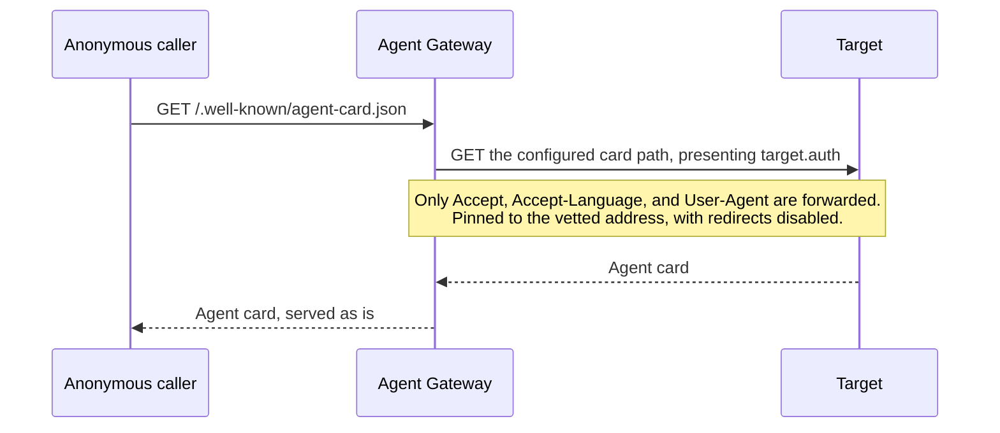

# Protocol Implementation Notes

Use the hosted [protocol documentation](https://docs.affinidi.com/products/affinidi-trust-fabric/agent-gateway/concepts/protocols/)
for A2A, MCP, AP2, DIDComm, x402, and MPP concepts and integration guidance. This page records
revision-specific behavior and limitations of the checked-out source.

## Support Matrix

| Protocol | Status in this revision | Implementation note |
| --- | --- | --- |
| A2A `1.0` | Active, advertised | JSON-RPC messaging, discovery, identity extensions, policy, and proxy targets; implemented against spec revision [`1.0.1`](https://a2a-protocol.org/v1.0.1/specification/) |
| A2A `0.3` | Accepted | Accepted while the `a2a_legacy_compatibility` feature flag is on (the default); see [A2A Protocol Versions](#a2a-protocol-versions) |
| MCP `2024-11-05` | Active | Admitted and advertised on every MCP endpoint |
| MCP `2026-07-28` | Active | Admitted and advertised alongside `2024-11-05` on every MCP endpoint |
| AP2 | Experimental | Disabled by default; production proof signing is not implemented |

The hosted documentation is rolling product documentation. Use this matrix and the repository
changelog when behavior must match this source revision exactly.

## A2A-Specific Behavior

Agent-card discovery is unauthenticated by design. Caller-leg Trust Check is bypassed for the public
agent-card and UCP well-known paths recognized by `src/proxy/paths.rs`, and for paths ending in
`/discovery`; unrelated `.well-known/*` paths do not receive that bypass. A surface-configured
caller identity (`inbound_identity`: `static`, `from_mtls`, `from_api_key`, `from_jwt_claim`) is not
resolved on those paths either, on the direct or fabric send leg, so a credential that cannot be
resolved does not fail discovery.

Forwarded requests on those public paths never carry the surface's `target.auth`: that
credential vouches that the gateway vetted the caller, and discovery vetted nobody.

### Agent card fetch

The card the gateway serves at `/.well-known/agent-card.json` and
`/.well-known/agent.json` is different, because the gateway fetches it itself from its
`http(s)` target, on a path the operator configures and the caller cannot change
(`agent_card_location_path` or `override_agent_card_location`, defaulting to
`/.well-known/agent-card.json`).

That fetch presents `target.auth` as `CallerAssertion::GatewayOriginated`, so a target
that requires a credential still publishes its card. A Simple Proxy tunnel's ingress key
and an agent behind a bearer token both work.



| Aspect | Behaviour |
| --- | --- |
| `target.auth.fallback: reject` | 502 with the generic detail "Target authentication failed". The cause is logged only. |
| `target.auth.fallback: passthrough` | Fetches without the credential. |
| Caller headers | Only `Accept`, `Accept-Language`, and `User-Agent` are forwarded while the credential is attached, so an anonymous caller can neither override the credential nor add identity or forwarding headers. |
| Redirects | The client is pinned to the vetted target address with redirects disabled, so the credential cannot follow a 3xx to another host. A 3xx answers 502 "Upstream redirected". |
| Blocked by egress policy | 403 |
| Without `target.auth` | The fetch forwards caller headers and follows redirects as before. |
| `fabric://` targets | Unchanged. The remote gateway applies its own target auth. |

The card fetched with `target.auth` is served to unauthenticated callers as is, so a
target must not return credential-only content on its card path. A2A's authenticated
extended card lives on a separate endpoint that the gateway does not fetch. This may later
become a per-surface opt-in.

For payload-derived managed identity, the Gateway reads configured fields from the identity
extension metadata, sorts them by field path, joins them as `key=value` pairs with `|`, and hashes
the canonical string with SHA-256. This hash is deterministic and unkeyed. Credential-derived modes
(`from_mtls`, `from_api_key`, and `from_jwt_claim`) instead use HMAC-SHA256 keyed by the process
identity pepper. `AG_IDENTITY_HASH_PEPPER` supplies the stable pepper when valid; otherwise startup
generates an ephemeral pepper and derived DIDs change after restart. The `static` mode returns its
configured DID directly without hashing or issuance; see
[`src/identity/credential_identity.rs`](../src/identity/credential_identity.rs). Only
`from_jwt_claim` is reported to policy as verified (`source_auth`); payload-derived, `from_mtls`,
`from_api_key`, and `static` identities are `unverified`, while an identity presentation reports
`vp` / `vp_unanchored` regardless of mode (see
[`docs/POLICY.md`](POLICY.md#caller-identity-verification-in-policy-input)).

Target `custom_metadata` is merged into outbound extension metadata. A secret reference must occupy
the whole string and use `$SECRET:<secret_id>`.

Relevant implementation:

- [`src/a2a/`](../src/a2a/) handles A2A protocol behavior.
- [`src/identity/vc_issuer.rs`](../src/identity/vc_issuer.rs) issues or resolves managed identity.
- [`src/proxy/handler.rs`](../src/proxy/handler.rs) applies the direct inbound pipeline.

## A2A Protocol Versions

The Gateway serves A2A `1.0` and accepts `0.3` callers while legacy compatibility is on. It does
not translate between versions: the request is forwarded as sent, so a caller and the Managed Agent
it reaches must share a version.

### Version negotiation

On an A2A or AP2 surface the Gateway resolves the `A2A-Version` request header right after gateway
OPA and the AP2 gate, and then runs [JSON-RPC and request-shape validation](#error-mapping). All
three come before any payment (a delegated `agent_pay` payment or local x402/MPP verification), the
forward-target egress check, the `max_body_size` limit and forwarding. So a request refused with
any of the [errors below](#error-mapping) is never charged, and those errors take precedence over an egress
block or HTTP `413`; the [protocol-version metric](OBSERVABILITY.md#a2a-protocol-version-metric)
also counts requests that are refused later. A delegated `agent_pay` payment is still settled before
the rest of this Gateway's pipeline (egress check, body-size limit, Trust Check, surface policy,
upstream), so a request it paid for can still be refused there.

Negotiation runs on every request that reaches that point, whatever the HTTP method, and applies
to Managed Agent and `a2a-proxy://` targets alike; there is no per-surface opt-out. Requests that
return earlier are not negotiated: agent-card discovery (`/.well-known/agent-card.json` and
`/.well-known/agent.json`), the DID Auth `/authenticate` endpoints on a `did_auth` surface, and
onboarding surfaces. `fabric://` targets skip negotiation and validation (see
[Fabric coverage gap](#fabric-coverage-gap)).

| `A2A-Version` header | Resolved as |
| --- | --- |
| Absent, empty, or not readable as visible ASCII | `0.3`, as the specification requires |
| `0.3` or `1.0` | As sent |
| A patch revision such as `1.0.1` | Its `Major.Minor` (`1.0`) |
| Anything else | Rejected with `-32009` |

The accepted set is `0.3` and `1.0`, narrowed to `1.0` when `a2a_legacy_compatibility` is off. The
flag changes only what is accepted, never how the header is read: an absent header still resolves
to `0.3` and is then refused.

### Error mapping

The checks run in this order, and each rejection returns before any payment and before the upstream
is contacted:

| Condition | HTTP / JSON-RPC result |
| --- | --- |
| Resolved version not accepted | HTTP `400`, `-32009` (`VersionNotSupportedError`); `data.supported` lists the accepted set |
| Body is not JSON | HTTP `400`, `-32700` |
| `jsonrpc` is not `"2.0"`, or `method` is not a string | HTTP `400`, `-32600` |
| Request shape invalid (see below) | HTTP `400`, `-32602` (`Invalid params`); `data.errors[]` holds `{field, message}` per problem, at most 20; `data.truncated: true` when more were found |

`data.requested` on `-32009` is the trimmed header when it names no known version (`2.0`), and the
resolved `Major.Minor` otherwise, so an absent header, `0.3` or `0.3.x` refused under v1.0-only
answers `"requested": "0.3"`. The last three rows need `[a2a] validate_messages` (on by default) and a
non-empty body.

### Method names

[`src/a2a/methods.rs`](../src/a2a/methods.rs) pairs every v0.3 slash-form method with its v1.0
PascalCase name (`message/send` and `SendMessage`, `tasks/get` and `GetTask`, and so on, including
`tasks/list` and `ListTasks`, which are v1.0 additions). Either spelling is accepted whatever
version was negotiated. The method is forwarded, and exposed to policy as `input.a2a.method`,
exactly as the caller sent it, so a policy that matches one spelling matches only that era. Policy
also receives `input.a2a.method_canonical`, the v0.3 slash form of a method in this table whichever
spelling was sent (`SendMessage` gives `message/send`); it is absent when the method is not in the
table or there is none. The Gateway's internal checks (payment gating, request-shape validation,
A2A-proxy dispatch and the onboarding agent) resolve both spellings to one in the same way. The
pre-0.2 alias `tasks/send` is not in the table: validation, payment filters and A2A-proxy dispatch
do not recognise it, it has no `method_canonical`, and on a Managed Agent surface it is forwarded as
sent.

### Writing policy for both versions

Because `input.a2a.method` and `input.a2a.message` reach policy exactly as the caller sent
them, a rule written for one version matches only that version.

**Deny-lists must match `input.a2a.method_canonical`.** This matters from the day a gateway
accepts both spellings: a rule that denies `tasks/cancel` by `input.a2a.method` is bypassed by a
caller that sends `CancelTask`. Match the canonical method, and add a rule that fails closed on a
method outside the [method table](#method-names):

```rego
default allow := false

allow if not deny

# Blocks both `tasks/cancel` and `CancelTask`.
deny if input.a2a.method_canonical == "tasks/cancel"

# Blocks any method outside the method table, such as `tasks/send`.
deny if {
	input.a2a.method
	not input.a2a.method_canonical
}
```

The fail-closed rule also blocks custom or extension methods; add an exception for any a surface
serves.

**An allow-list** keeps matching existing traffic until callers start sending v1.0 names. To
accept both spellings, match either one:

```rego
# Option A: a set membership check.
allow if input.a2a.method in {"message/send", "SendMessage"}

# Option B: two rules, which OPA evaluates as a logical OR.
allow if input.a2a.method == "message/send"
allow if input.a2a.method == "SendMessage"
```

Matching `input.a2a.method_canonical == "message/send"` does the same in one rule.

**The message shape differs too**, and it is not canonicalised:

| Field | v0.3 | v1.0 |
| --- | --- | --- |
| `role` | `"user"`, `"agent"` | `"ROLE_USER"`, `"ROLE_AGENT"` |
| A text part | `{"kind": "text", "text": "..."}` | `{"text": "..."}`, with no `kind` |

So `input.a2a.message.role == "user"` and `input.a2a.message.parts[_].kind == "text"` match v0.3
callers only. To cover both, match either role spelling, and identify a text part by the presence
of `text`:

```rego
allow if input.a2a.message.role in {"user", "ROLE_USER"}

allow if input.a2a.message.parts[_].text
```

`metadata`, `extensions`, and `messageId` are the same in both versions, so rules that read them,
including the agent identity extension, need no change.

Two gaps remain. With `[a2a] validate_messages` off, a JSON-RPC batch or a non-string `method`
reaches policy with neither `input.a2a.method` nor `input.a2a.method_canonical`, so no rule keyed on
the method sees it; keep validation on, which refuses both with `-32600`. On a `fabric://` surface
the request is never validated, so the same applies whatever the setting.

The allow-list and message-shape patterns are pinned against the policy engine by the tests in
[`src/surface_context/mod.rs`](../src/surface_context/mod.rs).

### Request-shape validation

Under `validate_messages`, requests to a Managed Agent target are checked against what A2A itself
requires, and the problems found are reported together in one `-32602` response, up to 20
of them: validation stops walking `parts` at the cap and sets `data.truncated: true` (the key is
absent otherwise), and a caller-supplied `kind` echoed in a message is quoted and cut to 64
characters, so a large body cannot inflate the error:

| Method (either spelling) | Checked |
| --- | --- |
| Any | `params`, when present, is an object or an array |
| `message/send`, `message/stream` | `params` and `params.message` are objects; `messageId` is a non-empty string; `role` is a recognised value in either spelling (`user`/`agent`, `ROLE_USER`/`ROLE_AGENT`/`ROLE_UNSPECIFIED`); `parts` is a non-empty array; each part carries exactly one content member (`text`, `raw`, `url`, `data` or `file`), and a `kind`, when present, is a string naming that member |
| `tasks/get`, `tasks/cancel`, `tasks/resubscribe` | `params.id` is a non-empty string, in any format |
| `tasks/list` | The optional `status` filter names a task state in either spelling (`working`, `TASK_STATE_WORKING`) |

Both eras are accepted throughout, and field-name casing is not enforced (`message_id` passes), so
conformant generated clients are not refused. Responses are never inspected. A surface whose target
is `a2a-proxy://` is exempt: the proxy is the implementation rather than a pass-through, needs only
`params.message` and text parts, and has no downstream agent that would refuse a looser message.

### Generated agent cards

The cards the Gateway generates (the synthesized A2A-proxy card and the onboarding card) are valid
`1.0` documents:

- `protocolVersion` is `[a2a] default_version` (default `1.0`; see
  [A2A settings](CONFIGURATION_RELOAD.md#a2a-settings)) while the Gateway accepts it, and otherwise the
  first version it does accept.
- `supportedInterfaces[]` lists one entry per accepted version, the advertised version first, all
  with the same URL and `protocolBinding: "JSONRPC"`. With legacy compatibility off it lists only
  `1.0`.
- `provider.organization` and `capabilities.extendedAgentCard` carry the provider and
  extended-card flag; `capabilities.stateTransitionHistory` is not emitted.
- While legacy compatibility is on, the v0.3 fields `url`, `preferredTransport`, `agentProvider`
  and `supportsAuthenticatedExtendedCard` are emitted as well, each derived from its `1.0`
  counterpart, so a v0.3 client can act on the card. With it off they are omitted. `protocolVersion`
  and `supportedInterfaces[0]` name `default_version` while the Gateway accepts it, and otherwise
  the first version it does accept, so pinning `"0.3"` with legacy compatibility off yields `1.0`.

Field mapping from v0.3 to v1.0 in generated cards:

| v0.3 field | v1.0 field | In the generated card |
| --- | --- | --- |
| `url` and `preferredTransport` | `supportedInterfaces[]`, ordered | v1.0 field always; the v0.3 pair too while `0.3` is accepted |
| `additionalInterfaces[]` | Folded into `supportedInterfaces[]` | Not emitted |
| `transport` | `protocolBinding` | `protocolBinding`, value `"JSONRPC"` (previously the incorrect `"HTTP+JSON"`) |
| `agentProvider` | `provider.organization` | v1.0 field always; the v0.3 field too while `0.3` is accepted |
| `supportsAuthenticatedExtendedCard` | `capabilities.extendedAgentCard` | v1.0 field always; the v0.3 field too while `0.3` is accepted |
| `capabilities.stateTransitionHistory` | Removed in v1.0 | Not emitted |

The dual-emitted v0.3 fields are deprecated. Card consumers should read the v1.0 fields.

An explicit `[a2a] default_version = "0.3"`, as in a configuration copied from an older example,
takes effect: generated cards then advertise `0.3` and list the `0.3` interface first while `0.3`
is accepted. Remove the line or set `"1.0"` to advertise `1.0`.

A Managed Agent's own card is served at the agent's `protocolVersion` and never translated to
another version. On agent-card discovery requests the Gateway changes it in two ways: its endpoint
URLs are rewritten to the gateway, and, when agent identity is configured, its
`agent-identity/v1` extension is replaced by a signed `agent-identity-credential/v1` presentation
(with the `didwebvh` feature, `agentDid` and `agentDNA` are added too). The URL rewrite covers
`supportedInterfaces`, `supported_interfaces`, `additionalInterfaces` and `additional_interfaces`,
in their original order, since in `1.0` order
encodes preference. An extended card returned as a JSON-RPC result (`GetExtendedAgentCard` /
`agent/getAuthenticatedExtendedCard`) is forwarded as the agent sent it, without URL rewriting.

A surface's agent card (the synthesized A2A-proxy card or a Managed Agent's rewritten card) is
served as `application/a2a+json` only when the caller's `A2A-Version` resolves to `1.0` or the
caller lists that type in `Accept`; every other caller receives `application/json`. The response carries
`Vary: A2A-Version, Accept`, so a shared cache stores each variant separately. The onboarding
card served by the identity API (`/onboard/{uuid}/.well-known/agent-card.json`) is always served as
`application/json`.

### Legacy compatibility

The `a2a_legacy_compatibility` feature flag (dashboard **Settings → System → Feature Flags**)
controls whether `0.3` is accepted. Unset counts as on, so an upgrade never starts refusing callers
by itself. Off serves `1.0` only: a `0.3` request, including one with no `A2A-Version` header, is
answered with `-32009` and `"supported": ["1.0"]`, and generated cards drop the `0.3` interface and
the v0.3 fields. Off reaches every negotiated request (see [Version negotiation](#version-negotiation)):
a GET, or a call to an `a2a-proxy://` surface, that carries no `A2A-Version` header gets HTTP `400`
`-32009` as well, and no surface can opt out. Agent-card discovery is not negotiated, so a headerless
client can still fetch the card; a generated card then lists only `1.0` in `supportedInterfaces[]`,
while a Managed Agent's card lists whatever the agent published. The flag is read from settings on
each request and takes effect without a restart.
Before switching it off, check `agent_gateway_a2a_protocol_version_total` (see
[Observability Internals](OBSERVABILITY.md#a2a-protocol-version-metric)) for remaining `0.3`
traffic, bearing in mind it does not count [fabric traffic](#fabric-coverage-gap). Once it is off,
refused callers are counted with `negotiated_version="rejected"`.

### Guidance for callers

- Send `A2A-Version: 1.0` on every call. A request without the header counts as `0.3`, and is
  refused once an operator switches legacy compatibility off.
- Read the endpoint from `supportedInterfaces[0].url`, the preferred interface, and fall back to
  the top-level `url` only for v0.3 cards.
- Confirm the Managed Agent behind a surface speaks v1.0 before switching, because the Gateway
  does not translate between versions.

What stays the same:

1. Conformant v0.3 callers keep working while legacy compatibility is on, the default.
2. Both method spellings are accepted whatever version was negotiated, so a partly migrated client
   is not refused.
3. A Managed Agent's card is served at its own version; only its endpoint URLs and identity
   extension change.
4. The legacy discovery path `/.well-known/agent.json` still resolves.
5. `application/json` remains the default card media type.
6. Existing policies keep matching existing traffic, since the method reaches policy as sent. A
   deny-list still has to match `method_canonical`; see
   [Writing policy for both versions](#writing-policy-for-both-versions).

### Backend identity in task artifacts

On the response leg, the protected agent's identity extension is read from the status message
first and then from `artifacts[]` in document order; the first match wins, and a location that
declares the extension without its payload is reported as malformed rather than skipped. `history[]`
is never read, because it holds the caller's own messages. This applies to a bare Task (a `GetTask`
or v0.3 `message/send` result) and to the Task a v1.0 `SendMessage` result wraps in
`{"task": …}`.

When the identity is on the status message, the signed `agent-identity-credential/v1`
presentation replaces the raw extension there. An identity resolved from an artifact is used for
issuance and the Trust Recorder, but the artifact keeps its raw extension and no credential is
added to the reply.

Neither remaining location proves authorship: A2A artifacts carry no author, and the Gateway does not
validate responses. A Managed Agent that reflects caller content into its status message or an
artifact (by echoing it, tracing it, or under prompt injection) can therefore let a caller plant an
identity extension that resolves as the agent's own, with the managed-identity issuance and Trust
Recorder writes that follow. This rests on the trust placed in the Managed Agent; see
[`response_identity_candidates`](../src/proxy/backend_identity.rs).

### Fabric coverage gap

Version negotiation, both validation layers and the protocol-version metric run only on the direct
inbound path. They are skipped for a surface whose target is `fabric://`, and
the [fabric receive pipeline](FABRIC.md#fabric-receive-pipeline) does not run them either. So on
both G2G legs:

- a `0.3` request, an unsupported `A2A-Version` and a malformed A2A request all reach the remote
  Target, even with `a2a_legacy_compatibility` off, and the remote agent decides;
- `agent_gateway_a2a_protocol_version_total` does not count the traffic, so it cannot show `0.3`
  callers on G2G surfaces.

These are protocol-conformance checks, not access control. Source authentication, gateway and
surface policy, and Trust Check still run on each leg.

Relevant implementation:

- [`src/a2a/version.rs`](../src/a2a/version.rs) owns negotiation, the accepted set, and generated-card interfaces.
- [`src/a2a/validation.rs`](../src/a2a/validation.rs) owns request-shape validation.
- [`src/a2a/errors.rs`](../src/a2a/errors.rs) builds the JSON-RPC error responses.
- [`src/a2a/url_rewriter.rs`](../src/a2a/url_rewriter.rs) rewrites Managed Agent card URLs.


### Current limitations

- **Streaming:** the SSE pass-through runs for MCP surfaces only. An A2A `message/stream` /
  `SendStreamingMessage` or `tasks/resubscribe` / `SubscribeToTask` response is read in full in
  `src/proxy/handler.rs` and returned whole, so the caller sees nothing until the upstream closes.
  Headers, event order and terminal task states are preserved, but the whole stream must finish
  within the request timeout (`[a2a] timeout_seconds`, default 30 s, or the surface's
  `request_secs`), or the request fails; only MCP SSE requests get the long-lived timeout. The
  buffered stream is also bound as described in [Upstream Response Bounds](#upstream-response-bounds),
  so a pause between events longer than `networking.timeout.idle_secs` fails it. MCP streaming
  keeps the incremental path.
- **Signed cards:** there is no signature handling. URL rewriting and identity-extension
  replacement invalidate any `signatures[]` on a Managed Agent's card, and the signatures are passed
  through unchanged, so downstream verification fails.
- **Bindings:** only the JSON-RPC binding is served. A2A mandates no particular binding, so this is
  conformant; gRPC and REST are not planned.
- **Per-interface routing:** the rewrite points every interface URL (`supportedInterfaces[]`,
  `additionalInterfaces[]`) at the surface's one gateway endpoint and keeps each entry's
  `protocolBinding` and `protocolVersion`. An upstream that routes by interface loses that routing:
  a client that picks a `GRPC` or `HTTP+JSON` entry reaches the Gateway's JSON-RPC endpoint and
  fails, and one that picks a per-version path is forwarded to the surface's target endpoint rather
  than that path.
- **Reply shape:** the A2A proxy runtime (`src/a2a_proxies/runtime.rs`) and the onboarding agent
  answer in the v0.3 shape (`kind`, `role: "agent"`) whatever version the caller negotiated.

## Upstream Response Bounds

Every upstream response the Gateway buffers is bounded by size and by idle time, whatever the
protocol (`proxy::upstream_body::read_bounded`). This covers every response on the direct path
(for MCP, any that is not `text/event-stream`, plus a `tools/list` answered as SSE, which is
buffered for tool gating), every HTTP response on a Transit Point, and the legacy Fabric receive
forward to the local Target, JSON or SSE. A Fabric receive failure is returned to the sending
gateway as a `ForwardResponse` with the same status. The Fabric receive agent-card hop and MCP
tool discovery (JSON or SSE, capped at the default `max_body_size`) are bounded the same way; a
card that fails the bounds is treated as missing.

An SSE stream the Gateway parses event by event rather than buffering whole (an MCP
`text/event-stream` passthrough, and Legacy SSE sessions) holds at most `[a2a] max_body_size` of
one incomplete event (the default 10 MB for Legacy SSE sessions). An event that grows past that
ends the stream, and a Legacy SSE session ends with it. An MCP `text/event-stream` passthrough also
ends when the upstream sends nothing for the surface's `mcp_http.stream_idle_timeout_secs` (default
60 s) or is still streaming at `mcp_http.stream_max_lifetime_secs` (default 3600 s).

The gateway holds at most 10,000 Legacy SSE sessions (`GET /sse` on `proxy://` and `fabric://`
surfaces, and on standalone MCP proxies). A `GET /sse` beyond that, after sessions whose client has
disconnected are dropped, is answered with HTTP `429` "Too many active SSE sessions".

- A body larger than `[a2a] max_body_size` (default 10 MB, which also caps requests) is answered
  with HTTP `502` "Upstream response too large".
- A pause between chunks longer than the target's `networking.timeout.idle_secs` (Transit Point
  first, then surface; default 60 s; `0` disables it) is answered with HTTP `504`.
- A body still arriving when the target's `request_secs` expires (default `[a2a] timeout_seconds`
  direct and on Fabric receive, 30 s on a Transit Point) is answered with HTTP `504`. On Fabric
  receive the forward client's `[a2a] timeout_seconds`, or the caller's deadline, also caps the
  whole exchange.

For an SSE-shaped direct MCP request (`GET`, or `POST` accepting `text/event-stream`) the upstream
may take up to 24 hours to send headers; `request_secs` for a non-SSE body then counts from the
headers. A `text/event-stream` passthrough keeps the 24-hour limit; a buffered SSE `tools/list`
does not, and must end within `request_secs`.

Not bounded here: `fabric://` legs.

## MCP Validation Boundary

`2024-11-05` is active on every MCP endpoint. The Gateway recognizes `2026-07-28` per-request
metadata and mirrored HTTP headers on direct Access Points, Transit Points, standalone MCP Proxies
and Fabric receive, and admits and advertises that revision alongside `2024-11-05` on every MCP
endpoint. Fabric carries it only as framed streams; the buffered Fabric forward stays
`2024-11-05`-only. Revisions the gateway does not model are rejected as unsupported.

`2026-07-28` support is measured against the published MCP conformance suite with
`make mcp-conformance`, which runs the ordinary gateway binary; see
[`scripts/mcp-conformance/README.md`](../scripts/mcp-conformance/README.md) and the Conformance
Harness section of [`MCP_METADATA.md`](MCP_METADATA.md).

| Condition | HTTP / JSON-RPC result |
| --- | --- |
| Valid modern request whose upstream answers with a legacy (non-modern) result | HTTP `502` |
| Request using an unmodelled revision such as `2025-06-18` | HTTP `400`, `-32022`, listing the revisions the endpoint supports |
| Malformed modern metadata | HTTP `400`, `-32602` |
| Missing, malformed, or mismatched mirrored headers | HTTP `400`, `-32020` |
| Modern-signaled POST with an empty body | HTTP `400`, `-32700` |
| Modern metadata declaring legacy `2024-11-05` | HTTP `400`, `-32602`, mixed-era diagnostic |
| Legacy `initialize` asking for a revision the endpoint does not serve | Forwarded asking for `2024-11-05`, so the session settles on a revision the endpoint serves |

The `initialize` cap is `cap_legacy_initialize` in `src/mcp/request_validation.rs`, applied
after `normalize_bytes` on the direct, Transit Point and Fabric receive paths, so an upstream
that supports `2025-11-25` cannot settle a session the gateway then rejects.

A lone `MCP-Protocol-Version: 2024-11-05` header remains legacy traffic when modern metadata and
mirrored method or name headers are absent. Every supplied `Mcp-Name` is validated, including for
methods without a mirrored name source. Complete Base64 sentinel markers trigger decoding; partial
markers remain plain ASCII, and overlapping markers fail without panicking.

Wire validation runs before generic method-prefix protocol classification. Modern `tasks/*`
requests therefore receive MCP validation errors instead of being classified as A2A. Requests
without modern signals retain legacy protocol-family handling.

## MCP Metadata Compatibility

Canonical metadata is carried in `params._meta` for requests and notifications and in
`result._meta` for successful responses. Affinidi-owned keys use the `io.affinidi.fabric/*`
namespace.

The Gateway also recognizes an explicit top-level `_meta` compatibility envelope for legacy
traffic. Canonical aliases are normalized, conflicting Gateway-owned values are rejected, and
modern-signaled requests cannot use the top-level compatibility envelope.

`AgentSurface.mcp_legacy_metadata_output` controls output placement for legacy traffic:

- `compatibility` is the default and preserves historical top-level output and aliases;
- `canonical` writes metadata to `params._meta` or `result._meta` with canonical keys.

The setting is inherited by Surface Variants. It changes legacy output shape but does not activate
the recognized modern revision.

Relevant implementation:

- [`src/mcp/meta.rs`](../src/mcp/meta.rs) owns metadata placement, aliases, and normalization.
- [`src/mcp/request_validation.rs`](../src/mcp/request_validation.rs) owns request classification and wire validation.
- [`src/mcp/identity.rs`](../src/mcp/identity.rs) owns identity extraction and injection.
- [`src/mcp_proxies/`](../src/mcp_proxies/) contains the REST-to-MCP adapter.

### MCP proxy exposure

An MCP proxy turns a REST API described by an OpenAPI spec into an MCP server. It
can be reached two ways:

- **Through a surface** whose target is `proxy://<proxy-id>`. Caller
  authentication, surface OPA policies, MCP tool policies, MCP tool gating and
  target auth all apply.
- **Directly**, on the `{prefix}/{endpoint_path}` route registered for each
  `mcp_proxies` prefix in `network.json`. This route carries no caller
  authentication or policy of its own.

`McpProxy.direct_access` (default `true`) controls the second. A proxy created
with `"direct_access": false` answers only through a surface; on the direct route
it is treated exactly like a path with no proxy (POST and `GET …/sse` answer 404,
and the `GET` route-info response reports `configured: false`), so its existence is
not disclosed. Records and create requests without the field keep today's behaviour.

Direct-route matching is on a path-segment boundary, and the longest matching
`endpoint_path` wins, so a proxy at `/foo` does not answer `/foobar`.

`McpProxy.managed_by` (optional, at most 64 printable characters) names the
product that maintains the proxy through the API. It is a label only and grants
or restricts nothing; on update, absent keeps it and an empty string clears it.

In the dashboard, the Add MCP Proxy wizard and the proxy's Routing tab carry an
"Also serve on its own route (no sign-in)" switch (on by default, matching the
API). With it off, the route fields are disabled, the Overview and Routing tabs
show the surfaces that front the proxy instead of a copyable route, and the
Sandbox tab points to a fronting surface's sandbox, since the direct route
would answer 404. The Proxies list shows each proxy's reachability and any
`managed_by` label; a managed proxy's edit page and delete confirmation warn
that changes may be overwritten by, or break, the managing product. The surface
builder's "via MCP Proxy" target notes whether the chosen proxy can also be
reached around the surface.

## x402 Payment Verification

A local x402 paywall verifies a caller's payment against the surface's own `payment_requirements`,
never against the requirement the credential carries. The credential's `accepted` object must name
one of the requirements the `402` challenge issued, exactly, in everything verification and
settlement act on: `scheme`, `network`, `asset`, `payTo`, `amount`, the asset transfer method in
`extra`, and the EIP-712 `name` and `version` in `extra`. The amount must equal the configured one
for `upto` as well as `exact`, because an `upto` payer authorises the configured amount as the
maximum. EVM addresses compare case-insensitively, because the challenge issues them lowercased;
Solana addresses compare exactly. A credential that names no issued requirement is rejected with
`400 invalid_payment` before any signature check, chain lookup, facilitator call, or settlement,
in every `verification_mode` including `mock`, and its transaction record is marked failed. A
surface with x402 enabled and no `payment_requirements` accepts no payment. Beyond that match,
`mock` skips every signature, chain, and facilitator check, so it grants access for an unpaid
credential; it is for tests only and must not be used in production.

Every check takes its expected values from the resolved requirement: the recipient, amount, token,
asset transfer method, and EIP-712 domain. A requirement checked by signature therefore needs
`extra.assetTransferMethod` (`eip3009` or `permit2`), and an EIP-3009 one also needs `extra.name`
and `extra.version`; clients no longer supply them. Signature checks require the authorised value
to equal the configured amount. Solana transaction-hash verification checks native SOL lamports
only and refuses a requirement for an SPL token, which must use `spl_transfer`. An embedded or
external facilitator receives the resolved requirement as `paymentRequirements` next to the
caller's `paymentPayload.accepted`, so the facilitator's own requirement match also applies.

The transaction record and every settlement path (immediate, deferred, startup recovery, and
fabric) use the payload with `accepted` replaced by the resolved requirement. A record written by
an earlier build carries the caller's own `accepted`: the deferred worker and startup recovery
settle it only if that still resolves to one of the surface's current requirements, and otherwise
mark its settlement failed.

In `fabric_gateway` verification mode, the requesting gateway resolves the requirement and sends it
as `payment_requirement` in the `x402/verify-request` body. The facilitator gateway verifies against
that requirement and rejects a verify-request that does not carry one. A facilitator gateway trusts
its fabric peers: it verifies against the requirement a peer sends, and settles the payload a peer
sends in `x402/settle-request` as it is. Upgrade requesting gateways first. An upgraded requester
binds the payment, including its EIP-712 domain, before a facilitator on an earlier build sees it;
an upgraded facilitator rejects every verify-request from a requester on an earlier build.

## AP2 Limitation

AP2 is controlled by `feature_flags.ap2_experimental`, which defaults to off. When disabled, an AP2
POST with a body is rejected with HTTP `501` after Gateway OPA and before payment handling or
forwarding.

When enabled, transformation still returns `501` if the Gateway cannot produce the required
cryptographic proof. The current implementation does not fabricate a proof to make the request
appear successful.
