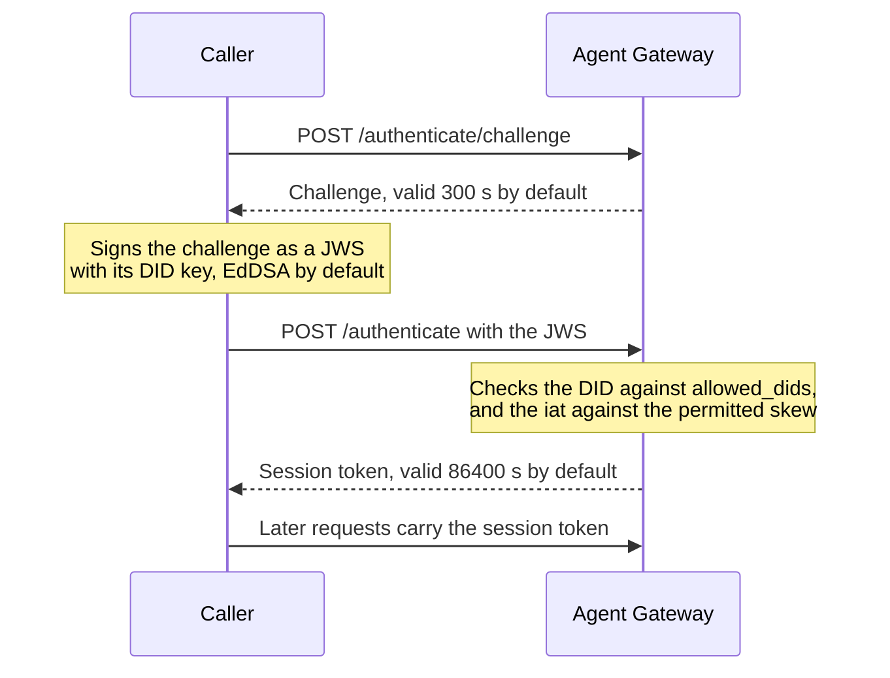

# Source Authentication and Managed Identity

Revision-specific internals of how the gateway authenticates an inbound caller and how
it derives the managed agent's DID. These are separate concerns and the source keeps
them separate: source authentication proves who is calling, managed identity names the
agent the request is on behalf of.

Use the hosted [identity documentation](https://docs.affinidi.com/products/affinidi-trust-fabric/agent-gateway/concepts/identity/)
for product concepts. See [`POLICY.md`](POLICY.md#caller-identity-verification-in-policy-input)
for how a derived DID is graded in policy input, and [`FABRIC.md`](FABRIC.md#peer-issuer-dids)
for attribution on the fabric path.

Implemented in [`src/source_auth/`](../src/source_auth/) and
[`src/didauth/`](../src/didauth/).

## Source authentication

Configured on the Access Point as `caller_authentication.methods`. Each method is a
`SourceAuthConfig`
([`models.rs`](../src/source_auth/models.rs)), which has five variants.

| Method | Serialized tag | Validates |
| --- | --- | --- |
| JWT bearer | `jwt_bearer` | An inbound bearer token against a JWT verification strategy |
| API key | `api_key` | A key extracted from the request against the secrets store |
| API key provider | `api_key_provider` | A key extracted from the request against the API Key Provider |
| DID Auth | `did_auth` | A DID Auth session token |
| mTLS | `mtls` | A TLS client certificate |

`methods` is a list, but the inbound pipeline enforces only its first entry
([`AgentSurface::source_auth`](../src/config/agent_surface_accessors.rs)); later entries
are accepted and ignored.

A missing or invalid credential does not refuse the request. That includes an mTLS
certificate that lacks the configured binding field. The request continues with no caller
identity, and policy sees `input.source_auth` as
`{"method": "failed", "attempted_method": ..., "reason": ...}`. Only server-side errors,
such as missing configuration or an internal failure, block the request with `500`
([`errors.rs`](../src/source_auth/errors.rs)). A surface that must reject unauthenticated
callers therefore needs a policy that denies them:

```rego
package surface.policy

default allow := false

allow if not deny

deny if input.source_auth.method == "failed"
```

See [`POLICY.md`](POLICY.md#failed-caller-authentication).

### mTLS

Two trust modes, in [`MtlsTrust`](../src/source_auth/models.rs):

| Mode | Behaviour |
| --- | --- |
| `Pinned { certificate_ids }` | Accepts only those exact certificates, matched by SHA-256 fingerprint of the stored leaf DER. No chain verification. References certificates whose `kind == ClientLeaf`. |
| `Ca { ca_certificate_ids, … }` | Verifies that the presented leaf chains to one of the configured CAs. References certificates whose `kind == Ca`, and can require the TLS Client extended key usage. |

The identity taken from the certificate is chosen by `MtlsIdentityBinding`. Every mode
except `Fingerprint` fails at runtime when the certificate does not carry the field.

| Binding | Takes |
| --- | --- |
| `fingerprint` | Lowercase hex SHA-256 of the leaf DER. Always available. |
| `subject_cn` | Subject Common Name |
| `dns_san` | First DNS SubjectAltName |
| `uri_san` | First URI SubjectAltName. SPIFFE IDs arrive through this mode. |
| `ip_san` | First IP SubjectAltName, rendered canonically |
| `subject_rdn { oid }` | An arbitrary RDN by OID from the Subject DN, for example UID as `0.9.2342.19200300.100.1.1` |

The certificate reaches the gateway either from a directly terminated TLS handshake or
forwarded as an XFCC header from a proxy listed in `tls.client_auth.trusted_proxies`.
An XFCC header from any other source is not trusted.

### DID Auth

A two-step ceremony: `POST /authenticate/challenge` issues a challenge, and
`POST /authenticate` accepts a JWS over it.



| Setting | Default | Notes |
| --- | --- | --- |
| `allowed_dids` | empty | Empty means any DID is accepted |
| `challenge_ttl_seconds` | 300 | Capped at 3600. A longer challenge widens the replay window. |
| `session_ttl_seconds` | 86400 | |
| `allowed_algorithms` | `["EdDSA"]` | The verifier recognises `EdDSA` and `ES256`; a value outside that set is rejected at validation time |

`IAT_SKEW_SECONDS` is 120 ([`verify.rs`](../src/didauth/verify.rs)). A JWS is rejected
when its `iat` is more than 120 seconds in the future. The backdating allowance is
wider, at 30 times that value.

Workload Binding supports `caller_source: did`, which tags the Workload Binding
presentation with `user_hash = SHA256(did)`.

## Managed identity

A rule that derives the managed agent's DID. `ManagedIdentityConfig`
([`models.rs`](../src/source_auth/models.rs)) has five modes. It is set per identity
slot on the surface, and a Transit Point may override it for its own outbound leg.

| Mode | Derives the DID from | Counts in policy as |
| --- | --- | --- |
| `payload_extraction` | A field in the request payload metadata. Also accepted on the wire as `from_payload`. | `unverified` |
| `from_api_key` | A stored API key named by `api_key_id` | `unverified` |
| `from_mtls` | A stored certificate named by `certificate_id` | `unverified` |
| `static` | A fixed `did`, for test fixtures and stub agents | `unverified` |
| `from_jwt_claim` | A claim on a JWT already verified by source auth | `source_auth` |

Only `from_jwt_claim` is request-bound. The other four read a stored credential or the
request body and are independent of the credential authenticated on this request, which
is why they do not count as verified. An identity presentation reports `vp` or
`vp_unanchored` regardless of the configured mode; see
[`POLICY.md`](POLICY.md#caller-identity-verification-in-policy-input).

### `from_jwt_claim`

Requires `jwt_bearer` source auth on the same surface, so the token is cryptographically
verified before the DID is derived.

| Field | Default | Effect |
| --- | --- | --- |
| `claim` | `oid` | The claim whose value identifies the agent. The default is the stable Microsoft Entra Agent ID object identifier. |
| `namespace_claims` | empty | Additional claims folded into the identity hash to namespace the agent across tenants or issuers, for example `["iss", "tid"]`. Every listed claim must be present on the token, or resolution fails. |

One stable `did:webvh` is minted per distinct claim value. Token rotation keeps the DID
stable, and a shared identity-hash pepper keeps it identical across every gateway in the
fabric.

### Identity hash pepper

The two derivation paths hash differently.

| Mode | Hash |
| --- | --- |
| `payload_extraction` | Plain SHA-256 over the selected fields, sorted by path and joined as `field=value\|field=value` ([`identity_hash.rs`](../src/identity/identity_hash.rs)). No pepper. |
| `from_mtls`, `from_api_key`, `from_jwt_claim` | `HMAC-SHA256(pepper, canonical(fields))` ([`credential_identity.rs`](../src/identity/credential_identity.rs)) |
| `static` | None. The configured DID is used as given. |


The pepper keeps a credential-derived hash non-invertible, so emitting it through policy
input or the audit log does not expose the certificate, key, or claim it came from. It is
read from `AG_IDENTITY_HASH_PEPPER`, as hex or as a loader reference such as `env://`,
`file://`, `aws_secrets://`, or `aws_parameter_store://`, and must decode to at least 32
bytes. A2A proxy identities other than Entra agents are hashed with it too.

Without it, or with a value that is too short or cannot be resolved, the gateway falls back
to an ephemeral pepper, and every **credential-derived** DID changes on restart. Payload-derived DIDs are unaffected. Two gateways that should mint
the same credential-derived DID for the same agent must share the pepper. See
[`CONFIGURATION_REFERENCE.md`](CONFIGURATION_REFERENCE.md#environment-variables).

Credential-derived modes skip body parsing entirely.

## Trust Recorder

The only writer of agent-in-trust-registry records
([`trust_recorder.rs`](../src/trust_registry_verification/trust_recorder.rs)). It fires
on the response leg and on discovery, and is idempotent.

After writing its records, the Trust Recorder publishes a name for each authority it
wrote. The name comes from the Authority register entry with that DID, or, failing that,
from the Issuer with that DID, which covers the `{{ surface.issuer_did }}` template. An
Issuer DID used as a record's entity is named after the Issuer too. A DID with no
matching Authority or Issuer stays unnamed.

When the managed agent has a display name (see [Display names](#display-names)), the
Trust Recorder also publishes the agent DID's entity reference field and attaches
`{"displayName": "<name>", "origin": "managed"}` as `context` on the records it creates
for the agent DID. Context is a snapshot taken at creation and is never rewritten; the
reference field carries the current name. A naming failure never skips record creation.

`authority_did` accepts the template `{{ surface.issuer_did }}`, resolved at write time
to the surface's configured Issuer DID. When the surface has no issuer configured the
template does not resolve and the entry is skipped with a warning rather than written
with a placeholder.

## Display names

A display name is an unverified, human-readable label for a DID
([`display_name.rs`](../src/identity/display_name.rs)). Valid names are trimmed, keep
their case, contain no control characters or invisible Unicode format (`Cf`) characters
such as zero-width spaces and bidirectional overrides, and fit in 128 characters and
256 UTF-8 bytes. Descriptions are dropped when they contain either kind of character. An invalid or empty name is skipped with a warning, and the DID is shown
instead. Falling back to the DID is display-only: no reference field, context or VC
name is ever published with the DID as the name.

### Managed agents

The managed agent's display name is its surface name. On A2A and AP2 surfaces with an
`http` or `https` target, the dashboard shows the `name` in the target's Agent Card
instead, marked unverified (see [Agent Card names](#agent-card-names)). Each identity record carries an
origin (`managed` or `external_caller`), stamped when the gateway issues the DID. The
origin follows the identity slot the DID came from, not the request leg: on a surface
with no inbound slot, an inbound request that derives the DID from the protected slot
(or legacy `target.identity_injection`) issues it as `managed`, the same as the
outbound leg and the response path. A
record written before origins existed has none until the gateway next issues its
credential. Until then it is never published, and the dashboard shows it unnamed, in its
own row, with the LOCAL or REMOTE badge instead of an origin badge. A record is not
classified from the surface it links to: before origins existed, caller DIDs were also
stored as local records linked to the surface, so a link does not prove a managed agent.
Credential principals (the name of the backing certificate or secret) appear only in
the dashboard and are never published.

If one DID is managed on more than one surface, no name is published and the dashboard
shows a name conflict.

#### Agent Card names

The Agent Card name ([`target_card_names.rs`](../src/identity/target_card_names.rs))
is dashboard-only. It applies to every managed-identity mode, and the Identities page
shows it in place of the surface name with an "unverified" marker. The card is read from
`<target endpoint>/.well-known/agent-card.json`, then `/.well-known/agent.json`, or from
the target origin plus the access point's `agent_card_path` when that is set. Surfaces of
other protocols, such as MCP, and targets with another scheme, such as `fabric://`, are
never looked up.

Lookups are cached per surface for 300 seconds and are re-read when the target endpoint
or card path changes, with a 5-second timeout for each card URL tried. The dashboard
never waits: until its first lookup finishes, and whenever the card has no valid `name`,
a row shows the surface name. When the card cannot be read (unreachable, blocked by
egress policy, a non-success status, an oversized body, or a non-JSON body), the row keeps
the last name read from the same target and card path, and the next lookup is retried
after the cache period; with no earlier name, it shows the surface name.

The card name is self-asserted by the target and never verified. The target is trusted
to serve traffic, not to choose what the gateway's Issuer signs, so the card name never
reaches the VC, Trust Recorder context, or trust-registry reference fields, and card
lookups never sit on the request path. A name conflict shows no name, whatever the card
says.

The agent identity VC carries the surface name as `credentialSubject.name` on both the
legacy and SSI paths. VCs are signed on each issuance, so the next VC after a surface
rename carries the new name under the same DID.

### Trust registry reference fields

The gateway publishes names as trust-registry reference fields
([`reference_fields.rs`](../src/trust_registries/reference_fields.rs)), never by
rewriting trust records:

| Trigger | Fields published |
| --- | --- |
| Issuer create, retry, or edit | Entity field for the Issuer DID, authority field for its Authority |
| Authority edit | Authority field, to every registry an Issuer of that Authority uses |
| Surface rename | Entity field for each managed DID of the surface, to each Trust Recorder registry |
| Trust Recorder | Entity field for the agent DID; authority field for each record's authority (an Authority, else an Issuer with that DID); entity field for an Issuer DID used as a record's entity |

An Authority or Issuer is either global or owned by one tenant, and an owned one is named
only within its tenant.
An Issuer publishes its Authority's name only when that Authority is global or in the
Issuer's tenant. The Trust Recorder names an Authority or Issuer only when it is global
or in the surface's tenant; a surface without a tenant names only global ones. A DID
that fails this check gets no reference field, but its records are still written, so
external DIDs keep working.

Each publish sends `create-reference-field`. On the problem-report code
`e.p.msg.conflict` it sends `update-reference-field`, and on a second conflict it
resends the update once. Any other error is logged and retried on the next trigger.
A reference field is shared by every writer for its type and id, so gateways that
publish different names for the same Authority overwrite each other, and the last write
wins. Fields are not create-only, so renaming an Authority or Issuer updates the name
in every registry that already holds it.
Successful publishes are cached per registry, field type, and id, so an unchanged name
is not re-sent. Publishing runs in the background and never delays or fails an HTTP
response, record creation, forwarding, or a TRQP query.

### External callers

Caller names appear only in the dashboard
([`caller_names.rs`](../src/observability/caller_names.rs)) and never override a
managed agent's name. They are resolved in the background, cached for 300 seconds, in
this order:

1. A verified agent name: a `host/@local` entry in the caller's `alsoKnownAs` that the
   DID resolver verifies back to the same DID. At most four entries are tried. Their
   egress controls are in [`POLICY.md`](POLICY.md#agent-name-resolution).
2. The `name` of the caller's Agent Card, marked unverified. The card is found through a
   DID-document service of type `AgentCard` or `A2AAgentCard`, or whose id ends in
   `#agent-card`. It is fetched under the strict egress policy with a 5-second timeout
   and a 64 KiB limit.
3. The DID.

Until the first lookup for a DID finishes, the dashboard row carries
`display_name_pending` and shows "resolving…". A finished lookup that found no name, or
that failed, shows the DID alone and is retried after the cache period.

## Related

- [`POLICY.md`](POLICY.md): how a derived DID is graded and exposed to OPA.
- [`FABRIC.md`](FABRIC.md): attribution rules on the fabric receive path.
- [`ACCESS_TOKENS.md`](ACCESS_TOKENS.md): management-plane tokens, which are a separate concern.
- [`../ARCHITECTURE.md`](../ARCHITECTURE.md): where these stages sit in the request path.
