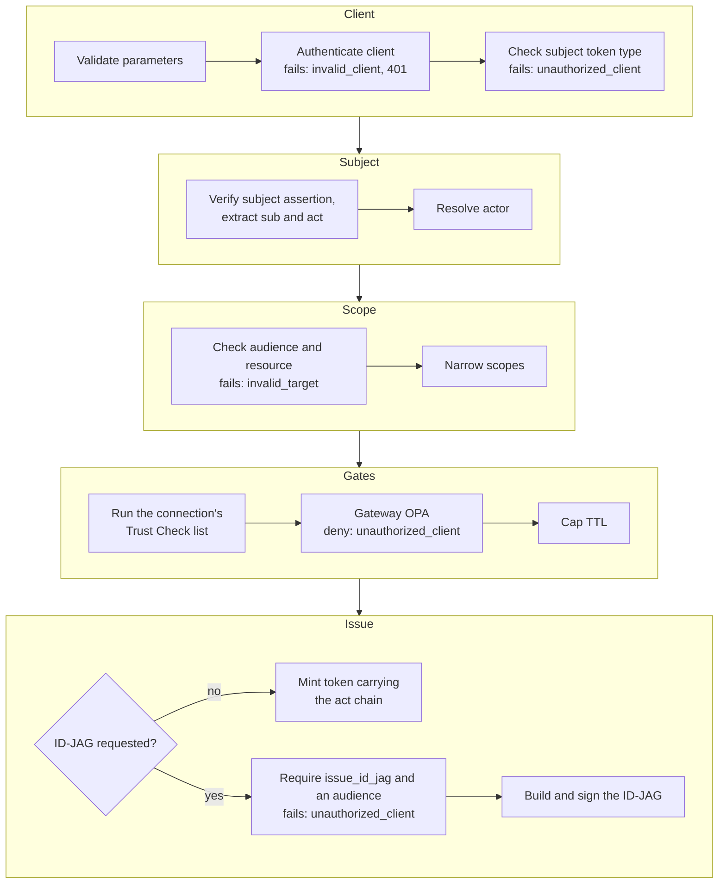
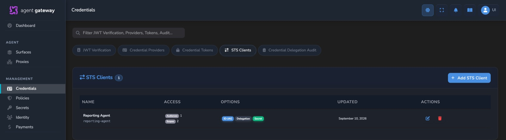

# Security Token Service (STS)

Revision-specific internals of the Agent Gateway Security Token Service
(RFC 8693 token exchange + ID-JAG). This documents the behavior of the
checked-out source.

`src/sts/` is an identity-native OAuth **token service**: it accepts a caller's
identity assertion, runs it through client and policy checks, and mints a
short-lived, audience-scoped token carrying an RFC 8693 delegation chain. The
pure, dependency-light core (URN vocabulary, request validation, `act`-chain
composition, ID-JAG build/validate) lives in `types.rs` / `errors.rs` /
`token_exchange.rs` / `id_jag.rs`; ports and Axum handlers in `handlers.rs`;
persistence in `store.rs`; admin CRUD in `admin.rs`; a client-side helper in
`client.rs`.

## Endpoints

Built by `build_sts_router`, merged into the identity API in
`src/identity/router.rs`. `/oauth2/` and `/api/oauth2/` are in
`PUBLIC_PATH_PREFIXES` in `src/auth_manager/middleware.rs` because the caller
authenticates as an OAuth client, not a dashboard session.

- `POST /oauth2/token` — RFC 8693 token exchange
  (`grant_type=urn:ietf:params:oauth:grant-type:token-exchange`) and RFC 7523
  ID-JAG redemption (`grant_type=urn:ietf:params:oauth:grant-type:jwt-bearer`).
- `GET /oauth2/jwks.json` — public keys for verifying issued tokens
  (`VCIssuer::signing_public_jwks`, strips the private `d`, `kid` defaults to
  `key-1`).
- `GET /.well-known/oauth-authorization-server` — RFC 8414 metadata;
  `token_endpoint` / `jwks_uri` are returned as absolute URLs. The base is
  resolved in precedence order: **(1) the gateway's configured public origin** —
  the first inbound listener `external_urls` entry, threaded into
  `StsConfig.public_base_url` (`compose_configured_base` keeps only its
  scheme+authority and appends the request mount prefix such as `/api`) — then
  **(2) request-derived** host/scheme (`metadata_base_url`), then **(3) relative
  paths** when neither yields a host. The configured origin is primary because
  behind a terminating HTTP proxy/tunnel the request carries neither the public
  host (`Host` is the internal `127.0.0.1:PORT`) nor the public scheme (the local
  hop is plain HTTP), and the tunnel may drop forwarding headers. The
  request-derived fallback is itself **proxy-aware**: host prefers
  `X-Forwarded-Host` (first comma-separated entry), then RFC 7239 `Forwarded
  host=`, else `Host`; scheme prefers `X-Forwarded-Proto`, then `Forwarded
  proto=`, else `https`. Deployments with no inbound `external_urls` and no
  forwarding headers behave as `Host`-derived.

## Token types

In `types.rs`, subject/actor/requested URNs — JWT
(`urn:ietf:params:oauth:token-type:jwt`), ID-JAG
(`urn:ietf:params:oauth:token-type:id-jag`,
`draft-ietf-oauth-identity-assertion-authz-grant`), and the Affinidi extension
VP (`urn:affinidi:params:oauth:token-type:vp`).

- **Subject verification**: a JWT/ID-token is verified via the `jwt_bearer`
  strategy resolved by the token's `iss` (`JwtBearerSubjectVerifier`); a VP is
  verified via `VCIssuer::verify_agent_presentation_full` (`VcIssuerVpVerifier`)
  and the exchanged token's subject becomes the cryptographically-proven
  credential-subject DID.
- **Issued tokens** are EdDSA-signed via `VCIssuer::sign_jwt_with_gateway_key`,
  verifiable by resolving the gateway DID document or the JWKS endpoint. An
  issued **ID-JAG additionally carries the explicit JOSE `typ:
  oauth-id-jag+jwt` header** (`ID_JAG_JWT_TYP`, via
  `sign_jwt_with_gateway_key_typ`; RFC 8725 explicit typing) so redemption can
  reject a plain access/ID token presented in its place.

## Delegation

Delegation is an RFC 8693 §4.1 nested `act` chain, delegation-by-default: the
authenticated `client_id` becomes the implicit actor unless the managed
connection sets `allow_impersonation`; an explicit `actor_token` (with
`actor_token_type`) overrides it.

**The delegation actor survives the ID-JAG round-trip.** `handle_token_exchange`
composes the `act` (`compose_delegation_chain(subject_act, actor_sub)`) and
**embeds it in the issued ID-JAG** (`IdJagParams.act` → `build_id_jag_claims`),
so the actor (an agent DID presented via `actor_token`, or the implicit client)
is carried by the grant rather than being a config-only / audit-only value. On
redemption, `handle_jwt_bearer` **preserves that `act` verbatim** into the
minted resource token (`AccessTokenParams.subject_act = id_jag.act`, `actor_sub
= None`) so `sub` = the user and `act` = the proven agent DID; the redeeming
OAuth client stays in the separate `client_id` claim (it is the same principal
as the agent — provably so, since redemption is client-bound — so it is **not**
nested as a second actor). A **legacy ID-JAG with no `act`** falls back to the
redeeming `client_id` as the implicit actor, so old grants redeem unchanged.
`IdJagClaims.act: Option<Value>` is extracted by `validate_id_jag`.

## Token-exchange order

In `handlers.rs`, `handle_token_exchange` runs: validate params → authenticate
client (missing/bad creds → `invalid_client`, 401) → subject-token-type
allowlist (`unauthorized_client`; a token whose JOSE `typ` is the ID-JAG media
type counts as `id-jag` whatever type the client declares) → verify subject
assertion + extract `sub`/`act` → resolve actor; a verified JWT subject or actor
the gateway signed itself (under its DID or the MCP issuer) is refused
(`reject_self_issued`, `invalid_request`) unless, on `/oauth2/token`, it is one
of the gateway's own access tokens (`typ: JWT`), so its ID-JAGs are consumed only
through `jwt-bearer` and its peer issuer attestations never become subjects →
enforce audience/resource against the allowlist (`invalid_target`; the gateway's
own issuer DID is always accepted, so self-audienced ID-JAG issuance needs no
allow-list entry) → narrow scopes → run the connection's Trust Check list →
authorize against gateway OPA policy (`unauthorized_client` on deny) → cap TTL,
never past a JWT subject's or actor's `exp` (`invalid_grant` once it has passed)
→ on `requested_token_type = id-jag`,
require `issue_id_jag` on the connection (`unauthorized_client`) and a non-empty
audience, then build + sign the ID-JAG (embedding the composed `act`). Errors
follow the OAuth model (`errors.rs`) and every response carries
`Cache-Control: no-store`.

## ID-JAG redemption hardening

`handle_jwt_bearer` (RFC 7523 `jwt-bearer`): the assertion is
signature-verified — a **gateway-issued** ID-JAG (whose `iss` is the gateway's
own DID) is verified against the gateway's **own published JWKS automatically**
(`JwtBearerSubjectVerifier` synthesizes an in-memory `Static` self-trust
strategy from `signing_public_jwks()` when `iss == get_issuer_did()`), so
loopback redemption where the issuer and the redeeming resource-AS are the same
gateway needs **no** operator-configured verification strategy for the gateway's
own DID; genuinely external issuers still resolve a configured strategy by `iss`
— then required to be an actual ID-JAG — explicit `typ: oauth-id-jag+jwt`
(`parse_jose_typ`), `aud` = this gateway, present `jti`, unexpired `exp`
(`validate_id_jag`, which **requires `jti`**).

- It is **bound to its `client_id`**: a different authenticated client cannot
  redeem it.
- It is **single-use**: the replay-protection backend (`src/sts/replay.rs`,
  behind the `ReplayProtection` trait) consumes the `jti` and rejects any replay
  within the validity window; the backend is selected by `gateway.json`
  (`sts.replay_protection.backend`, default `in_process`) and resolved through a
  runtime registry (`build_replay_backend` / `register_replay_backend`), so an
  alternative provider can be registered at startup without touching the handler
  — an unknown/unregistered name falls back to the built-in in-process guard (an
  in-process `ReplayGuard`: DashMap keyed by `jti`, atomic per-jti via the entry
  API, opportunistically pruned).
- The grant is consumed only after every other check passes, so a benign failure
  (e.g. wrong audience) never burns a valid ID-JAG.
- The issued access token's scope is **ceilinged to the grant**: `ceiling_scopes`
  (`token_exchange.rs`) computes requested ∩ ID-JAG-scope, then the client
  allowlist narrows further, so redemption can never widen the authorization.
  The issued token's lifetime is also capped at the ID-JAG's `exp`
  (`invalid_grant` once it has passed), so exchanging and redeeming in turn
  cannot outlive the original assertion.

## Policy gate

In `src/sts/policy.rs`: before any token is minted — on **both** the
token-exchange and `jwt-bearer` paths, after subject/actor verification and
audience/scope resolution — the issuance is authorized against the **gateway OPA
policy** (the same `GatewayPolicyManager` engine that gates proxy traffic,
evaluated against the self-gateway id). Rego reads the request context under
`input.sts.*` (`grant`, `client_id`, `subject`, `actor`, `audience`, `scope`,
`requested_token_type`; built by `build_policy_input`). A policy deny →
`unauthorized_client` carrying the policy's `deny_reason` (logged once under
`sts_audit`); an unconfigured gateway policy (or no policy manager wired) allows
by default, so issuance still runs under the static managed-connection
allowlists. The evaluator is a port (`StsPolicyEvaluator`) so the handler flow
stays unit-testable; production wraps the manager via `GatewayPolicyEvaluator`,
wired in `build_sts_router` from `IdentityApiState.gateway_policy_manager`.

## Trust Check on issuance

In `src/sts/trust_check.rs`: an STS managed connection may carry a
`trust_check_list` — the same `TrustCheckElement` vocabulary an Agent Surface
uses on its caller leg (`StsClient.trust_check_list`, validated on the admin API
via the shared `validate_trust_check_list` — cap `TRUST_CHECK_LIST_MAX`, unique
ids, per-element `validate()`). Immediately **before** the policy gate, the list
is evaluated over TRQP via `run_trust_check_stage` (caller leg, over a
`TrqpListenerClient`) and the verdict is merged into the OPA input at
`input.trust_check_results.caller[]`, so the gateway policy can allow/deny on a
recognition/authorization result. Element template strings resolve against the
issuance input (`{{ input.sts.* }}`). Like the proxy pipeline, the stage never
denies — OPA decides. The checker is a port (`StsTrustChecker`); production wraps
the trust-registry listener manager (`ListenerTrustChecker`, wired in
`build_sts_router` from `create_identity_api_router`'s
`trust_registry_listener_manager`), and when no manager is wired the list is
skipped (`DisabledTrustChecker`).

## Managed connections

The STS clients allowed to exchange tokens are `StsClient` records in
`FileSystemStsClientStore` at `<storage_base>/sts_clients`; the client secret is
resolved from the secrets store by reference and compared with
`constant_time_eq` (`StoreBackedClientRegistry`). A connection with **no
`client_secret_ref` is rejected at authentication (fail-closed)** — the token
endpoint has no alternative client-auth, so a secretless connection is treated as
misconfigured, not public.

Per-connection controls:

- `allowed_audiences` — when non-empty, the requested audience/resource must
  match an entry, else `invalid_target`. The gateway's own issuer DID is always
  accepted as an audience even when not listed, so ID-JAG issuance (whose `aud`
  is the gateway acting as Resource AS) needs no redundant self-allow-listing;
  genuinely external audiences still require an entry. On a connection that
  carries a `tenant_id`, the token endpoint refuses, with `invalid_target`,
  a resource served by a surface or standalone MCP Proxy of a tenant the
  connection **cannot** reference. This covers the base Access Point, enabled
  variants and their Transit Points. Create and update reject such an entry
  with `400` as early feedback. Minting checks again, so it also covers
  resources declared after the connection was saved and endpoints moved
  between tenants. A Resource Server accepts a token on issuer, audience and
  scope alone, so without this a tenant could mint tokens another tenant's
  endpoint would take. A declaration counts only when its endpoint serves it:
  a public origin of the endpoint's listener plus its own path, whatever the
  endpoint's status. So declaring another tenant's URL never blocks that
  tenant. Saving a surface or Proxy with such a declaration is refused (see
  `docs/MCP_METADATA.md`). Entries that name no resource this appliance serves
  are third-party audiences and are not restricted, so a connection can still
  be created before the surface it will target exists. Appliance-global
  connections are administrator-created and unrestricted. Ownership reads the
  network configuration loaded at startup, so restart after changing listener
  `external_urls`.
- `allowed_scopes`
- `allowed_subject_token_types` — matched against the declared
  `subject_token_type`, except that an ID-JAG-typed token counts as `id-jag`.
- `allowed_subject_audiences` — opt-in; when non-empty, a JWT subject token's
  `aud` must include one, else `invalid_grant`. VP subjects are exempt.
- `max_ttl_secs`
- `issue_id_jag`
- `allow_impersonation`

CRUD is `/v1/sts/clients` (admin-only, RBAC `StsClientsView/Edit/Delete` in
`src/rbac/mod.rs`) via `create_sts_client_router`.

## Token-endpoint throttle

In `src/sts/throttle.rs`: `POST /oauth2/token` is rate-limited per client id and
per source address (proxy-forwarded `X-Forwarded-For` first entry, then RFC 7239
`Forwarded for=`, else no ip key). Every value comes from `gateway.json`
(`sts.token_endpoint_throttle`: `enabled`, `failed_attempts_only`, `per_client` /
`per_ip` each `{requests, window_secs}`, `lockout_secs`) — nothing is hardcoded.
A caller over its window limit is locked out for `lockout_secs` and receives
`429 Too Many Requests` with `Retry-After` + `Cache-Control: no-store` **before**
any dispatch (the token-exchange metric increments `result=denied` for that
grant). With `failed_attempts_only=true` only `invalid_client` rejections (bad
or missing client credentials) count toward the limit; otherwise every request
counts. `TokenEndpointThrottle` is a `DashMap` of per-key windows
(`from_config` / `retry_after` / `record`) with opportunistic pruning. Enabled by
default with conservative limits; `enabled=false` disables it entirely.

## Observability

One `agent_gateway_sts_token_exchange_total{grant,result}` Prometheus counter per
issuance (`grant ∈ token_exchange|jwt_bearer|other`; `result = denied` for any
client-side rejection — bad client, target/scope/grant denial — and `error` only
for a server fault; `track_sts_token_exchange`, which also observes the
`agent_gateway_sts_token_exchange_duration_seconds{grant}` latency histogram)
plus one structured `sts_audit` event per mint (`emit_issuance_audit`: client,
subject, audience, issued token type, scope, actor, jti). A `server_error`
**never leaks internal detail to the client body** (`StsError::client_description`
returns a generic message; the detail is logged server-side under `sts_audit`).

## Dashboard

In `www/default`: an "STS Clients" tab on the Credentials page plus a
create/edit page manage the connections, admin-gated by the `sts_clients.*`
permissions. The tab and page use the operator-facing term **"STS client"** (the
routes `/sts-clients`, the API `/api/v1/sts/clients`, and the `sts_clients.*`
permissions are unchanged). The create/edit page exposes the client id, secret
reference (required — a tag-filtered dropdown of Secrets-store entries,
defaulting to those tagged `sts` with a toggle to show all, reusing the shared
`SecretSelector`), allowed audiences/scopes/subject-token-types,
`allowed_subject_audiences`, the TTL cap, and the ID-JAG / impersonation toggles.
The dashboard's permission gating depends on `GET /v1/permissions` enumerating
`sts_clients.view/edit/delete` (in `src/auth_manager/permissions.rs`) — a new
`Feature` must be added there as well as to the RBAC defaults, or the tab stays
hidden even for administrators.

## Tests

Pure and handler unit tests inline in `src/sts/*` (including redemption
hardening — single-use replay, client-binding, explicit typing, scope ceiling —
in `src/sts/handlers.rs::tests`, `src/sts/replay.rs::tests` (also the pluggable
replay-backend registry), and `src/sts/throttle.rs::tests` (the configurable
per-client / per-ip token-endpoint throttle)). Black-box BDD coverage in
`tests/features/surface/sts_token_exchange.feature` (10 scenarios driving a real
gateway through `POST /oauth2/token` — token exchange, ID-JAG issuance, and the
`jwt-bearer` redemption leg with single-use / client-binding / scope-ceiling /
fail-closed-client assertions; steps in `tests/surface_bdd/steps/sts.rs`).

## Known limitations

- **Client-side external STS is not wired to a provider grant type.** `client.rs`
  provides a token-exchange helper to consume an _external_ STS (e.g. Okta/Entra
  XAA) on an outbound leg. It is reusable but not yet connected to a provider
  grant type.
- **No dashboard editor for `trust_check_list`.** A client's `trust_check_list`
  is configured via the JSON API only.
