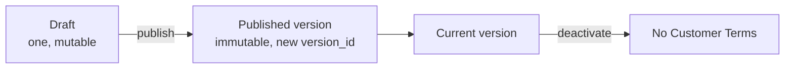
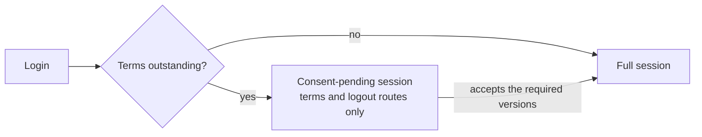

# Terms and Consent

How the gateway requires dashboard users to accept terms before they can use the product,
and how it keeps evidence that they did. Implemented in [`src/terms/`](../src/terms/),
with session gating in [`src/auth_manager/middleware.rs`](../src/auth_manager/middleware.rs).

The vocabulary, such as *Terms version*, *Acceptance Record*, and *Consent-pending
session*, is defined in [`CONTEXT.md`](../CONTEXT.md#terms-and-consent).

## Turning it on

Terms are enforced when `terms` is `true` in `gateway.json`. When it is `false`, no user
is ever asked to accept anything and every status check reports no consent required.

`affinidi_terms_url` in the same file is where the current Affinidi Terms metadata is
fetched from. See [`CONFIGURATION_REFERENCE.md`](CONFIGURATION_REFERENCE.md#gatewayjson).

## Two documents

| Document | Published by | ID |
| --- | --- | --- |
| Affinidi Terms | Affinidi, fetched from `affinidi_terms_url` | `affinidi-terms` |
| Customer Terms | The appliance operator, from the dashboard | `customer-terms` |

Either, both, or neither may be current. A user accepts at most two versions at once, one
of each.

## Versions

A Terms version is immutable. Its `version_id` is an opaque identifier used for every
acceptance and staleness check; its `version` is the label people read. The two are kept
apart so that a relabelled document can never be mistaken for an accepted one.

**Customer Terms** move from a single mutable draft to a published version:

Publishing assigns a new UUID as the `version_id`, records who published and when, and
makes the version current. A `version` label that has already been published is rejected.
Deactivating removes Customer Terms from the requirement entirely.

**Affinidi Terms** arrive as a manifest from `affinidi_terms_url`, at most 64 KB. The
gateway rejects any update that would rewrite history:

| Rejected update | Why |
| --- | --- |
| A lower `publication_sequence` than the current one | A rollback |
| The same sequence with different metadata | A silently edited publication |
| A new sequence reusing the current `version_id` | A changed document under an old identity |
| A `version_id` seen earlier being brought back | A reused identity |

## Refresh and outage behaviour

The Affinidi manifest is refreshed on a background task, every 55 to 60 minutes at a
random point so that appliances do not refresh in step. `AFFINIDI_TERMS_REFRESH_INTERVAL_SECONDS`
overrides the interval, clamped to between 60 and 3600 seconds in release builds.

A failed refresh keeps the **last-known-good** metadata, which is persisted locally and
used without expiry. An outage at Affinidi therefore never locks users out or silently
drops a requirement.

| Provider state | Meaning |
| --- | --- |
| Healthy | Metadata is present and the last refresh succeeded |
| Degraded | Metadata is present, but the last refresh failed |
| Unavailable | No metadata has ever been obtained |

`GET /v1/terms/provider-health` reports the state and the last successful refresh. The
metrics `agent_gateway_affinidi_terms_refresh_total` and
`agent_gateway_affinidi_terms_refresh_duration_seconds` track refreshes.

## Who has to accept what

Whether a user must accept a current version depends on when they are asked.

| Context | A version is required when |
| --- | --- |
| Registration | The user has not accepted that exact version |
| Login, version flagged `requires_reconsent` | The user has not accepted that exact version |
| Login, any other version | The user has never accepted any version of that document |

So an ordinary new version does not interrupt existing users. Setting
`requires_reconsent` on it does.

## Accepting

`POST /v1/terms/acceptances` takes the versions the user is accepting. The request is
checked strictly:

- Every submitted version must be explicitly marked accepted.
- At most two versions may be submitted.
- The submitted set must equal the required set **exactly**.

If the requirements changed while the user was reading, for example because a new version
was published, the request fails with `409` and the current requirement list, rather than
recording acceptance of an outdated version. Acceptance is serialised by a lock, so two
concurrent requests cannot both record against stale state.

Each accepted version produces an immutable **Acceptance Record**: the user, the
appliance, the document, the exact `version_id`, its label, title, and URL, the
server-recorded time, and whether it happened at registration or login.

## Gating the session

A user who logs in with terms outstanding gets a **consent-pending session**. It is fully
authenticated, but can reach only:

- `/v1/terms/applicable`, `/v1/terms/status`, and `/v1/terms/acceptances`
- `/auth/check` and `/auth/logout`, and `/saml/logout`

each also under the `/api` prefix. Any other route answers `403` with the code
`TERMS_ACCEPTANCE_REQUIRED`. Once the required versions are accepted, the same session
reaches everything its role allows.

A management access token is gated the same way on behalf of the user it is bound to:
while that user has terms outstanding, every call made with the token answers `403`
`TERMS_ACCEPTANCE_REQUIRED`, and the user has to sign in and accept before the token works
again.

When the terms state cannot be read at all, the check fails closed with `503` rather than
letting the request through.

## Management API

| Route | Purpose | Permission |
| --- | --- | --- |
| `GET /v1/terms/applicable` | The current versions | None; public, so the registration page can show them |
| `GET /v1/terms/status` | Whether this user must accept anything, and what | Any session, including consent-pending |
| `POST /v1/terms/acceptances` | Accept the required versions | Any session, including consent-pending |
| `GET /v1/terms/provider-health` | Affinidi provider state | None; public |
| `GET /v1/terms` | Both documents and their version history | `terms.view` |
| `PUT /v1/terms/customer/draft` | Save the Customer Terms draft | `terms.edit` |
| `POST /v1/terms/customer/publish` | Publish the draft as a new version | `terms.edit` |
| `POST /v1/terms/customer/deactivate` | Stop requiring Customer Terms | `terms.edit` |

## Related

- [`CONTEXT.md`](../CONTEXT.md#terms-and-consent): the terms vocabulary.
- [`RBAC.md`](RBAC.md): the roles that apply once consent is given.
- [`CONFIGURATION_REFERENCE.md`](CONFIGURATION_REFERENCE.md): the `terms` and `affinidi_terms_url` settings.
