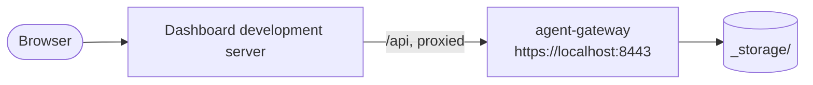
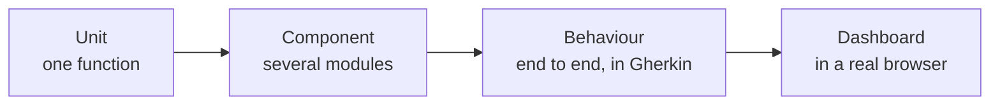

# Development Guide

This guide covers development workflows beyond the canonical first source build. If you have not
yet run the Gateway locally, complete [`GETTING_STARTED.md`](GETTING_STARTED.md) first.

## Workflow Overview

| Workflow | Use it for | Entry point |
| --- | --- | --- |
| Native debug | Backend plus frontend development server | `make run-debug` |
| Native watch | Restarting the backend after Rust changes | `make run-watch` |
| Native release | Testing an optimized binary with the built dashboard | `make run-release` |
| Named instance | Running isolated local configurations on separate ports | `make run-debug x=<name>` |
| Docker | Building and running a local container image from this source tree | `make docker-run` |
| VS Code | Debugging the backend with CodeLLDB breakpoints | `make setup-vscode`, then F5 |



`make run-debug` runs both processes. In `make run-release` there is no development
server: the binary serves the built dashboard itself, on the same origin as the API.

These workflows build locally. They do not depend on a public binary or container image.

Run `make help` to list every available target with a short description.

## Native Development

The local environment is generated beneath `envs/local/`, with bootstrap configuration at:

```text
envs/local/config/config.toml
```

The run targets prepare configuration and certificates before launching the process.

### Debug Mode

```bash
make run-debug
```

`run-debug` starts the Rust debug binary and a frontend development server. Frontend changes hot reload. Rust backend changes do not automatically rebuild or restart in this mode.

### Backend Watch Mode

```bash
make run-watch
```

`run-watch` uses `cargo watch` for changes under `src/`, rebuilding and restarting the backend. It also runs the frontend development server, whose own tooling handles frontend hot reload.

### Release Mode

```bash
make run-release
```

`run-release` builds the optimized binary and dashboard, prepares `envs/local/`, and serves the built dashboard without a separate frontend development server.

### Standalone Frontend

```bash
make www-dev
```

Use this when the backend is already running and you only need the dashboard development server.

### Build And Configuration Targets

| Command | Purpose |
| --- | --- |
| `make cargo-build` | Build the debug binary after verifying local Rust dependencies |
| `make cargo-release` | Build the optimized binary |
| `make www` | Build the dashboard |
| `make www-rebuild` | Remove the dashboard build, rebuild it, and refresh local configuration |
| `make config-debug` | Prepare certificates, dashboard, and local debug configuration; it builds the binary when configuration generation requires it |
| `make config-debug-dev` | Prepare local debug configuration without a static dashboard build |
| `make config-release` | Prepare the release environment |

## Named Instances

Run isolated local instances by supplying `x`:

```bash
make run-debug x=peer-a
make run-watch x=peer-b
```

Each instance uses `envs/local-<name>/` and receives a deterministic set of HTTP, HTTPS, outbound, and frontend ports. The assigned values are written to that instance's `instance.env` and printed at startup.

Use names that are stable across runs. If two names resolve to a conflicting port set, preparation stops and asks you to choose another suffix or remove the conflicting environment.

To prepare a named instance without starting it:

```bash
make config-debug-x x=peer-a
```

## Docker

Docker builds an image from the current source tree (backend binary + dashboard)
and runs it. There are two ways to run it: `make docker-run` (one command) or
`docker compose` (against a config you generate first). Docker is an integration
workflow, not a zero-config quickstart — for the fastest first run with passkey
login, use `make run-debug` (see [GETTING_STARTED.md](GETTING_STARTED.md)).

### make docker-run (one command)

```bash
make docker-run
```

This prepares `envs/docker/`, builds `agent-gateway:local` when required, creates
the `agent-network` network, replaces the existing `agent-gateway` container,
mounts configuration and storage, and publishes the listener ports.

### docker compose

The root [`docker-compose.yml`](../../docker-compose.yml) runs the built image
against the config generated by `make config-docker`. It does not generate config
itself, so run that first:

```bash
make config-docker                                   # 1. generate envs/docker/{config,certs}
export AG_BACKUP_ENCRYPTION_KEY=$(openssl rand -hex 32)   # 2. required 64-hex key
docker compose up                                    # 3. run
```

If you skip step 1, compose stops immediately with `bind source path does not
exist` instead of a cryptic in-container error. Keep the key exported for every
`docker compose` command (including `down`).

### Accessing the gateway

The container publishes `8443` (HTTPS, self-signed) and `8080` (HTTP). Both serve
the same dashboard and `/api/v1/*` endpoints.

| Goal | URL |
| --- | --- |
| Dashboard + passkey registration/login | **https://localhost:8443/** (accept the self-signed cert) |
| Readiness | `curl -k https://localhost:8443/api/v1/health` |
| Liveness | `curl -k https://localhost:8443/api/v1/alive` |

Use **https://localhost:8443/** to log in: `make config-docker` sets the WebAuthn
`external_origin` to `https://localhost:8443` and `rp_id` to `localhost`, so passkey
registration only succeeds at that origin. The UI also loads over plain HTTP at
http://localhost:8080, but passkey login is rejected there (origin mismatch). For
a deployment, replace `webauthn.rp_id`, `webauthn.external_origin`, and the
`did.domain` in `envs/docker/config/gateway.json` with your public host; the
process refuses to start if `rp_id` is not an effective domain of
`external_origin`.

### Build memory (OOM)

The release compile is memory-hungry. The image build defaults to `lto=off` and
reduced `codegen-units` (via the `CARGO_PROFILE_RELEASE_*` build args) so it fits
in a memory-constrained builder such as the buildx `docker-container` driver used
by `make docker-run`. If the build is still killed with `cannot allocate memory`
(`signal: 9, SIGKILL`), raise Docker Desktop's memory limit, or lower the
optimization further:

```bash
docker build -t agent-gateway:local --build-arg CARGO_PROFILE_RELEASE_OPT_LEVEL=1 .
```

### Lower-level targets

| Command | Purpose |
| --- | --- |
| `make config-docker` | Generate configuration under `envs/docker/` |
| `make docker-build-local` | Build `agent-gateway:local` when source inputs changed |
| `make docker-rebuild-local` | Force a clean local image rebuild |
| `make docker-run-dev` | Build and run the debug image (`Dockerfile.dev`) — faster build, no release optimization |
| `make docker-shell` | Start a temporary container from the local image and open a shell in it |
| `make docker-network` | Create `agent-network` if absent |

Do not edit `scripts/d-run.sh` for ordinary local use; the run script configures
the network and port mappings.

### Storage and stopping

Both run paths persist storage to `envs/docker/_storage` on the host, beside the
generated `envs/docker/config` and `envs/docker/certs`. Stop the container with:

```bash
docker compose down          # for `docker compose up` (keep the key exported)
docker rm -f agent-gateway   # for `make docker-run`
```

To start from a clean slate, remove the storage directory as well:

```bash
rm -rf envs/docker/_storage
```

On Linux the container runs as a non-root user (uid 999); if it cannot write to
the bind-mounted storage, make the directory writable once with
`mkdir -p envs/docker/_storage && chmod 777 envs/docker/_storage`.

## VS Code Debugging

Generate local debugger configuration with:

```bash
make setup-vscode
```

Run `make config-debug-dev` first if no prepared `envs/local/config/config.toml` exists. The setup
script discovers prepared local instances and writes ignored files under `.vscode/`:

- `launch.json` with one CodeLLDB configuration per prepared local instance,
- `agent-gateway.env` with generated local development keys,
- `extensions.json` with recommended extensions, and
- `settings.json` that excludes `envs/docker` from search and file watching.

Install the recommended extensions, press F5, and select an Agent Gateway configuration. F5 builds and debugs the backend only. Run `make run-debug` when you also need the frontend development server and browser passkey flow.

## Shell Scripts

Shell scripts under `scripts/` and `www/default/` follow one convention, enforced by
`make shellcheck` (fails on warnings):

| Rule | Why |
| --- | --- |
| `#!/bin/bash` for executables | One fixed interpreter path, independent of `PATH`. Because macOS ships Bash 3.2 at `/bin/bash`, scripts must stay 3.2-compatible: no `declare -A`, `mapfile`/`readarray`, `${var,,}`, `local -n`, or `globstar` |
| `# shellcheck shell=bash` for sourced libraries | Sourced helpers (`_portable.sh`, `_run-common.sh`, `mediator/_url.sh`) have no shebang and are not executable, so ShellCheck needs the dialect declared |
| `set -e` minimum, `set -euo pipefail` for new scripts | Fail fast on errors. Older scripts are still on bare `set -e`; adding `-u`/`-o pipefail` to them needs a per-script check, since `cmd \| head -1` exits non-zero under `pipefail` |
| Executable bit matches the shebang | A file with a shebang is `755`; a sourced library is `644` |
| Use `sedi` from `_portable.sh` | BSD and GNU `sed -i` take different arguments |

ShellCheck runs with no repo-wide config file and with `--severity=warning`; it never follows a
sourced helper. A script that consumes a value from `_env.sh` or `_run-common.sh` therefore declares
that contract explicitly right after the `source` line (or after the function call that sets it):

```bash
source "$(dirname "$0")/_env.sh"

# Values the sourced helper above must provide.
: "${envs_dir:?_env.sh must set envs_dir}"
```

This documents the dependency, fails fast with a clear message if the helper contract ever breaks, and keeps SC2154 meaningful. Prefer a narrowly scoped `# shellcheck disable=...` with a comment explaining why over relaxing the lint globally.

```bash
make shellcheck   # lint every tracked *.sh
make lint         # fmt-check + clippy + eslint + shellcheck
```

## Tests And Quality Checks



[`TESTING.md`](TESTING.md) explains what belongs in each layer.

Use focused tests during implementation, then run the checks appropriate to the files you changed.

### Fast Rust Loop

```bash
make check
cargo test --bin agent-gateway "<module name>"
```

### Rust Tests

```bash
make test
```

Other available targets include:

| Command | Purpose |
| --- | --- |
| `make test-unit` | Unit and component tests compiled into the `agent-gateway` binary test target |
| `make test-bins` | Binary tests |
| `make test-policies` | Focused policy-engine tests |
| `make test-coverage` | Coverage and JUnit output |
| `make gw-e2e` | Gateway-to-Gateway BDD suite using managed mediator containers |
| `make mcp-conformance` | MCP `2026-07-28` conformance harness plus legacy compatibility checks ([`scripts/mcp-conformance/README.md`](../../scripts/mcp-conformance/README.md)) |
| `make mcp-conformance-legacy` | Only the MCP legacy (`2024-11-05`) compatibility checks on the default build |

### Frontend Tests

```bash
make npm-test
make npm-lint-ci
make npm-build-ci
```

### Full Local Preflight

```bash
make ci
```

This is the repository's broad local preflight and can take substantially longer than focused
checks. [`CONTRIBUTING.md`](../../CONTRIBUTING.md) defines the minimum checks expected before a pull
request.

## Running An Agent In Docker

After `make docker-run`, attach an agent container to the existing network:

```bash
docker run --network agent-network \
  --name my-agent \
  --env-file .env \
  my-agent:local
```

Use the agent container name as the hostname when configuring an Agent Surface Target that should reach it over the Docker network. Attach required supporting services to the same network:

```bash
docker run --network agent-network --name redis-service -d redis:latest
```

Do not publish an agent port to the host unless host access is independently required. Container-to-container traffic on `agent-network` does not require a host port mapping.

## Storage Export And Backup

Agent Gateway has two different archive types. They are not interchangeable.

For supported appliance configuration and operations, use the hosted
[Agent Gateway reference](https://docs.affinidi.com/products/affinidi-trust-fabric/agent-gateway/reference/).
This section covers only commands and archive distinctions implemented by this source tree.

| Format | Purpose | Contents and protection |
| --- | --- | --- |
| `.atgx` | Diagnostic sharing | Excludes sensitive directories, redacts remaining data, then encrypts to a recipient public key |
| `.agbak` | Full restore | Contains appliance storage needed for restoration, including sensitive records, and is encrypted with the configured backup encryption key |

Use `.atgx` when sharing diagnostic state with a trusted recipient. Use `.agbak` for controlled backup and restore. A redacted `.atgx` export cannot restore an appliance, and a `.agbak` file must not be treated as sanitized support data.

### Create A Redacted `.atgx` Export

Generate an Ed25519 key pair for the recipient:

```bash
openssl genpkey -algorithm Ed25519 -out private.pem
openssl pkey -in private.pem -pubout -out public.pem
```

Stop the local Gateway, then export its storage from the repository root:

```bash
cargo run -- --config envs/local/config/config.toml --export-storage export.atgx
```

Paste the contents of `public.pem` when prompted, followed by an empty line. The dashboard also
exposes the redacted export under **Settings > Admin > Export Storage**.

Decrypt a received export with the corresponding private key:

```bash
cargo run -- --decrypt-export export.atgx --output export.zip
```

Paste the contents of `private.pem` when prompted, followed by an empty line. The resulting ZIP is redacted diagnostic material.

### Full `.agbak` Backup

Full backup and restore are management operations exposed by the running Gateway and dashboard. They require a configured backup encryption key. Retain that key under your organization's key-management and recovery policy; losing it makes the encrypted backup unusable. The legacy `.tgwbak` extension written by earlier builds is still accepted on restore.

See the dashboard's backup and restore controls for the running instance. Review the storage and encryption settings before relying on backups in an operational environment. Encryption at rest is a separate option and is disabled by default.

## Related Documentation

- The hosted [Agent Gateway documentation](https://docs.affinidi.com/products/affinidi-trust-fabric/agent-gateway/) covers product deployment, configuration, and operator workflows.
- [`GETTING_STARTED.md`](GETTING_STARTED.md) is the canonical first source-build and login path.
- [`../CONFIGURATION_RELOAD.md`](../CONFIGURATION_RELOAD.md) describes configuration reload behavior.
- [`../FABRIC.md`](../FABRIC.md) covers Connection Points and Gateway-to-Gateway development.
- [`CONTRIBUTING.md`](../../CONTRIBUTING.md) defines contribution requirements.
