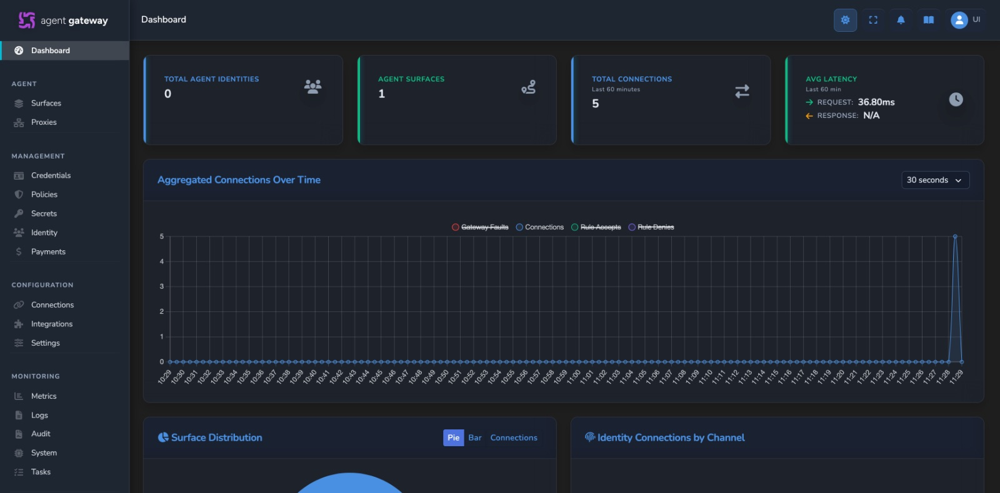

# Build And Run Agent Gateway From Source

This is the canonical first-run path for building Affinidi Agent Gateway from this source tree. It starts the backend and dashboard and guides you to a working passkey login. It is not the appliance deployment guide; use the hosted [Agent Gateway Quickstart](https://docs.affinidi.com/products/affinidi-trust-fabric/agent-gateway/get-started/) to deploy and configure the product. macOS is the primary, fully-scripted source path; for a native Debian/Ubuntu setup see [Linux (native)](#linux-native).

For Docker, VS Code, watch mode, release mode, and multi-instance workflows, see
[`DEVELOPMENT.md`](DEVELOPMENT.md).

## Outcome

At the end of this guide you will have:

- a locally built `agent-gateway` process,
- the dashboard running through its frontend development server,
- a passkey registered and an authenticated dashboard session,
- readiness confirmed at `/api/v1/health`, and
- liveness confirmed at `/api/v1/alive`.

Login does not complete automatically. You must follow the browser prompts and approve passkey registration with a supported authenticator.

## Prerequisites

This path is written for macOS with [Homebrew](https://brew.sh). For a native Linux setup, see [Linux (native)](#linux-native) below.

Install these before starting:

| Requirement | Notes |
| --- | --- |
| Git | Used to clone and work with the repository |
| Homebrew | Used by `make install-deps` |
| Rust `1.95.0` or newer | The minimum version is declared in [`Cargo.toml`](../../Cargo.toml) |
| Node.js and npm | Required to build and run the dashboard |
| A WebAuthn-capable browser and authenticator | For example, Safari or Chrome with Touch ID, or a compatible security key |

The dependency target installs the additional Rust tools, native packages, command-line tools, and Git hooks used by the repository.

## Build And Run

From the repository root, run:

```bash
make install-deps
make run-debug
```

`make install-deps` is a one-time macOS/Homebrew setup. `make run-debug` builds the dashboard and debug Rust binary, generates local certificates and keys, prepares the local environment, starts the Gateway, and starts the frontend development server.

During initial configuration, the setup may ask for public inbound and outbound URLs. Press Enter to use the local defaults unless you are intentionally testing through a configured public tunnel.

The first build may take several minutes. Later builds are incremental.

Configuration generated by this workflow is stored under `envs/local/`. The bootstrap configuration is:

```text
envs/local/config/config.toml
```

## Linux (native)

`make install-deps` and `make install-rust-deps` are macOS/Homebrew only. On Linux, install the build dependencies yourself, then use the same run target.

Install the native libraries and tools (Debian/Ubuntu shown — the native build dependencies the [`Dockerfile`](../../Dockerfile) base stage installs, plus `jq` for the run scripts):

```bash
sudo apt-get update
sudo apt-get install -y --no-install-recommends \
  build-essential cmake jq libclang-dev libcurl4-openssl-dev libdbus-1-dev \
  libsasl2-dev libsasl2-modules libssl-dev libxml2-dev libxmlsec1-dev \
  pkg-config protobuf-compiler xmlsec1
```

Then install a stable Rust toolchain via [rustup](https://rustup.rs) and Node.js 20 or newer with npm.

Build and run with the standard target. It calls `cargo build` and the frontend build directly, so it does not require the macOS Homebrew tool checks:

```bash
make run-debug
```

From here, follow [Open The Dashboard](#open-the-dashboard) and the remaining steps below; they are identical on every platform.

**Scope:** CI builds and tests the Rust workspace on Linux (Debian bookworm `rust:<version>-slim-bookworm` images), so the build is verified. The full local run flow — certificate generation, the frontend development server, and passkey login — is not exercised by CI on Linux; treat it as community-supported. The self-signed certificate is added to the system trust store only on macOS, so on Linux accept the browser's certificate warning or use `curl -k` (see [Troubleshooting](#troubleshooting)). The Docker workflow in [`DEVELOPMENT.md`](DEVELOPMENT.md#docker) is a cross-platform integration alternative, but browser passkey login requires its generated WebAuthn origin and relying-party values to match the URL you use.

## Open The Dashboard




Read the URLs printed by `make run-debug`. The standard local endpoints include:

```text
WebAuthn origin: http://localhost:8080
HTTPS backend:  https://localhost:8443
Frontend dev:   http://localhost:3002
```

Use the browser window opened by the run script. It opens the configured WebAuthn
`external_origin`, which is `http://localhost:8080` for the standard local environment. Use the
generated value in `envs/local/config/gateway.json` as the source of truth because named instances
and public URL overrides use different origins.

The frontend development server also runs on the printed frontend port for UI development, but the
default generated WebAuthn origin is the HTTP Gateway endpoint. Opening a different origin for
passkey registration will fail origin validation unless the generated WebAuthn configuration is
changed to match it.

## Register And Log In

The default local authentication mode is passkey authentication.

1. Open the configured WebAuthn origin, normally through the browser window opened by the script.
2. Start registration from the onboarding screen.
3. Follow the browser's passkey prompt.
4. Approve registration with Touch ID or another supported authenticator.
5. Continue into the management dashboard.

The browser interaction is required. Starting the process does not register a passkey or log you in automatically.

## Verify Readiness And Liveness

Use the backend URL printed by the run command. With the standard local ports:

```bash
curl -k https://localhost:8443/api/v1/health
curl -k https://localhost:8443/api/v1/alive
```

The local backend uses a self-signed certificate, so these examples use `-k`.

| Endpoint | Meaning | Expected result |
| --- | --- | --- |
| `GET /api/v1/health` | Readiness | HTTP `200` with `{"status":"OK"}` when Active and ready; HTTP `503` while starting or in Standby mode |
| `GET /api/v1/alive` | Liveness | HTTP `200` while the process is alive, including in Standby mode |

The externally mounted paths include `/api`. Router-relative references elsewhere in the codebase may use `/v1/health` and `/v1/alive`.

## Stop The Gateway

Press `Ctrl-C` in the terminal running `make run-debug`. The run script stops both the backend and frontend development server.

## Reset Local State

Use the narrowest reset target that matches what you want to remove:

| Command | Removes |
| --- | --- |
| `make clean-local-storage` | Local persisted data, including passkey and onboarding state |
| `make clean-envs-local` | Generated `envs/local/` configuration, certificates, and assigned ports |
| `make clean-artifacts` | Rust build artifacts, dashboard build output, and `node_modules` |
| `make clean-all` | Generated environments plus everything removed by `make clean-artifacts` |

To repeat first-time onboarding while keeping build artifacts, run:

```bash
make clean-local-storage
make run-debug
```

Cleanup targets delete local data. Review the command before running it if the environment contains work you need to retain.

## Troubleshooting

| Symptom | What to do |
| --- | --- |
| `make install-deps` fails on Linux or Windows | This target is macOS/Homebrew-specific. Use a developer alternative in [`DEVELOPMENT.md`](DEVELOPMENT.md). |
| The first build appears idle | Rust and dashboard dependency compilation can take several minutes. Check the terminal for ongoing compiler output before interrupting it. |
| macOS link fails with undefined `_ENGINE_*` symbols from `librdkafka` | OpenSSL 4 removed the ENGINE API. `.cargo/config.toml` pins Apple Silicon builds to `/opt/homebrew/opt/openssl@3` via `AARCH64_APPLE_DARWIN_OPENSSL_DIR`; run `brew install openssl@3` if it is missing. |
| The setup waits after asking for a public URL | Press Enter for the local default unless you intentionally need a public tunnel. |
| The dashboard does not open | Open the WebAuthn `external_origin` from `envs/local/config/gateway.json`. Do not assume the default port for a named instance or public URL override. |
| Passkey registration does not prompt | Use a WebAuthn-capable browser and ensure Touch ID or another platform/security-key authenticator is available. |
| `/api/v1/health` returns `503` | The instance is not ready. Wait for startup to finish and inspect the server log. A Standby instance intentionally remains unready. |
| `curl` reports a certificate error | Use `curl -k` for the generated local development certificate. Do not use insecure certificate handling for production endpoints. |
| Startup reports an occupied port | Stop the process using that port or use a named instance as described in [`DEVELOPMENT.md`](DEVELOPMENT.md#named-instances). |
| Generated configuration is inconsistent | Run `make clean-envs-local`, then `make run-debug` to regenerate `envs/local/`. This also removes local certificates and port assignments. |

## Next Steps

- Deploy an appliance, create a surface, and configure product features with the hosted [Agent Gateway documentation](https://docs.affinidi.com/products/affinidi-trust-fabric/agent-gateway/).
- Read the [project overview](../../README.md) for the repository front door.
- Use the [repository documentation index](../README.md) for implementation references.
- Debug the backend in VS Code: run `make setup-vscode` to generate `.vscode/` (CodeLLDB config, recommended extensions, and local dev keys — all gitignored), then press F5. See [`DEVELOPMENT.md`](DEVELOPMENT.md#vs-code-debugging) for details.
- Use the [development guide](DEVELOPMENT.md) for Docker, VS Code, watch mode, named instances, tests, and exports.
- Read [CONTRIBUTING.md](../../CONTRIBUTING.md) before proposing a change.
