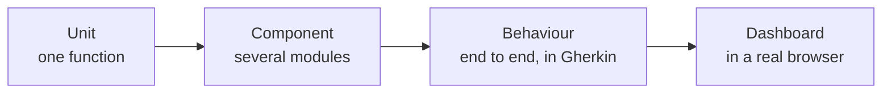

# Testing

Four test layers, what belongs in each, and how to run them.

[`CONTRIBUTING.md`](../../CONTRIBUTING.md) states the requirement: cover changes with
tests, positive and negative cases, and assert returned values rather than the absence of
an error. This page says which layer to put them in.

## Layers

| Layer | Lives in | Covers | Needs |
| --- | --- | --- | --- |
| Unit | `#[cfg(test)] mod tests` inline in each module | One function or type in isolation | Nothing |
| Component | [`src/component_tests/`](../../src/component_tests/) | A flow across several modules | Nothing |
| Behaviour | [`tests/`](../../tests/) with Gherkin features under [`tests/features/`](../../tests/features/) | A described behaviour end to end, in the project's own vocabulary | A built binary, and containers for the federation suite |
| Dashboard | [`ui-tests/`](../../ui-tests/) | The dashboard in a real browser | A running gateway and Playwright |

Around 300 source files carry inline test modules, there are 12 component-test files, 35
feature files, and 6 Playwright specs.



Left to right, each layer is slower and covers more at once.

## Choosing a layer

Work down this list and stop at the first one that fits.

| The change is | Test it as |
| --- | --- |
| A pure function, a parser, a validator, a conversion | Unit |
| A new field with validation rules | Unit, positive and negative |
| Two or more modules agreeing on something, such as a pipeline stage calling a store | Component |
| A protocol exchange over a real listener | Component |
| A behaviour an operator would recognise and describe, such as "a caller without a valid token is refused" | Behaviour |
| Anything crossing two gateways | Behaviour, in the `g2g` feature set |
| A dashboard page, form, or interaction | Dashboard |

A change that adds a stage to the request pipeline usually needs two: a unit test for the
logic, and a component test proving the stage runs in the right place.

## Unit tests

Inline, in the module they cover.

```rust
#[cfg(test)]
mod tests {
    use super::*;

    #[test]
    fn rejects_a_name_longer_than_the_cap() { /* … */ }
}
```

Run all of them, or one module:

```bash
make test-unit
cargo test --bin agent-gateway "<module name>"
```

For a compile check without running anything, `cargo test --no-run`.

## Component tests

[`src/component_tests/`](../../src/component_tests/) holds flows that cross module
boundaries but need no Docker. Shared setup is in
[`src/component_tests/helpers/`](../../src/component_tests/helpers/).

Existing files show the intended granularity: one per flow, such as `channel_e2e.rs`,
`mcp_policy_e2e.rs`, `trust_check_e2e.rs`, `access_tokens_pat.rs`, `mtls.rs`.

They compile into the binary's test target, so they run with the unit tests:

```bash
cargo test --bin agent-gateway component_tests
```

## Behaviour tests

Two Cucumber suites, both declared as harness-free test targets in
[`Cargo.toml`](../../Cargo.toml).

| Suite | Features | Step definitions | Scope |
| --- | --- | --- | --- |
| `surface_bdd` | [`tests/features/surface/`](../../tests/features/surface/), 28 files | `tests/surface_bdd/`, `tests/surface_bdd_support.rs` | One gateway: surfaces, source auth, policy, MCP, STS, trust recording |
| `g2g_bdd` | [`tests/features/g2g/`](../../tests/features/g2g/), 7 files | `tests/g2g_bdd/`, `tests/g2g_bdd_support.rs` | Two gateways over the fabric, with a managed DIDComm mediator |

```bash
cargo test --test surface_bdd
make gw-e2e
```

`make gw-e2e` starts mediator containers, sets `FABRIC_BDD_MANAGED_MEDIATOR`, and runs
with `G2G_BDD_PARALLELISM` scenarios at once, 8 by default. Set
`G2G_BDD_PARALLELISM=1` when a failure is hard to attribute.

Feature files use the vocabulary in [`CONTEXT.md`](../../CONTEXT.md). Use the glossary's
terms rather than code identifiers, so a scenario reads as behaviour rather than
implementation. [`scripts/bdd-gherkin.py`](../../scripts/bdd-gherkin.py) generates a step
inventory, which is the quickest way to find an existing step before writing a new one.

## Dashboard tests

Playwright, in [`ui-tests/`](../../ui-tests/), with 6 specs under `ui-tests/specs/`.

```bash
make ui-test
make ui-test-headed
make ui-test-report
```

`make ui-test` boots a gateway in test mode, runs the suite, and tears it down.

Every interactive element ships with a `data-testid`, and these tests are the consumer.
The naming convention is in [`ui-tests/README.md`](../../ui-tests/README.md): page roots
are `page-<area>`, actions are `<area>-<verb>-button`, list items are
`<area>-card-<id>` or `<area>-row-<id>`, and wizards use `wizard-<name>` with
`wizard-next`, `wizard-back`, and `wizard-submit`.

## Frontend unit tests

Jest, alongside the dashboard source:

```bash
make npm-test
```

## Running everything

| Command | Runs |
| --- | --- |
| `make test` | All Rust tests. `make test test=<filter>` narrows by name. |
| `make test-unit` | The binary's tests only |
| `make test-policies` | The OPA policy engine tests |
| `make test-all` | Rust, frontend, and dashboard tests |
| `make test-rust-ci` | The CI flow locally: coverage plus `surface_bdd`, against the coverage threshold |
| `make test-junit` | Nextest with a JUnit report at `test-results.xml` |
| `make test-coverage` | Coverage at `coverage.xml` plus the JUnit report |

Each of these depends on `config-test`, which only prepares the local certs and keys
(`make config-certs`). Rust tests build their own temporary environments, and `make ui-test`
wipes and prepares `tmp/local-ui-tests` (HTTP port 8711) at the start of each run and keeps
it afterwards for debugging, so a test run never touches a development instance.

## Before opening a pull request

The checks from [`CONTRIBUTING.md`](../../CONTRIBUTING.md):

```bash
cargo clippy --all-targets --all-features
cargo fmt --all
cargo test --no-fail-fast --all-targets --all-features
```

And, when `www/default/` changed:

```bash
cd www/default && npx prettier --write src && npm run lint
```

## Related

- [`DEVELOPMENT.md`](DEVELOPMENT.md): running the gateway, Docker, and debugging.
- [`../../CONTRIBUTING.md`](../../CONTRIBUTING.md): what a contribution has to include.
- [`../../CONTEXT.md`](../../CONTEXT.md): the vocabulary feature files use.
